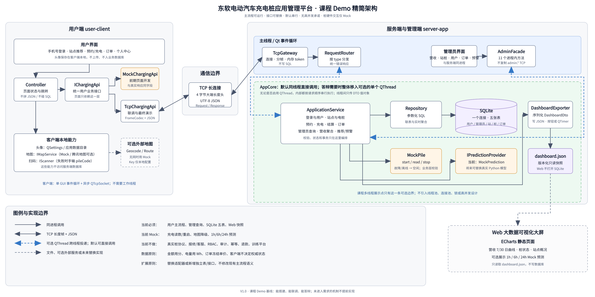

# BIT_2026_CS：东软电动汽车充电桩应用管理平台

这是一个面向课程验收的轻量 monorepo。当前主线只计划实现可演示的 Qt 用户端、Qt 服务端/管理端、SQLite 和 ECharts 大屏；复杂计价、真实桩、高并发、工单、RBAC 和模型训练保留为以后按需扩展的参考，不是当前开发任务。



## 文档优先级

1. [项目说明书](docs/requirements/project-spec.doc)：课程验收需求。
2. [Demo 整体接口契约](contracts/overall-interface-v1.md)和[数据库设计](docs/design/demo-database-design.md)：当前开发的唯一实现基线。
3. [扩展参考文档](docs/extension/README.md)：未来需求池，未经决策不得直接实现。

发生冲突时必须按这个顺序处理。完整导航见 [docs/INDEX.md](docs/INDEX.md)。

## 目录与负责人边界

| 目录 | 建议负责人 | 可以独立依赖什么 |
| --- | --- | --- |
| `client/` | Qt 用户端 | `contracts/`、`shared/protocol/`、Mock API |
| `server/` | Qt 服务端与管理员端 | `contracts/`、`database/`、Mock 桩/预测 |
| `web/` | ECharts 大屏 | `contracts/examples/dashboard.sample.json` |
| `shared/protocol/` | 客户端与服务端共同维护 | 只实现 DTO、错误码和帧编解码 |
| `database/` | 服务端/数据库负责人 | 编号迁移 SQL、种子 SQL |
| `contracts/` | 跨模块共同确认 | 消息、DTO、状态和示例 JSON |

各应用开始实现后必须能独立配置和构建。是否增加根聚合构建入口由团队后续决定，它不能成为客户端或服务端单独开发的前置条件。

## 当前仓库状态

当前提交只初始化了边界、契约、数据库设计和开发目录骨架，尚未替任何成员决定页面类、源文件数量或具体业务代码结构。推荐后续按以下目录逐步落代码：

```text
client/src/{ui,api,model}
server/src/{transport,application,persistence,admin_ui,adapters}
shared/protocol/{include,src}
web/{css,js}
```

## 如何独立开工

- 客户端负责人先在 `client/` 根据 V1 契约定义页面侧接口和 Mock；
- 服务端负责人先在 `server/` 根据同一契约定义 Service/Repository 边界；
- Web 负责人根据契约中的 `DashboardDto` 准备自己的静态 fixture；
- 数据库负责人根据五表设计，在 `database/migrations/` 和 `database/seeds/` 中提交第一版实现。

本次仓库初始化只冻结目录和契约，不预先提交 CMake target、应用源代码、建表 SQL、种子 SQL 或二进制数据库。各负责人开始实现时在自己的目录内补齐构建文件和代码。

“独立开工”不等于零协调。具体替代依赖、共享边界和分阶段联调检查点见[模块并行开发指南](docs/guides/parallel-development.md)。

## 当前明确不做

- 真实充电桩协议、设备心跳和厂商命令队列；
- 线程池、连接池、并发压力指标和分布式部署；
- 报修/客服、退款/对账、管理员 RBAC；
- 峰谷分段计价、预测训练平台和预测历史表；
- Web 直接打开 SQLite。

需要启动其中任何一项时，先按 [Demo-first 决策](docs/decisions/0001-demo-first.md)建立增量设计，不要整体恢复旧 24 表方案。

## 协作

开发前阅读 [CONTRIBUTING.md](CONTRIBUTING.md)。第一次使用 GitHub 的成员按 [Ubuntu 与 GitHub 协作教程](docs/guides/github-collaboration.md)完成账号、Git、SSH、克隆、短期分支和 PR 配置。建议从 `main` 创建短期功能分支，例如 `client/login-page`、`server/order-flow`、`web/revenue-chart`。修改 `contracts/` 的变更必须同时说明客户端和服务端影响。

所有人和 AI 工具共同遵守 [PROJECT_RULES.md](PROJECT_RULES.md)。仓库同时提供 `AGENTS.md`、`CLAUDE.md`、`.agents/skills/` 中的 Codex 项目 skill 和 `.claude/skills/` 中的 Claude Code 项目 skill；两种工具都使用 `bit-charging-dev`，但真正的跨工具权威规则只有一份。
