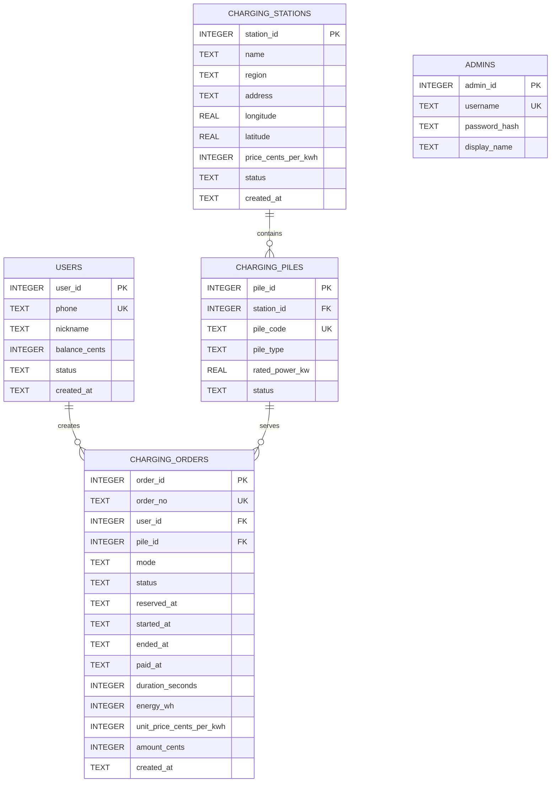

# 东软电动汽车充电桩应用管理平台：课程 Demo 数据库设计

> 版本：V1.0（精简基线）
>
> 适用：当前 Demo 参考环境（Ubuntu 22.04.3、Qt Framework 6.2.4、C++17）、Qt QSQLITE、SQLite 3
>
> 原则：只保存当前演示流程真正需要的事实；未进入需求的能力只留接口，不提前建表。
>
> 配套文件：[整体接口契约](../../contracts/overall-interface-v1.md)、[架构图](./architecture/demo-architecture.png)
>
> 当前阶段：只冻结设计；建表 SQL、种子 SQL 和样例数据库由数据库负责人在实现阶段提交。

---

## 1. 结论

### 1.1 对现有数据库方案的检查结果

现有《数据库设计与搭建方案》在技术上是可执行的：其中 DDL 已用 SQLite 实际验证，可以无错误创建 **24 张表、3 个视图和 23 个显式索引**，`foreign_key_check` 没有异常。它能够覆盖原架构，而且是明显的超额覆盖。

问题不在于“数据库不能用”，而在于它把许多课程说明书没有要求的功能提前固化成了数据库和接口义务，例如：

- 持久化会话、请求幂等重放和审计日志；
- 管理员分级授权和站点权限范围；
- 峰平时段、快慢充倍率和分段计费；
- 设备命令历史、报修工单和客服工单；
- 小时聚合、模型版本、预测任务和预测点；
- 退款、钱包账本、备份保留和并发压力测试。

项目说明书明确点名的数据库对象只有：**用户、管理员、充电站、充电桩、充电订单**。因此本版只保留这 5 张表。

### 1.2 现有两份文档不能直接共同作为实现基线

现有数据库文档和 C/S 契约之间至少有以下口径冲突：

| 事项 | 数据库文档 | C/S 契约 | 本版裁决 |
| --- | --- | --- | --- |
| 用户位置 | 保存最后经纬度和标签 | 明确位置不入库 | 不入库；查询站点时临时传坐标 |
| 头像 | 保存客户端本地路径，服务端不收图片 | 上传 Base64/资源 ID | 头像完全由客户端本地配置保存 |
| 距离计算 | 一处规定客户端计算 | 另一处规定服务端计算和排序 | 服务端按请求坐标计算；不保存坐标 |
| 线程/连接 | 单 CoreThread、两个连接 | 又规定读线程、写队列和多连接 | 一个业务执行器、一个数据库连接，串行即可 |
| 状态同步 | 一处定义服务端事件推送 | C/S V1 又规定只轮询 | Demo 只用请求/响应和页面轮询 |
| 响应信封 | `code + reason + message`，样例缺 `type` | `code + message` 并回显 `type` | 采用新契约中的唯一精简信封 |
| 接口名字 | `restart`、`freeze/unfreeze` 等 | `command`、`status.set` 等 | 以新整体接口契约为准 |
| ID 类型 | 数据库只有整数主键 | 接口又称 ID 为独立展示字符串 | Demo 直接传整数 ID；桩另保留可扫码编号 |

因此，不建议继续修改旧 24 表方案。本文和新接口契约构成当前设计基线；数据库开始实现后，已合并的编号迁移 SQL 才成为结构事实源。旧文档仅作为扩展思路参考。

### 1.3 五张表为什么够用

| 功能 | 数据来源或写入位置 |
| --- | --- |
| 手机号登录、自动注册、昵称、余额、冻结 | `users` |
| 管理员 `admin / 123456` 登录 | `admins` |
| 附近站点、价格、地址、坐标 | `charging_stations` |
| 桩编号、快慢充、功率、实时模拟状态 | `charging_piles` |
| 预约、充电、计费、支付、订单列表 | `charging_orders`；支付同时更新 `users.balance_cents` |
| 站点总桩数、空闲数、在线率 | 从 `charging_piles` 实时聚合 |
| 电桩累计次数、累计时长 | 从已结束的 `charging_orders` 实时聚合 |
| 今日/月/总营收、7/30 日曲线 | 从 `COMPLETED` 订单按 `paid_at` 聚合 |
| Web 大屏 | 服务端把上述聚合结果导出为 JSON；Web 不直连数据库 |
| 1/6/24 小时预测 | `IPredictionProvider` 的 Mock 输出；当前不落库 |
| 充电桩硬件 | `MockPile`；当前没有真实设备表、心跳表或命令表 |

---

## 2. 当前范围与明确不做的内容

### 2.1 当前必须实现

1. 数据库负责人编写首个编号迁移，只建立这 5 张表。
2. 编写演示种子，覆盖用户、站点、电桩和近 30 日订单页面需要的数据。
3. 服务端通过一个 Repository/数据访问模块访问 SQLite。
4. 预约、开始充电、停止结算和补支付时，订单、桩状态、余额在一个事务中修改。
5. 管理端和 Web 大屏从这 5 张表查询、联表和聚合。

### 2.2 当前不建表

| 能力 | 当前放在哪里 | 何时再建表 |
| --- | --- | --- |
| 登录 token | 服务端内存 `token -> userId` | 需要服务重启后保持登录时 |
| 用户在线状态 | 当前 TCP 连接/内存会话 | 需要跨实例在线统计时 |
| 头像 | 客户端 `QSettings` 或应用数据目录 | 需要跨设备同步头像时 |
| 最近位置 | 客户端内存或 `QSettings` | 产品明确要求服务端同步时 |
| 充值/支付流水 | 当前只保留用户余额与订单支付结果 | 增加账单流水、退款或对账时 |
| 预约超时/违约 | 当前不实现自动超时 | 需求明确预约时限后 |
| 报修、客服、管理员管理 | 当前需求未要求 | 页面和接口进入本期计划后 |
| 设备命令日志 | `MockPile.restart()` 直接返回结果 | 接入真实硬件或需要操作审计时 |
| 小时指标 | 查询时聚合 | 数据量大到查询确实变慢时 |
| 预测结果 | Mock/静态 JSON | 真正部署模型且需保留历史时 |
| 请求幂等、审计、迁移校验和 | 不实现 | 有真实重试、审计或多版本升级需求时 |

这些不是“永远禁止”，而是“当前没有消费者，所以当前不建”。

---

## 3. 数据模型



设计只保留三个直接关系：

- 一个站点包含多个电桩；
- 一个用户有多个历史订单；
- 一个电桩有多个历史订单，但同一时刻最多被一张预约/充电订单占用。

订单不重复保存 `station_id`。需要站点时沿 `order.pile_id -> pile.station_id` 查询即可；当前系统不支持把已有电桩迁移到另一个站点，也不物理删除历史电桩。

---

## 4. 表和字段字典

### 4.1 `users`：用户

| 字段 | 类型 | 必填 | 含义 |
| --- | --- | :---: | --- |
| `user_id` | INTEGER PK | 是 | 用户 ID；接口直接使用整数 |
| `phone` | TEXT UNIQUE | 是 | 11 位手机号；免密演示登录的唯一依据 |
| `nickname` | TEXT | 是 | 昵称；新用户默认为“用户+手机号后 4 位” |
| `balance_cents` | INTEGER | 是 | 模拟账户余额，单位分，不使用浮点元 |
| `status` | TEXT | 是 | `ACTIVE` 正常，`FROZEN` 冻结 |
| `created_at` | TEXT | 是 | 注册时间，UTC ISO 8601 |

说明：

- 手机号登录属于课程演示身份识别，不宣称是真实安全认证。
- 本地头像不写此表；换头像不需要服务端接口。
- 不保存月违约次数，因为本期没有预约超时/违约需求。

### 4.2 `admins`：管理员

| 字段 | 类型 | 必填 | 含义 |
| --- | --- | :---: | --- |
| `admin_id` | INTEGER PK | 是 | 管理员 ID |
| `username` | TEXT UNIQUE | 是 | 登录账号 |
| `password_hash` | TEXT | 是 | 课程版固定使用 SHA-256 结果；不向客户端返回 |
| `display_name` | TEXT | 是 | 管理界面显示名 |

首版只有一个管理员，不做角色、站点授权、账号新增、改密和审计。种子账号为 `admin / 123456`。若日后上线真实系统，密码算法必须替换为专用密码哈希；这不是当前 Demo 的实现范围。

### 4.3 `charging_stations`：充电站

| 字段 | 类型 | 必填 | 含义 |
| --- | --- | :---: | --- |
| `station_id` | INTEGER PK | 是 | 站点 ID，也是管理端展示 ID |
| `name` | TEXT | 是 | 站名 |
| `region` | TEXT | 是 | 区域下拉筛选值，如“浑南区” |
| `address` | TEXT | 是 | 详细地址 |
| `longitude` | REAL | 是 | 经度 |
| `latitude` | REAL | 是 | 纬度 |
| `price_cents_per_kwh` | INTEGER | 是 | 当前站点统一单价，单位分/kWh |
| `status` | TEXT | 是 | `ACTIVE` 或 `DISABLED` |
| `created_at` | TEXT | 是 | 创建时间 |

计价只保留“一个站点一个当前价”。说明书没有峰谷价、服务费、停车费、快慢充倍率或跨时段计价要求，因此当前不建计价配置表。开始充电时把站点价格复制到订单，之后改站点价格不会改变历史订单。

### 4.4 `charging_piles`：充电桩

| 字段 | 类型 | 必填 | 含义 |
| --- | --- | :---: | --- |
| `pile_id` | INTEGER PK | 是 | 电桩 ID |
| `station_id` | INTEGER FK | 是 | 所属站点 |
| `pile_code` | TEXT UNIQUE | 是 | 展示编号，也是扫码/手输内容 |
| `pile_type` | TEXT | 是 | `FAST` 快充或 `SLOW` 慢充 |
| `rated_power_kw` | REAL | 是 | 额定功率，单位 kW |
| `status` | TEXT | 是 | `IDLE`、`RESERVED`、`CHARGING`、`FAULT`、`OFFLINE` |

这里只保留一个状态字段。课程界面需要的“在用/闲置/故障”映射如下：

| 管理界面分类 | 数据库状态 |
| --- | --- |
| 在用 | `RESERVED`、`CHARGING` |
| 闲置 | `IDLE` |
| 故障 | `FAULT`、`OFFLINE` |

真实硬件可能需要把在线状态和工作状态拆成两个维度，但当前只有 Mock，拆分只会增加同步错误。

### 4.5 `charging_orders`：预约、充电与结算订单

| 字段 | 类型 | 必填 | 含义 |
| --- | --- | :---: | --- |
| `order_id` | INTEGER PK | 是 | 订单内部/接口 ID |
| `order_no` | TEXT UNIQUE | 是 | 展示订单号 |
| `user_id` | INTEGER FK | 是 | 下单用户 |
| `pile_id` | INTEGER FK | 是 | 使用的电桩 |
| `mode` | TEXT | 是 | `RESERVATION` 预约开始，`DIRECT` 直接开始 |
| `status` | TEXT | 是 | `RESERVED`、`CHARGING`、`PENDING_PAYMENT`、`COMPLETED`、`CANCELLED` |
| `reserved_at` | TEXT/null | 条件 | 预约时间；预约模式必有 |
| `started_at` | TEXT/null | 条件 | 实际开始充电时间 |
| `ended_at` | TEXT/null | 条件 | 停止充电时间 |
| `paid_at` | TEXT/null | 条件 | 支付完成时间 |
| `duration_seconds` | INTEGER | 是 | 充电时长，单位秒 |
| `energy_wh` | INTEGER | 是 | 充电量，单位 Wh |
| `unit_price_cents_per_kwh` | INTEGER/null | 条件 | 开始充电时冻结的站点单价 |
| `amount_cents` | INTEGER | 是 | 最终金额，单位分 |
| `created_at` | TEXT | 是 | 订单创建时间 |

状态变化：

```text
预约：      [新建] -> RESERVED -> CHARGING -> PENDING_PAYMENT/COMPLETED
                         \-> CANCELLED

直接充电：  [新建] ------------> CHARGING -> PENDING_PAYMENT/COMPLETED

补支付：                                  PENDING_PAYMENT -> COMPLETED
```

本期没有自动预约过期、违约和退款状态。不要为了“以后可能需要”先添加状态。

首个迁移 SQL 应拒绝最明显的矛盾组合，例如没有开始时间/价格的 `CHARGING`、已经结束或支付的 `RESERVED`。合法的状态转换顺序仍由 `ApplicationService` 控制；不要给 UI 提供任意修改 `status` 的通用 SQL 接口。

---

## 5. 不存字段，但接口仍要返回的派生数据

以下数据都可以从 5 张表得到，不应重复保存。

### 5.1 站点卡片

对每个站点聚合：

- `totalPileCount = COUNT(pile_id)`；
- `availablePileCount = COUNT(status = 'IDLE')`，且站点必须为 `ACTIVE`；
- `onlinePileCount = COUNT(status <> 'OFFLINE')`；
- `onlineRatePercent = onlinePileCount * 100.0 / totalPileCount`；无桩时为 0；
- `distanceKm` 使用本次请求坐标与站点坐标计算，只存在于响应中。

### 5.2 电桩累计数据

- `chargeCount`：该桩的 `charging_orders.status IN ('PENDING_PAYMENT','COMPLETED')` 的订单数；
- `totalChargeSeconds`：上述已停止充电订单的 `duration_seconds` 总和。

这些值用于管理界面展示，不需要写回电桩表。

### 5.3 营收与趋势

当前没有退款，所以：

```text
营收 = SUM(charging_orders.amount_cents)
       WHERE status = 'COMPLETED'
```

日期归属使用 `paid_at`。今日、本月、总营收和 7/30 日折线只是不同时间范围下的同一查询。聚合层按 `Asia/Shanghai` 生成截至当日（包含当日）的连续 7/30 个 `YYYY-MM-DD` 日期，按日期升序排列，并给没有收入的日期补 0；不要求数据库保存日期表。以后如果加入退款，必须新增钱包/支付流水表，再改变营收口径；当前不要预先实现退款账本。

### 5.4 金额公式

单位固定为分、Wh、分/kWh：

```text
amountCents = floor((energyWh * unitPriceCentsPerKwh + 500) / 1000)
```

即对不足一分钱的结果四舍五入。客户端只负责显示；最终金额只能由服务端计算。

---

## 6. 数据访问边界

UI、TCP Gateway、Web 页面和 Mock 都不得直接拼 SQL。服务端只需要一个轻量数据访问模块，不要求为每张表设计复杂框架。

| 能力组 | 最少需要的数据库操作 |
| --- | --- |
| 用户 | 按手机号查找；不存在时创建；按 ID 读取；更新昵称；增加余额；冻结/解冻 |
| 管理员 | 按账号读取密码哈希和显示名 |
| 站点/电桩 | 站点列表与聚合；站点详情；新增站点及若干 Mock 桩；桩列表；更新 Mock 状态 |
| 订单 | 当前未结束订单；新建预约/直接充电单；合法状态更新；订单列表；营收/累计值聚合 |

可以实现为一个 `Repository` 类，也可以拆成四个小类。类名、文件名和 SQL 写法不是契约；上表列出的输入、输出和数据语义才是契约。

将用户状态改为 `FROZEN` 前，`ApplicationService` 必须先检查该用户是否有 `RESERVED/CHARGING/PENDING_PAYMENT` 订单；存在时不更新用户状态，并返回 `40902`。这是业务前置规则，不必用跨表触发器固化。

所有用户输入都用 `QSqlQuery::prepare()` 和 `bindValue()` 绑定。每次 Qt 打开 SQLite 连接后执行：

```sql
PRAGMA foreign_keys = ON;
```

当前一个服务进程只需一个业务数据库连接。连接在哪个线程使用，就在哪个线程创建；不要在线程间传递 `QSqlDatabase` 或 `QSqlQuery`。是否启用 WAL 不属于本契约。

---

## 7. 最小事务约定

只规定容易产生半成品数据的四个边界，不规定线程池、锁、重试或幂等系统。

| 操作 | 同一事务内完成 |
| --- | --- |
| 预约 | 确认用户没有未结束订单、桩为 `IDLE`；插入 `RESERVED` 订单；桩改 `RESERVED` |
| 开始 | 预约单转 `CHARGING` 或创建直接充电单；写入当前站点价格快照；桩改 `CHARGING` |
| 停止 | 从 `MockPile` 取得最终时长/电量；算金额；释放桩为 `IDLE`；余额足够则扣款并完成，否则订单置 `PENDING_PAYMENT` |
| 补支付/充值 | 充值只增加余额；补支付检查余额、扣款并把订单转为 `COMPLETED` |

两个部分唯一索引继续作为最后防线：

- 每个用户最多一张 `RESERVED/CHARGING/PENDING_PAYMENT` 订单；
- 每个电桩最多一张 `RESERVED/CHARGING` 订单。

这两个索引用于防止普通业务代码写错，不代表系统承诺高并发。

---

## 8. 实现阶段的数据库交付契约

### 8.1 预期文件

数据库负责人开始实现时，应在 `database/` 下交付：

- `migrations/001_initial_demo.sql`：从空库建立本文五表和必要索引；
- `seeds/demo.sql`：生成课程页面所需的演示数据；
- 可选样例数据库：只用于快速联调，不能替代 SQL。

本次仓库初始化不预先编写这些实现文件。种子时间应以建库当天为基准，因此正式演示前应使用新的空数据库执行迁移和种子，确保“今日”和近 7/30 日曲线仍有数据。

种子包含：

- 1 个管理员：`admin / 123456`；
- 5 个用户：普通、充电中、已预约、冻结和待支付场景；
- 3 个站点；
- 12 个电桩，覆盖闲置、预约、充电、故障和离线；
- 9 条近 30 日已完成订单；
- 1 条充电中、1 条已预约、1 条待支付订单。

种子脚本应可重复执行且不重复插入固定数据，但不要求刷新已有库中的相对时间。它用于初始化空库，不是“恢复标准演示状态”的重置脚本。

### 8.2 实现后的验收要求

迁移和种子实现完成后，至少验证 `integrity_check=ok`、`foreign_key_check` 无异常，并检查：

1. 数据库只有 5 张业务表；
2. 站点/电桩/用户/订单列表都有可显示数据；
3. `RESERVED` 订单对应 `RESERVED` 桩；
4. `CHARGING` 订单对应 `CHARGING` 桩；
5. `PENDING_PAYMENT` 订单的桩已经是 `IDLE`；
6. 7 日和 30 日营收查询至少有多个非零点。

---

## 9. 扩展规则

后续功能只遵守两条规则：

1. **先有页面或接口消费者，再加表。** 例如确定要展示钱包明细时再加 `wallet_transactions`，确定要保留预测历史时再加 `prediction_results`。
2. **新增模块通过既有 Service 接口接入。** 不允许 Web、Python 模型或真实充电桩直接写业务数据库。

建议的未来增量与当前表之间没有强耦合：

| 未来需求 | 建议新增对象 |
| --- | --- |
| 预约自动过期/违约 | 给订单增加 `expires_at` 和 `EXPIRED` 状态即可 |
| 充值明细、退款、对账 | `wallet_transactions` |
| 报修闭环 | `fault_reports` |
| AI 转人工 | `support_tickets` |
| 多管理员和站点权限 | `admin_station_scopes`，再给管理员加角色 |
| 峰谷/快慢充计价 | 独立 `pricing_rules`，订单现有单价快照无需改变 |
| 设备命令审计 | `pile_commands` |
| 模型预测历史 | `prediction_results` |

当前五表不会阻碍上述扩展，也不会让当前开发者先实现没有页面使用的机制。
