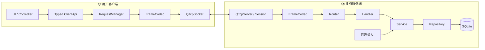
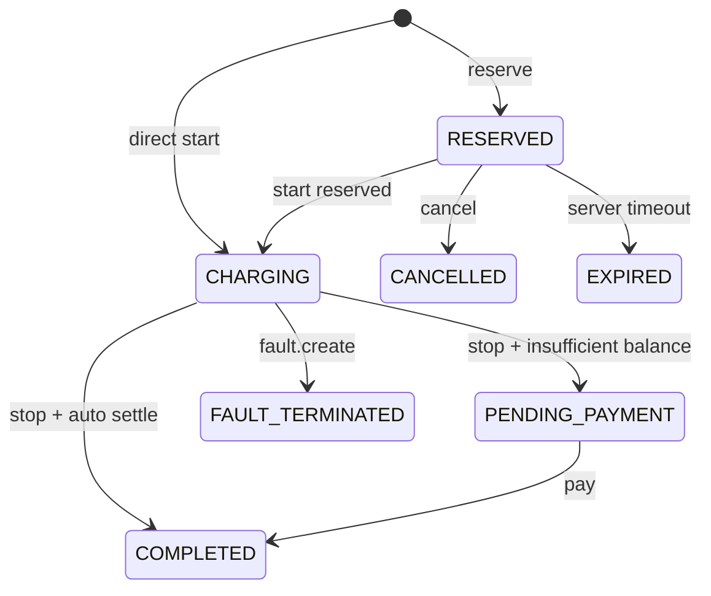

# 东软电动汽车充电桩应用管理平台 C/S 接口契约（扩展参考草案）

> 文档版本：V1.0-reference.1
>
> 扩展状态：**候选设计，尚未激活**
>
> 整理日期：2026-09-02
>
> 适用环境：Ubuntu 22.04+、Qt 6.2+、C++17、Qt Widgets、Qt Network、SQLite 3
>
> 通信基线：TCP 长连接 + 4 字节大端长度头 + UTF-8 JSON
>
> 当前权威：[Demo 整体接口契约](../../contracts/overall-interface-v1.md)、[Demo 数据库设计](../design/demo-database-design.md)

> [!CAUTION]
> 本文是目标态扩展设计草案，不是当前课程 Demo 的实现基线。本文中的表、字段、接口、错误码、线程和可靠性要求，只有在对应功能已立项、完成兼容设计并同步进入当前主线契约后才生效。禁止让开发者或 AI 同时把本文与 Demo 契约当作等价实现标准；也禁止把配套复杂数据库文档中的整库 DDL 直接执行到 Demo 数据库。

---

## 0. 这份文档解决什么问题

本文件保存复杂版曾考虑过的消息、DTO 和可靠性方案，作为未来扩展需求池。当前跨进程边界的唯一事实源是 [`contracts/overall-interface-v1.md`](../../contracts/overall-interface-v1.md)。当某个扩展被批准时，应把相关的小范围约定迁入当前契约或单独冻结 V2，而不是直接实现本文全部内容。

- 某项扩展被激活后，客户端只按迁入主线契约的 DTO、页面状态与错误语义实现，不直接照抄本文；
- 服务端只实现该项扩展所需的最小帧、会话、Service、Repository 与事务变化，不把本文其余候选一并带入；
- 扩展联调以更新后的主线契约和 fixture 为准，不以本文或任一方当前代码为标准；
- 数据库表名、SQL、线程数和页面布局仍是实现细节，不得因为本文出现过某种方案就穿透网络边界。

### 0.1 历史范围分组

| 原级别 | 范围 | 当前处理方式 |
| --- | --- | --- |
| P0 | 登录、资料、站桩、预约/充电/支付、管理端核心功能 | 已由 Demo 契约重新冻结；相同功能以当前契约为准 |
| P1 | 钱包流水、报修、客服、管理员管理、复杂计价、预测持久化 | 扩展候选；有消费者后逐项激活 |
| P2 | 地图、扫码、Web HTTP、真实模型或设备 | 独立适配器/部署扩展；边界候选见 §23 |

### 0.2 发生冲突时的优先级

1. 当前主线的 [Demo 整体接口契约](../../contracts/overall-interface-v1.md)。
2. 当前主线的 [Demo 数据库设计](../design/demo-database-design.md)和已经合并的编号迁移。
3. 已批准的 ADR 或单项扩展提案。
4. 本文中尚未激活的候选设计。

### 0.3 已明确解决的来源歧义

- `order.stop` 保持 Demo 语义：停止、形成最终账单并释放桩；余额足够时由服务端同一业务编排自动结算，只有余额不足才进入 `PENDING_PAYMENT`，之后用 `order.pay` 补付。引入钱包流水时只追加 PAYMENT 记录，不改变同一 V1 消息的成功语义。
- 位置不会入库。`station.list` 接收本次查询坐标，服务端只在内存中计算距离/排序并返回，不保存用户临时位置。
- 管理端 Qt 界面若与 TCP 服务同进程，可直接调用同一 Service；本文 `admin.*` 契约仍作为 DTO、权限、测试和未来拆分的标准。
- V1 不依赖服务端主动推送。预约倒计时、充电进度、人工回复均由客户端轮询相应查询接口；避免两边因事件协议未定而互相等待。

### 0.4 激活规则与统一裁决

每个扩展依次经历 `IDEA -> ACCEPTED -> IMPLEMENTED`。进入 `IMPLEMENTED` 前必须具备明确消费者、契约变更、编号迁移（如涉及数据）、Mock/fixture 和最小兼容测试；破坏性变化必须升级协议版本。

| 事项 | 当前及扩展默认裁决 |
| --- | --- |
| 协议信封 | Demo V1 保持 `{version,type,requestId,token,data}`；本文复杂信封只是 V2 候选 |
| 用户/管理员 ID | 保留 integer ID；需要公开编号时新增 `userCode/adminCode`，不改变已有字段类型 |
| 位置 | 请求级临时坐标，服务端算距离，不持久化 |
| 头像 | 当前客户端本地；跨设备同步需独立资产扩展，不在普通 JSON 中发送大块 Base64 |
| 停止与支付 | `stop` 自动尝试结算，余额不足才待支付 |
| SQLite 执行 | 默认一个串行业务执行器；不因网络异步而产生多条并发写路径 |
| 状态更新 | V1 请求/响应加轮询；主动 `EVENT` 是未来版本候选 |
| 真实充电桩 | 通过 `IPileGateway` 替换 Mock，不让厂商协议进入业务层 |
| 同义接口 | 沿用主线名字；本文后文的历史 `order.active.get` 统一解释为 `order.current`，不实现两套别名 |

---

## 1. 系统边界与共同依赖



共同依赖的是本文的协议契约，不是客户端的 `ClientApi.h`，也不是服务端的 Repository。

### 1.1 分层责任

| 层 | 必须负责 | 禁止负责 |
| --- | --- | --- |
| 客户端 UI/Controller | 收集输入、页面状态、展示结果 | 拼帧、直接操作 Socket、计算权威金额/状态 |
| ClientApi | Typed DTO 与协议 `type` 的映射 | SQL、服务端业务规则 |
| RequestManager | `requestId`、超时、回调匹配、断线处理 | 页面逻辑 |
| FrameCodec | 4 字节长度头、粘包/半包、JSON 字节 | 业务鉴权 |
| Session/Router | 连接、鉴权上下文、按 `type` 分发 | SQL、复杂业务判断 |
| Handler | 校验请求 DTO、调用 Service、映射响应 | 直接写 SQL、跨模块事务 |
| Service | 权限、状态机、计价、事务、幂等 | Qt 页面操作 |
| Repository | 参数绑定 SQL、实体装载 | 网络 JSON、UI 提示 |

---

## 2. TCP 传输协议

### 2.1 连接与编码

| 项目 | 冻结值 |
| --- | --- |
| 传输 | TCP，客户端主动连接，服务端监听；地址和端口来自配置 |
| 连接方式 | 长连接；同一连接可连续发送多条请求 |
| 字符编码 | UTF-8；JSON 字段名使用本文定义的 ASCII camelCase |
| 帧格式 | `[4 字节无符号消息体长度，大端] + [JSON UTF-8 字节]` |
| JSON 根类型 | 必须是 object |
| 消息体长度 | `1..1,048,576` 字节；0 或超限时断开连接 |
| 压缩 | V1 不压缩 |
| TLS | 课程局域网演示版不实现；真实部署必须在 TLS 通道上传输密码与 token |

长度字段只表示 JSON 消息体字节数，不包含自身 4 字节。

### 2.2 接收状态机

每个连接拥有独立 `QByteArray receiveBuffer`，每次 `readyRead()` 只把 `readAll()` 追加到缓冲区，然后循环：

1. 少于 4 字节：等待下一次 `readyRead()`；
2. 读取大端 `bodyLength`，但暂不移除不完整帧；
3. `bodyLength == 0` 或超 1 MiB：记录协议错误并断开；
4. 缓冲区少于 `4 + bodyLength`：继续等待；
5. 取出完整 body，解析 JSON object；
6. 一次缓冲中如有多帧，继续循环解析。

客户端和服务端必须分别测试：半个长度头、分段 body、两帧粘连、超长帧、非法 UTF-8/JSON。

### 2.3 并发、顺序与超时

- 当前 Demo 可以让同一连接串行请求。只有并发能力扩展激活后，才允许多个未完成请求和乱序响应；届时客户端只能按 `requestId` 匹配。
- 网络层可以异步维护多个连接，但 SQLite 阶段的业务读写默认交给一个 `DatabaseExecutor/CoreThread` 串行执行。只有压测证明它成为瓶颈并完成数据库迁移 ADR 后，才能引入连接池或多写执行器。
- 普通查询客户端默认超时 5 秒；写请求默认超时 10 秒；模型预测查询默认 15 秒。超时只表示客户端没收到响应，不代表服务端一定没执行。
- 写请求超时后，只能用**同一个 `requestId` 和完全相同 data**重试；禁止生成新 ID 盲目重试充值、支付、预约、停止充电等操作。
- 断线后重新登录获得新 token；尚未确认的写请求仍按原 `requestId` 重放。

---

## 3. 消息信封

以下 `kind/protocolVersion/sessionToken/timestamp` 结构是历史复杂信封，属于 **V2 候选**，不得替换当前 Demo V1。单纯增加业务功能时优先在 V1 中增加新 `type` 和可选字段；确需持久化幂等、主动事件或新信封时，再单独冻结 V2 和兼容期。下文示例中的 `protocolVersion: "1.0"` 是历史样例值，不表示它已成为主线 V1。

### 3.1 请求

```json
{
  "kind": "REQUEST",
  "protocolVersion": "1.0",
  "type": "order.reserve",
  "requestId": "5a9cf368-1bd8-4a42-8cb5-9665b622f410",
  "sessionToken": "<raw-token>",
  "timestamp": "2026-09-02T08:30:15.123Z",
  "data": {
    "pileCode": "PILE-SY-0001"
  }
}
```

| 字段 | JSON 类型 | 必填 | 规则 |
| --- | --- | --- | --- |
| `kind` | string | 是 | 固定 `REQUEST` |
| `protocolVersion` | string | 是 | V1 固定 `1.0` |
| `type` | string | 是 | 本文接口表中的精确值，区分大小写 |
| `requestId` | string | 是 | UUID v4；一条业务请求全局唯一 |
| `sessionToken` | string | 条件 | 登录和 `system.ping` 可省略；其他接口必填 |
| `timestamp` | string | 是 | UTC ISO 8601 毫秒格式；受保护接口与服务端时间差不超过 5 分钟 |
| `data` | object | 是 | 无参数时也发送 `{}`，不得发送 `null` |

### 3.2 成功响应

```json
{
  "kind": "RESPONSE",
  "protocolVersion": "1.0",
  "type": "order.reserve",
  "requestId": "5a9cf368-1bd8-4a42-8cb5-9665b622f410",
  "code": 0,
  "message": "OK",
  "serverTime": "2026-09-02T08:30:15.168Z",
  "data": {
    "orderNo": "ORD202609020001",
    "status": "RESERVED",
    "reservationExpiresAt": "2026-09-02T09:00:15.123Z"
  }
}
```

### 3.3 失败响应

```json
{
  "kind": "RESPONSE",
  "protocolVersion": "1.0",
  "type": "order.reserve",
  "requestId": "5a9cf368-1bd8-4a42-8cb5-9665b622f410",
  "code": 40901,
  "message": "PILE_NOT_AVAILABLE",
  "serverTime": "2026-09-02T08:30:15.168Z",
  "data": {
    "pileCode": "PILE-SY-0001",
    "currentWorkStatus": "RESERVED"
  }
}
```

响应规则：

- `kind/type/requestId/protocolVersion` 必须原样关联请求；`type` 不得改成 `*.response`。
- `code == 0` 才表示业务成功。TCP 写成功不等于业务成功。
- `data` 始终为 object；失败时可为空，但不得返回 SQL、堆栈、数据库路径。
- 客户端按 `code` 决定逻辑，`message` 只用于日志与默认提示，不解析文本做业务判断。
- 完整帧但 JSON 无法解析时，服务端返回 `type="protocol.error"`、`requestId=""`、`40001` 后断开；长度本身非法时直接断开。

---

## 4. 通用数据与命名规则

| 类别 | 网络表示 | 示例/约束 |
| --- | --- | --- |
| 金额 | integer，单位分 | `balanceCents: 1250` 表示 12.50 元；禁止 float 元 |
| 电量 | integer，单位 Wh | `energyWh: 7350` 表示 7.350 kWh |
| 时长 | integer，单位秒 | `durationSeconds` |
| 功率 | number，单位 kW | `ratedPowerKw: 60.0` |
| 比例 | integer，千分数或基点 | 价格比例 `ratioPermille=1500`；占用率 `rateBp=8125` |
| 经纬度 | number | 经度 `[-180,180]`，纬度 `[-90,90]` |
| 距离 | number，单位 km | `distanceKm`，响应保留最多 3 位小数 |
| 时间 | string | UTC `yyyy-MM-ddTHH:mm:ss.zzzZ`；业务日报按 UTC+8 |
| 业务编号 | string | `stationCode/pileCode/orderNo/txnNo/...`；不让客户端依赖数据库行号 |
| 布尔 | boolean | 不使用 `0/1` 代替 JSON boolean |
| 可空值 | `null` | 字段语义存在但当前无值；可选字段未提交则省略 |
| 手机号 | string | 登录请求必须为 11 位数字；管理列表可返回脱敏值 |
| 密码/token | string | 不写日志、不落响应 fixture；服务端数据库仅存哈希 |

请求中的未知字段：V1 服务端忽略并记录 debug 日志，以允许兼容新增字段；必填字段缺失、类型错误或枚举非法返回 `40001`。更新类接口采用 PATCH 语义：字段省略表示不修改；只有本文标明可空的字段才允许显式传 `null` 清空。

### 4.1 列表请求与响应

所有 `*.list` 复用：

```json
{
  "page": 1,
  "pageSize": 20,
  "sort": [{"field": "createdAt", "direction": "DESC"}],
  "filters": {}
}
```

| 字段 | 类型 | 必填 | 规则 |
| --- | --- | --- | --- |
| `page` | integer | 否 | 默认 1，最小 1 |
| `pageSize` | integer | 否 | 默认 20，范围 1..100 |
| `sort` | array | 否 | 最多 3 项；字段必须在各接口白名单内 |
| `sort[].field` | string | 是 | 逻辑 DTO 字段名，不是数据库列名 |
| `sort[].direction` | string | 是 | `ASC` 或 `DESC` |
| `filters` | object | 否 | 各列表接口另行定义 |

统一列表响应：

```json
{
  "items": [],
  "page": 1,
  "pageSize": 20,
  "total": 0,
  "totalPages": 0
}
```

### 4.2 稳定枚举

| 枚举 | 允许值 |
| --- | --- |
| `PrincipalType` | `USER`, `ADMIN` |
| `AdminRole` | `SYS_ADMIN`, `STATION_ADMIN`, `USER_ADMIN` |
| `UserStatus` | `ACTIVE`, `FROZEN` |
| `AdminStatus` | `ACTIVE`, `DISABLED` |
| `StationStatus` | `ACTIVE`, `DISABLED` |
| `PileType` | `FAST`, `SLOW` |
| `OnlineStatus` | `ONLINE`, `OFFLINE` |
| `PileWorkStatus` | `IDLE`, `RESERVED`, `CHARGING`, `FAULT`, `DISABLED` |
| `OrderStartMode` | `RESERVATION`, `DIRECT` |
| `OrderStatus` | `RESERVED`, `CHARGING`, `PENDING_PAYMENT`, `COMPLETED`, `CANCELLED`, `EXPIRED`, `FAULT_TERMINATED` |
| `WalletTxnType` | `RECHARGE`, `PAYMENT`, `REFUND`, `ADJUSTMENT` |
| `FaultStatus` | `PENDING`, `ACCEPTED`, `PROCESSING`, `RESOLVED`, `REJECTED` |
| `SupportStatus` | `AI_ANSWERED`, `ESCALATED`, `HUMAN_REPLIED`, `CLOSED` |
| `DeviceCommandType` | `RESTART`, `ENABLE`, `DISABLE`, `MARK_REPAIRED` |
| `DeviceCommandStatus` | `PENDING`, `SUCCESS`, `FAILED`, `TIMEOUT` |
| `CongestionLevel` | `LOW`, `MEDIUM`, `HIGH` |
| `HorizonHours` | `1`, `6`, `24` |
| `Granularity` | `HOUR`, `DAY` |

客户端自行映射中文标签，不把中文状态发给服务端。`FAULT_TERMINATED` 对应需求中的“设备故障/故障终止”，`PENDING_PAYMENT` 对应“未支付”。

---

## 5. 通用 DTO 字典

接口表引用 DTO 名时，字段以本节为准；未标“可空”的字段在成功响应中必定存在。

### 5.1 `UserProfileDto`

| 字段 | 类型 | 说明 |
| --- | --- | --- |
| `userId` | integer | 沿用主线用户 ID；客户端不得作为鉴权依据 |
| `phone` | string | 用户本人返回完整手机号；管理员列表默认脱敏 |
| `nickname` | string | 1..32 个字符 |
| `avatarResourceId` | string/null | 默认头像资源 ID 或上传头像的受控资源 ID |
| `balanceCents` | integer | 当前钱包余额 |
| `status` | `UserStatus` | 用户状态 |
| `monthlyViolationCount` | integer | 当前中国业务月 `EXPIRED` 订单数 |
| `registeredAt` | datetime | 注册时间 |
| `version` | integer | 乐观锁版本；更新资料时回传 |

### 5.2 `AdminProfileDto`

| 字段 | 类型 | 说明 |
| --- | --- | --- |
| `adminId` | integer | 沿用主线管理员 ID |
| `username` | string | 登录账号 |
| `displayName` | string | 显示名 |
| `role` | `AdminRole` | 角色 |
| `status` | `AdminStatus` | 状态 |
| `mustChangePassword` | boolean | 是否要求修改初始密码 |
| `stationScopes` | array[string] | 站点管理员可访问的 `stationCode`；其他角色可为空数组 |
| `lastLoginAt` | datetime/null | 最后登录时间 |

### 5.3 `PricingDto`

| 字段 | 类型 | 说明 |
| --- | --- | --- |
| `basePriceCentsPerKwh` | integer | 全平台基准价 |
| `pileTypeRatios` | object | `{FAST:1500,SLOW:1000}`，单位千分数 |
| `periodRatios` | object | `{PEAK:1200,NORMAL:1000}`，单位千分数 |
| `peakPeriods` | array | 每项 `{startHour,endHour,label}`，左闭右开；跨零点拆两项 |
| `currentPeriodType` | string | `PEAK`/`NORMAL` |
| `currentPrices` | object | `{fastCentsPerKwh,slowCentsPerKwh}` |
| `explanation` | string | 供问号说明使用的稳定展示文案 |
| `updatedAt` | datetime | 最近更新时间 |

### 5.4 `StationCardDto`

| 字段 | 类型 | 说明 |
| --- | --- | --- |
| `stationCode` | string | 电站业务编号 |
| `name` | string | 站名 |
| `address` | string | 详细地址 |
| `regionCode` | string/null | 区域代码 |
| `longitude` / `latitude` | number | 坐标 |
| `status` | `StationStatus` | 用户列表只返回 `ACTIVE` |
| `totalPileCount` | integer | 未删除桩数 |
| `onlinePileCount` | integer | 在线桩数 |
| `availablePileCount` | integer | `ONLINE + IDLE` 且站启用 |
| `onlineRatePercent` | number | 0..100 |
| `distanceKm` | number/null | 根据本次请求坐标临时计算；管理端或未给坐标时为 null |
| `referencePriceCentsPerKwh` | integer/null | 当前时段参考价；站内无桩时为 null |
| `priceLabel` | string/null | 如“快充·峰时”；无参考价时为 null |
| `recommendationScore` | number/null | P1 模型启用时返回 |
| `recommendationReason` | string/null | P1 推荐解释 |

### 5.5 `PileDto`

| 字段 | 类型 | 说明 |
| --- | --- | --- |
| `pileCode` | string | 电桩业务编号/二维码内容核心 |
| `stationCode` | string | 所属站点 |
| `pileType` | `PileType` | 快充/慢充 |
| `ratedPowerKw` | number | 额定功率 |
| `onlineStatus` | `OnlineStatus` | 在线维度 |
| `workStatus` | `PileWorkStatus` | 工作维度 |
| `available` | boolean | 服务端综合站、删除、在线、工作状态计算 |
| `currentPriceCentsPerKwh` | integer | 当前时段价格 |
| `priceLabel` | string | 如“慢充·平时” |
| `lastHeartbeatAt` | datetime/null | 管理端可见；用户端可省略 |
| `cumulativeChargeCount` | integer | 管理端可见 |
| `cumulativeChargeSeconds` | integer | 管理端可见 |
| `version` | integer | 管理更新用 |

### 5.6 `StationDetailDto`

`StationCardDto` 全部字段，加：

| 字段 | 类型 | 说明 |
| --- | --- | --- |
| `piles` | array[`PileDto`] | 站内未删除桩；默认按 `pileCode ASC` |
| `pricing` | `PricingDto` | 全平台统一计价规则与当前价格 |

### 5.7 `OrderSummaryDto`

| 字段 | 类型 | 说明 |
| --- | --- | --- |
| `orderNo` | string | 订单号 |
| `status` | `OrderStatus` | 当前权威状态 |
| `startMode` | `OrderStartMode` | 预约/直接开始 |
| `stationCode` / `stationName` | string | 站点快照展示 |
| `pileCode` / `pileType` | string | 电桩摘要 |
| `createdAt` | datetime | 订单创建时间 |
| `reservationExpiresAt` | datetime/null | 仅预约中必有 |
| `chargingStartedAt` | datetime/null | 开始充电时间 |
| `chargingEndedAt` | datetime/null | 结束时间 |
| `durationSeconds` | integer | 已充/最终时长 |
| `energyWh` | integer | 已充/最终电量 |
| `amountCents` | integer | 当前预估或最终账单，最终金额由服务端确定 |

### 5.8 `OrderDetailDto`

`OrderSummaryDto` 全部字段，加：

| 字段 | 类型 | 说明 |
| --- | --- | --- |
| `unitPriceCentsPerKwh` | integer/null | 开始充电时冻结的单价 |
| `pileTypeSnapshot` | `PileType`/null | 计价快照 |
| `periodTypeSnapshot` | string/null | `PEAK`/`NORMAL` |
| `paidAt` | datetime/null | 支付时间 |
| `faultReason` | string/null | 故障终止原因 |
| `statusHistory` | array | `{fromStatus,toStatus,actorType,reason,changedAt}` |
| `payment` | object/null | `{walletTxnNo,paidAmountCents,refunded,refundTxnNo}` |

### 5.9 其他 DTO

| DTO | 字段 |
| --- | --- |
| `WalletTxnDto` | `txnNo, txnType, amountCents, balanceBeforeCents, balanceAfterCents, orderNo/null, remark/null, createdAt` |
| `FaultReportDto` | `reportNo, orderNo/null, stationCode, pileCode, faultType, description, status, handlerName/null, handlingNote/null, submittedAt, handledAt/null, updatedAt` |
| `SupportTicketDto` | `ticketNo, question, aiAnswer/null, humanAnswer/null, source, status, handlerName/null, createdAt, escalatedAt/null, repliedAt/null` |
| `DeviceCommandDto` | `commandNo, pileCode, commandType, status, beforeOnlineStatus, beforeWorkStatus, afterOnlineStatus/null, afterWorkStatus/null, resultMessage/null, issuedAt, completedAt/null` |
| `PredictionRunDto` | `stationCode, horizonHours, forecastBaseAt, generatedAt, modelName, modelVersion, peakStartedAt/null, peakEndedAt/null, congestionLevel, points[]` |
| `PredictionPointDto` | `forecastAt, predictedLoadKw, predictedIdlePiles, congestionLevel` |
| `RevenuePointDto` | `bucketStart, revenueCents, paidOrderCount, refundedOrderCount` |

---

## 6. 身份、权限与对象归属

### 6.1 会话规则

- 用户手机号不存在时由 `auth.user.login` 自动注册；默认昵称为“用户 + 手机号后 4 位”。
- 冻结用户、停用管理员不得建立新会话；冻结/停用时服务端撤销其现有会话。
- token 只在登录成功响应中返回一次；数据库只存 token hash。
- 服务端从 token 得到 `userId/adminId/role/stationScopes`。客户端提交的这些身份字段一律不可信。
- `auth.logout` 只撤销当前 token；重复退出视为成功。

### 6.2 管理角色权限

| 能力 | SYS_ADMIN | STATION_ADMIN | USER_ADMIN |
| --- | :---: | :---: | :---: |
| 全局指标/营收 | ✓ | 仅授权站 | 只读全局摘要 |
| 站点/电桩查询与维护 | ✓ | 仅授权站 | — |
| 设备命令、报修处理 | ✓ | 仅授权站 | — |
| 用户查询、冻结/解冻 | ✓ | — | ✓ |
| 订单查询 | ✓ | 仅授权站 | 与用户支持有关的只读查询 |
| 客服工单回复 | ✓ | — | ✓ |
| 管理员账号与站点授权 | ✓ | — | — |
| 计价配置 | ✓ | — | — |
| 预测 | ✓ | 仅授权站 | 只读全局摘要 |

越权角色返回 `40301`；站点管理员访问未授权 `stationCode` 或关联对象返回 `40302`。用户访问他人订单/工单返回 `40303`，不能用 `404` 泄漏对象是否存在。

---

## 7. 接口总表

`W` 表示写请求；除登录会话的特殊规则外，业务写请求必须做幂等；`R` 表示查询。P0/P1 见 §0.1。

> 下表保留的是历史接口库存，不是可直接复制的当前协议。激活任何一项前，必须先按 §26.2 归一化消息名和 ID 类型，并把最终结果迁入主线契约；表中的 P0/P1 只表示旧方案分组。

| 模块 | type | 访问者 | R/W | 阶段 |
| --- | --- | --- | :---: | :---: |
| 系统 | `system.ping` | 匿名/已登录 | R | P0 |
| 身份 | `auth.user.login`、`auth.admin.login`、`auth.logout` | 匿名/已登录 | W | P0 |
| 用户 | `user.profile.get`、`user.profile.update` | 用户 | R/W | P0 |
| 钱包 | `wallet.recharge`、`wallet.transactions.list` | 用户 | W/R | P0 |
| 计价 | `pricing.get` | 用户 | R | P0 |
| 站点 | `station.list`、`station.detail` | 用户 | R | P0 |
| 订单 | `order.current/reserve/cancel/start/progress/stop/pay/list/detail` | 用户 | 混合 | P0 |
| 报修 | `fault.create` | 用户 | W | P1 |
| 客服 | `support.ask/escalate/ticket.list/ticket.detail` | 用户 | 混合 | P1 |
| 预测 | `prediction.latest` | 用户/管理员 | R | P1 |
| 指标 | `metrics.overview/revenue/pileStates` | 管理员 | R | P0 |
| 管理站点 | `admin.station.list/detail/create/update` | 管理员 | 混合 | P0 |
| 管理电桩 | `admin.pile.list/detail/create/update/command` | 管理员 | 混合 | P0 |
| 管理用户 | `admin.user.list/detail/status.set` | SYS/USER_ADMIN | 混合 | P0 |
| 管理订单 | `admin.order.list/detail/refund` | 管理员 | 混合 | P0/P1 |
| 管理报修 | `admin.fault.list/detail/status.update` | SYS/STATION_ADMIN | 混合 | P1 |
| 管理客服 | `admin.support.list/detail/reply/close` | SYS/USER_ADMIN | 混合 | P1 |
| 管理账号 | `admin.account.self.get/password.change/list/create/update/stationScopes.replace` | 管理员/SYS | 混合 | P1 |
| 管理计价 | `admin.pricing.get/update` | SYS_ADMIN | R/W | P1 |

---

## 8. 系统与身份接口

### 8.1 `system.ping`

用途：验证 TCP/帧/JSON 链路并取得服务端时间，不访问数据库业务表。

| 方向 | 字段 | 类型 | 必填 | 说明 |
| --- | --- | --- | :---: | --- |
| 请求 | `data.echo` | string | 否 | 最长 64 字符；服务端原样返回 |
| 响应 | `data.echo` | string | 否 | 请求提供时返回 |
| 响应 | `data.serviceVersion` | string | 是 | 如 `1.0.0` |
| 响应 | `data.protocolVersion` | string | 是 | 固定 `1.0` |

### 8.2 `auth.user.login`

| 方向 | 字段 | 类型 | 必填 | 说明 |
| --- | --- | --- | :---: | --- |
| 请求 | `data.phone` | string | 是 | 11 位数字 |
| 请求 | `data.clientName` | string | 否 | 如 `qt-user-client`，最长 32 |
| 响应 | `data.sessionToken` | string | 是 | 原始 token，仅本次响应出现 |
| 响应 | `data.expiresAt` | datetime | 是 | 会话过期时间 |
| 响应 | `data.isNewUser` | boolean | 是 | 是否本次自动注册 |
| 响应 | `data.user` | `UserProfileDto` | 是 | 当前用户资料 |

业务语义：

1. 手机号不存在：在同一写事务中创建用户、生成默认昵称并创建会话；
2. 手机号存在且 `ACTIVE`：直接创建会话；
3. 用户 `FROZEN`：返回 `40102`，不得创建会话；
4. 登录不写通用幂等响应，因为其中含不能落库的原始 token；重复登录可生成新 token，客户端只保留最后一次成功响应。登录响应 fixture 中必须用占位 token。

### 8.3 `auth.admin.login`

| 方向 | 字段 | 类型 | 必填 | 说明 |
| --- | --- | --- | :---: | --- |
| 请求 | `data.username` | string | 是 | 3..32 字符 |
| 请求 | `data.password` | string | 是 | 1..128 字符；不得写日志 |
| 响应 | `data.sessionToken` | string | 是 | 管理会话 token |
| 响应 | `data.expiresAt` | datetime | 是 | 过期时间 |
| 响应 | `data.admin` | `AdminProfileDto` | 是 | 含角色和站点范围 |

账号不存在或密码错误统一返回 `40103 INVALID_CREDENTIALS`；管理员停用返回 `40102 PRINCIPAL_DISABLED`。说明书的 `admin/123456` 只允许初始化使用，首次登录由 `mustChangePassword=true` 引导改密。

### 8.4 `auth.logout`

请求 `data={}`。成功响应：

| 字段 | 类型 | 说明 |
| --- | --- | --- |
| `data.revoked` | boolean | 当前会话是否已撤销；重复退出仍返回 `true` |

---

## 9. 用户资料与钱包接口

### 9.1 `user.profile.get`

请求 `data={}`；响应 `data.user: UserProfileDto`。服务端每次实时派生本月违约次数，不信任客户端缓存。

### 9.2 `user.profile.update`

| 方向 | 字段 | 类型 | 必填 | 说明 |
| --- | --- | --- | :---: | --- |
| 请求 | `data.expectedVersion` | integer | 是 | 来自 `UserProfileDto.version` |
| 请求 | `data.nickname` | string | 否 | 1..32，trim 后不能为空 |
| 请求 | `data.avatar.kind` | string | 否 | `RESOURCE` 或 `IMAGE_BASE64` |
| 请求 | `data.avatar.resourceId` | string | 条件 | `RESOURCE` 时必填；必须在内置白名单 |
| 请求 | `data.avatar.mimeType` | string | 条件 | Base64 时仅 `image/png`、`image/jpeg` |
| 请求 | `data.avatar.imageBase64` | string | 条件 | 解码后最大 512 KiB；不得含 data URL 前缀 |
| 响应 | `data.user` | `UserProfileDto` | 是 | 更新后的完整资料与新版本 |

至少提交昵称或头像之一。版本不一致返回 `40906 VERSION_CONFLICT` 并在 `data.currentVersion` 返回当前版本；头像非法返回 `42205`。

### 9.3 `wallet.recharge`

| 方向 | 字段 | 类型 | 必填 | 说明 |
| --- | --- | --- | :---: | --- |
| 请求 | `data.amountCents` | integer | 是 | 1..1,000,000（0.01..10,000.00 元） |
| 请求 | `data.remark` | string | 否 | 最长 100；模拟支付说明 |
| 响应 | `data.walletTxn` | `WalletTxnDto` | 是 | `txnType=RECHARGE` |
| 响应 | `data.balanceCents` | integer | 是 | 事务提交后的余额 |

服务端在同一事务中更新余额、写不可变钱包流水和幂等结果。客户端不得先本地加余额；金额越界返回 `42204 INVALID_RECHARGE_AMOUNT`。

### 9.4 `wallet.transactions.list`

通用分页字段，加：

| 方向 | 字段 | 类型 | 必填 | 说明 |
| --- | --- | --- | :---: | --- |
| 请求 | `data.filters.txnTypes` | array[string] | 否 | `WalletTxnType` 子集 |
| 请求 | `data.filters.from` / `to` | datetime | 否 | 创建时间，`from <= to` |
| 响应 | `data.items` | array[`WalletTxnDto`] | 是 | 只返回当前用户流水 |

排序白名单：`createdAt`、`amountCents`；默认 `createdAt DESC`。

---

## 10. 计价与站点接口

### 10.1 `pricing.get`

请求 `data={}`；响应 `data.pricing: PricingDto`。该接口用于个人端“价格为什么不同？”说明。计价规则是全平台统一配置，不按站点分叉。

### 10.2 `station.list`

| 方向 | 字段 | 类型 | 必填 | 说明 |
| --- | --- | --- | :---: | --- |
| 请求 | `data.longitude` | number | 是 | 本次定位经度，不落库 |
| 请求 | `data.latitude` | number | 是 | 本次定位纬度，不落库 |
| 请求 | `data.regionCode` | string | 否 | 区域筛选 |
| 请求 | `data.pileType` | `PileType` | 否 | 只保留至少有该类型未删除桩的站 |
| 请求 | `data.onlyAvailable` | boolean | 否 | 默认 false；true 时只返回有空闲桩的站 |
| 请求 | `data.radiusKm` | number | 否 | 默认不限制；范围 `(0,200]` |
| 请求 | `data.orderBy` | string | 否 | `DISTANCE`（默认）或 `RECOMMENDATION`（P1） |
| 响应 | `data.items` | array[`StationCardDto`] | 是 | 用户端只含 `ACTIVE` 站 |
| 响应 | `data.pricingUpdatedAt` | datetime | 是 | 便于客户端判断价格缓存 |

此接口不使用通用页码：课程数据量下返回全部命中站，最大 200 个。服务端用 Haversine 计算 `distanceKm`。`RECOMMENDATION` 模型不可用时回退距离排序，并返回 `data.rankingMode="DISTANCE_FALLBACK"`。

参考价规则：请求指定 `pileType` 时按该桩型返回；未指定时取该站已配置桩型中当前最低单价，`priceLabel` 使用“慢充·平时起”这类文案。站内没有任何未删除桩时参考价为 `null`，客户端显示“暂无可用电桩”，不得显示 0 元。

### 10.3 `station.detail`

| 方向 | 字段 | 类型 | 必填 | 说明 |
| --- | --- | --- | :---: | --- |
| 请求 | `data.stationCode` | string | 是 | 目标站点 |
| 请求 | `data.longitude` / `latitude` | number | 否 | 同时提供时返回距离；不能只给一个 |
| 响应 | `data.station` | `StationDetailDto` | 是 | 站、所有未删除桩、统一价格 |

站点不存在或对用户已停用返回 `40402 STATION_OR_PILE_NOT_FOUND`。电桩“可用”由服务端按站 `ACTIVE`、`isDeleted=false`、`ONLINE + IDLE` 综合计算。

---

## 11. 用户订单接口

### 11.1 订单状态机与不变量



必须共同遵守：

- 同一用户最多一张 `RESERVED/CHARGING/PENDING_PAYMENT` 订单；
- 同一电桩最多一张 `RESERVED/CHARGING` 订单；
- 服务层检查之外，数据库分别以 `uq_user_one_active_order`、`uq_pile_one_active_order` 作为最终并发防线；
- 有 `PENDING_PAYMENT` 时预约和直接充电均返回 `40903`；
- 用户本月已有 3 次 `EXPIRED` 时预约返回 `40905`，直接充电不受该规则限制；
- 客户端倒计时只是显示，最终超时由服务端 UTC 时间和定时任务决定；
- 金额、最终电量、时长、单价和状态全部由服务端确定。

### 11.2 `order.current`（旧稿名为 `order.active.get`）

请求 `data={}`；响应：

| 字段 | 类型 | 说明 |
| --- | --- | --- |
| `data.order` | `OrderDetailDto`/null | 当前唯一活跃订单；无则 `null` |
| `data.serverTime` | datetime | 用于校准预约倒计时 |

客户端登录后、进入充电首页前必须调用。若是 `PENDING_PAYMENT`，跳转结算页；若是 `RESERVED/CHARGING`，展示顶部活跃订单卡片。

### 11.3 `order.reserve`

| 方向 | 字段 | 类型 | 必填 | 说明 |
| --- | --- | --- | :---: | --- |
| 请求 | `data.pileCode` | string | 是 | 目标空闲桩 |
| 响应 | `data.order` | `OrderDetailDto` | 是 | `status=RESERVED` |
| 响应 | `data.reservationExpiresAt` | datetime | 是 | 服务端创建时间 + 30 分钟 |

事务顺序：检查用户状态/待支付/活跃单/月违约 → 条件占桩 → 创建订单与状态历史 → 保存幂等响应。多人同时预约同一桩只能一人成功。

主要错误：`40402`、`40901`、`40902`、`40903`、`40905`、`50301`。

### 11.4 `order.cancel`

| 方向 | 字段 | 类型 | 必填 | 说明 |
| --- | --- | --- | :---: | --- |
| 请求 | `data.orderNo` | string | 是 | 必须属于当前用户且为 `RESERVED` |
| 响应 | `data.order` | `OrderDetailDto` | 是 | `status=CANCELLED` |
| 响应 | `data.releasedPile` | boolean | 是 | 成功时为 true |

用户主动取消不计违约。超时任务已先转为 `EXPIRED` 时返回 `40904` 并附 `data.currentStatus="EXPIRED"`。

### 11.5 `order.start`

| 方向 | 字段 | 类型 | 必填 | 说明 |
| --- | --- | --- | :---: | --- |
| 请求 | `data.pileCode` | string | 是 | 扫码或站点详情取得 |
| 请求 | `data.reservationOrderNo` | string | 否 | 从预约开始时必填；直接充电省略 |
| 响应 | `data.order` | `OrderDetailDto` | 是 | `status=CHARGING`，含价格快照 |
| 响应 | `data.pricingFormula` | object | 是 | `{base, pileRatioPermille, periodRatioPermille, unitPrice}` |

分支：

- 有 `reservationOrderNo`：必须是当前用户、当前桩、未过期的 `RESERVED` 订单；原订单转 `CHARGING`，不新建订单。
- 无预约号：仅允许站启用且桩 `ONLINE + IDLE`；创建 `startMode=DIRECT` 订单。
- 用户有任何其他活跃/待支付订单时拒绝。

### 11.6 `order.progress`

| 方向 | 字段 | 类型 | 必填 | 说明 |
| --- | --- | --- | :---: | --- |
| 请求 | `data.orderNo` | string | 是 | 当前用户订单 |
| 响应 | `data.orderNo` | string | 是 | 订单号 |
| 响应 | `data.status` | `OrderStatus` | 是 | 当前状态 |
| 响应 | `data.durationSeconds` | integer | 是 | 服务端模拟/采集值 |
| 响应 | `data.energyWh` | integer | 是 | 服务端模拟/采集值 |
| 响应 | `data.estimatedAmountCents` | integer | 是 | 仅估算，停止后才冻结最终金额 |
| 响应 | `data.measuredAt` | datetime | 是 | 数据时间 |

建议客户端充电页面每 2 秒轮询；服务端可限制为每用户每秒最多 2 次，超限 `42901`。非 `CHARGING` 仍返回当前数据与状态，不把状态变化伪装成网络错误。

### 11.7 `order.stop`

| 方向 | 字段 | 类型 | 必填 | 说明 |
| --- | --- | --- | :---: | --- |
| 请求 | `data.orderNo` | string | 是 | 必须属于当前用户且为 `CHARGING` |
| 响应 | `data.order` | `OrderDetailDto` | 是 | 余额足够为 `COMPLETED`，不足为 `PENDING_PAYMENT`；最终账单完整 |
| 响应 | `data.paid` | boolean | 是 | 是否已自动结算 |
| 响应 | `data.balanceCents` | integer | 是 | 自动扣款后或余额不足时的当前余额 |
| 响应 | `data.shortfallCents` | integer | 否 | 余额不足时返回 |

服务端确定最终电量/时长/金额并释放电桩。钱包扩展启用后，余额足够时在同一 Service 事务编排中扣款、追加 PAYMENT 流水并完成订单；余额不足时不部分扣款，客户端展示充值入口。

### 11.8 `order.pay`

| 方向 | 字段 | 类型 | 必填 | 说明 |
| --- | --- | --- | :---: | --- |
| 请求 | `data.orderNo` | string | 是 | 不得提交金额 |
| 响应 | `data.order` | `OrderDetailDto` | 是 | `status=COMPLETED` |
| 响应 | `data.walletTxn` | `WalletTxnDto` | 是 | `txnType=PAYMENT`、金额为负 |
| 响应 | `data.paidAmountCents` | integer | 是 | 来自订单账单 |
| 响应 | `data.balanceCents` | integer | 是 | 扣款后余额 |

余额不足返回 `42201`，`data` 包含 `requiredAmountCents`、`balanceCents`、`shortfallCents`；订单保持 `PENDING_PAYMENT`，不得部分扣款。

### 11.9 `order.list`

通用分页，加：

| 方向 | 字段 | 类型 | 必填 | 说明 |
| --- | --- | --- | :---: | --- |
| 请求 | `data.filters.statuses` | array[`OrderStatus`] | 否 | 多选 |
| 请求 | `data.filters.from` / `to` | datetime | 否 | 按创建时间 |
| 请求 | `data.filters.stationCode` | string | 否 | 站点筛选 |
| 响应 | `data.items` | array[`OrderSummaryDto`] | 是 | 仅当前用户 |

排序白名单：`createdAt`、`status`、`amountCents`；默认 `createdAt DESC`。客户端对 `RESERVED/CHARGING` 高亮。

### 11.10 `order.detail`

请求 `data.orderNo`；响应 `data.order: OrderDetailDto`。他人订单返回 `40303`。不存在返回 `40403`。

---

## 12. 报修、客服与预测接口

### 12.1 `fault.create`

| 方向 | 字段 | 类型 | 必填 | 说明 |
| --- | --- | --- | :---: | --- |
| 请求 | `data.orderNo` | string | 是 | 当前用户 `CHARGING` 订单 |
| 请求 | `data.faultType` | string | 是 | 1..64 |
| 请求 | `data.description` | string | 是 | 1..1000 |
| 响应 | `data.faultReport` | `FaultReportDto` | 是 | `status=PENDING` |
| 响应 | `data.order` | `OrderDetailDto` | 是 | `status=FAULT_TERMINATED` |

同一事务内：订单故障终止、桩改 `FAULT`、创建报修与状态历史。按现有需求故障终止不收费，`amountCents=0`；本接口不自动伪造管理员重启命令。

### 12.2 `support.ask`

| 方向 | 字段 | 类型 | 必填 | 说明 |
| --- | --- | --- | :---: | --- |
| 请求 | `data.question` | string | 是 | 1..1000 |
| 响应 | `data.ticket` | `SupportTicketDto` | 是 | 正常为 `AI_ANSWERED` |
| 响应 | `data.suggestEscalation` | boolean | 是 | AI 无法回答时为 true |

AI/RAG 不可用时不丢失用户问题：服务端直接创建 `source=HUMAN,status=ESCALATED` 的工单并仍返回 `code=0`，同时返回 `data.aiUnavailable=true`。正常 AI 回答时该字段为 `false`。

### 12.3 `support.escalate`

请求 `data.ticketNo`；响应 `data.ticket: SupportTicketDto`，状态为 `ESCALATED`。已升级时幂等成功；已关闭返回 `40904`。

### 12.4 `support.ticket.list`

通用分页；筛选 `statuses[]`，响应 `items: SupportTicketDto[]`。只返回当前用户，默认 `createdAt DESC`。

### 12.5 `support.ticket.detail`

请求 `data.ticketNo`；响应 `data.ticket: SupportTicketDto`。客户端人工客服页面每 5 秒轮询，直到 `HUMAN_REPLIED/CLOSED`。

### 12.6 `prediction.latest`

| 方向 | 字段 | 类型 | 必填 | 说明 |
| --- | --- | --- | :---: | --- |
| 请求 | `data.stationCode` | string | 是 | 管理员受站点范围限制 |
| 请求 | `data.horizonHours` | integer | 是 | 1、6 或 24 |
| 响应 | `data.prediction` | `PredictionRunDto` | 是 | 含模型版本、生成时间和曲线点 |

无有效预测返回 `40407 PREDICTION_NOT_FOUND`，客户端必须回退当前站点数据，不得把缺预测显示成“零负荷”。

---

## 13. 管理端指标接口

所有指标按服务端权限自动限定站点范围；请求中即使传入未授权站点也返回 `40302`。

### 13.1 `metrics.overview`

| 方向 | 字段 | 类型 | 必填 | 说明 |
| --- | --- | --- | :---: | --- |
| 请求 | `data.stationCodes` | array[string] | 否 | 空/省略表示权限内全部站 |
| 响应 | `data.todayRevenueCents` | integer | 是 | 今日实收净额 |
| 响应 | `data.monthRevenueCents` | integer | 是 | 本月实收净额 |
| 响应 | `data.totalRevenueCents` | integer | 是 | 历史实收净额 |
| 响应 | `data.todayOrderCount` | integer | 是 | 今日创建订单数 |
| 响应 | `data.todayEnergyWh` | integer | 是 | 今日正常结束充电量 |
| 响应 | `data.stationCount` | integer | 是 | 权限内站点数 |
| 响应 | `data.totalPileCount` | integer | 是 | 未删除桩数 |
| 响应 | `data.onlinePileCount` | integer | 是 | 在线桩数 |
| 响应 | `data.availablePileCount` | integer | 是 | 可用桩数 |
| 响应 | `data.onlineRatePercent` | number | 是 | 在线/未删除 |
| 响应 | `data.updatedAt` | datetime | 是 | 指标生成时间 |

营收唯一来自 `PAYMENT` 与 `REFUND` 钱包流水净额，禁止对订单 `amountCents` 求和当营收。

### 13.2 `metrics.revenue`

| 方向 | 字段 | 类型 | 必填 | 说明 |
| --- | --- | --- | :---: | --- |
| 请求 | `data.rangePreset` | string | 是 | `TODAY`、`LAST_7_DAYS`、`LAST_30_DAYS`、`THIS_MONTH`、`CUSTOM` |
| 请求 | `data.from` / `to` | datetime | 条件 | `CUSTOM` 时必填；最大跨度 366 天 |
| 请求 | `data.stationCodes` | array[string] | 否 | 权限内筛选 |
| 请求 | `data.granularity` | `Granularity` | 否 | 默认：今日 `HOUR`，其他 `DAY` |
| 响应 | `data.from` / `to` | datetime | 是 | 服务端规范化后的区间 |
| 响应 | `data.granularity` | `Granularity` | 是 | 实际粒度 |
| 响应 | `data.totalRevenueCents` | integer | 是 | 区间净营收 |
| 响应 | `data.points` | array[`RevenuePointDto`] | 是 | 缺失桶补 0 |

业务日按 `Asia/Shanghai` 划分，归属时间用支付/退款发生时间。

### 13.3 `metrics.pileStates`

| 方向 | 字段 | 类型 | 必填 | 说明 |
| --- | --- | --- | :---: | --- |
| 请求 | `data.stationCodes` | array[string] | 否 | 权限内筛选 |
| 响应 | `data.totalPileCount` | integer | 是 | 未删除桩总数 |
| 响应 | `data.online` / `offline` | integer | 是 | 网络状态分布 |
| 响应 | `data.workStates` | object | 是 | `IDLE/RESERVED/CHARGING/FAULT/DISABLED` 各数量 |
| 响应 | `data.workStatePercentages` | object | 是 | 各状态 0..100；无桩时均 0 |
| 响应 | `data.updatedAt` | datetime | 是 | 统计时间 |

在线/离线与工作状态是两个维度，客户端不得混成同一个互斥饼图。

---

## 14. 管理端站点与电桩接口

### 14.1 `admin.station.list`

通用分页，加：

| 方向 | 字段 | 类型 | 必填 | 说明 |
| --- | --- | --- | :---: | --- |
| 请求 | `data.filters.keyword` | string | 否 | 匹配站点编号/名称/地址 |
| 请求 | `data.filters.regionCode` | string | 否 | 区域 |
| 请求 | `data.filters.statuses` | array[`StationStatus`] | 否 | 多选 |
| 响应 | `data.items` | array[`StationCardDto`] | 是 | 站点管理员仅授权站；管理端包含停用站 |

排序白名单：`stationCode`、`name`、`onlineRatePercent`、`totalPileCount`、`createdAt`。

### 14.2 `admin.station.detail`

请求 `data.stationCode`；响应 `data.station: StationDetailDto`。管理视图额外返回：

| 字段 | 类型 | 说明 |
| --- | --- | --- |
| `data.station.createdAt` / `updatedAt` | datetime | 审计时间 |
| `data.station.version` | integer | 乐观锁版本 |

### 14.3 `admin.station.create`

| 方向 | 字段 | 类型 | 必填 | 说明 |
| --- | --- | --- | :---: | --- |
| 请求 | `data.stationCode` | string | 是 | 3..32，全局唯一 |
| 请求 | `data.name` | string | 是 | 1..64 |
| 请求 | `data.address` | string | 是 | 1..256 |
| 请求 | `data.regionCode` | string | 否 | 最长 32 |
| 请求 | `data.longitude` / `latitude` | number | 是 | 合法坐标 |
| 请求 | `data.initialPileCount` | integer | 否 | 默认 0，范围 0..100；大于 0 时 `stationCode` 最长 27 字符 |
| 响应 | `data.station` | `StationDetailDto` | 是 | 新站默认为 `ACTIVE` |

当 `initialPileCount > 0` 时，服务端在同一事务中生成初始桩：编号为 `<stationCode>-P001` 起的三位序号，`pileType=SLOW`、`ratedPowerKw=7.0`、`onlineStatus=OFFLINE`、`workStatus=IDLE`。创建后管理员可逐桩修改；也可令数量为 0，再用 `admin.pile.create` 精确新增。站点编号或自动生成桩编号冲突返回 `40907 DUPLICATE_BUSINESS_CODE`，整个事务回滚。

### 14.4 `admin.station.update`

| 方向 | 字段 | 类型 | 必填 | 说明 |
| --- | --- | --- | :---: | --- |
| 请求 | `data.stationCode` | string | 是 | 标识不可修改 |
| 请求 | `data.expectedVersion` | integer | 是 | 乐观锁 |
| 请求 | `data.name/address/regionCode/longitude/latitude` | 对应类型 | 否 | 至少一个可修改字段 |
| 请求 | `data.status` | `StationStatus` | 否 | 停用前不得有预约/充电订单 |
| 响应 | `data.station` | `StationDetailDto` | 是 | 更新结果 |

存在活跃订单时停用返回 `40908 RESOURCE_BUSY`。站点不提供物理删除接口。

### 14.5 `admin.pile.list`

通用分页，加筛选：

| 字段 | 类型 | 说明 |
| --- | --- | --- |
| `data.filters.keyword` | string | 匹配桩编号/站名/站编号 |
| `data.filters.stationCodes` | array[string] | 站点范围 |
| `data.filters.pileTypes` | array[`PileType`] | 桩型 |
| `data.filters.onlineStatuses` | array[`OnlineStatus`] | 在线状态 |
| `data.filters.workStatuses` | array[`PileWorkStatus`] | 工作状态 |
| `data.items`（响应） | array[`PileDto`] | 管理完整字段 |

排序白名单：`pileCode`、`stationCode`、`ratedPowerKw`、`onlineStatus`、`workStatus`、`cumulativeChargeCount`、`cumulativeChargeSeconds`。

### 14.6 `admin.pile.detail`

请求 `data.pileCode`；响应：

| 字段 | 类型 | 说明 |
| --- | --- | --- |
| `data.pile` | `PileDto` | 当前详细信息 |
| `data.recentCommands` | array[`DeviceCommandDto`] | 最近 20 条模拟命令 |
| `data.openFaultCount` | integer | 未解决/未驳回报修数 |

### 14.7 `admin.pile.create`

| 方向 | 字段 | 类型 | 必填 | 说明 |
| --- | --- | --- | :---: | --- |
| 请求 | `data.pileCode` | string | 是 | 3..32，全局唯一 |
| 请求 | `data.stationCode` | string | 是 | 必须在管理员范围内 |
| 请求 | `data.pileType` | `PileType` | 是 | FAST/SLOW |
| 请求 | `data.ratedPowerKw` | number | 是 | `>0` |
| 请求 | `data.onlineStatus` | `OnlineStatus` | 否 | 默认 `OFFLINE` |
| 响应 | `data.pile` | `PileDto` | 是 | 新桩默认 `workStatus=IDLE` |

### 14.8 `admin.pile.update`

| 方向 | 字段 | 类型 | 必填 | 说明 |
| --- | --- | --- | :---: | --- |
| 请求 | `data.pileCode` | string | 是 | 标识不可改 |
| 请求 | `data.expectedVersion` | integer | 是 | 乐观锁 |
| 请求 | `data.pileType` | `PileType` | 否 | 活跃订单时不可改 |
| 请求 | `data.ratedPowerKw` | number | 否 | `>0` |
| 请求 | `data.onlineStatus` | `OnlineStatus` | 否 | 模拟心跳/在线状态 |
| 响应 | `data.pile` | `PileDto` | 是 | 更新结果 |

工作状态的启停、故障修复和重启必须走 `admin.pile.command`，不能在本接口任意改写。

### 14.9 `admin.pile.command`

| 方向 | 字段 | 类型 | 必填 | 说明 |
| --- | --- | --- | :---: | --- |
| 请求 | `data.pileCode` | string | 是 | 目标桩 |
| 请求 | `data.commandType` | `DeviceCommandType` | 是 | 重启/启用/停用/标记修复 |
| 请求 | `data.reason` | string | 否 | 最长 200，写审计 |
| 响应 | `data.command` | `DeviceCommandDto` | 是 | 课程模拟版通常立即 `SUCCESS` |
| 响应 | `data.pile` | `PileDto` | 是 | 命令后的状态 |

命令语义：

| 命令 | 前置状态 | 成功效果 |
| --- | --- | --- |
| `RESTART` | 非已删除；不得 `CHARGING` | 记录重启；模拟恢复 `ONLINE`，原工作状态原则上不变 |
| `DISABLE` | 不得 `RESERVED/CHARGING` | `workStatus=DISABLED` |
| `ENABLE` | 当前 `DISABLED` | `workStatus=IDLE` |
| `MARK_REPAIRED` | 当前 `FAULT` | `workStatus=IDLE`；不自动关闭报修 |

不满足前置条件返回 `40908`。每条命令必须记录操作人、前后状态、结果和审计日志。

---

## 15. 管理端用户与订单接口

### 15.1 `admin.user.list`

通用分页，加：

| 方向 | 字段 | 类型 | 必填 | 说明 |
| --- | --- | --- | :---: | --- |
| 请求 | `data.filters.keyword` | string | 否 | 手机号/昵称/用户 ID；手机号支持模糊搜索 |
| 请求 | `data.filters.statuses` | array[`UserStatus`] | 否 | 状态 |
| 请求 | `data.filters.isOnline` | boolean | 否 | 从有效会话派生 |
| 响应 | `data.items` | array | 是 | 每项 `UserProfileDto + isOnline + phoneMasked` |

列表默认返回 `phoneMasked`，只有详情按权限返回完整手机号。排序白名单：`registeredAt`、`balanceCents`、`status`、`nickname`。

### 15.2 `admin.user.detail`

| 方向 | 字段 | 类型 | 必填 | 说明 |
| --- | --- | --- | :---: | --- |
| 请求 | `data.userId` | integer | 是 | 用户 ID |
| 响应 | `data.user` | `UserProfileDto` | 是 | 完整资料 |
| 响应 | `data.isOnline` | boolean | 是 | 会话派生 |
| 响应 | `data.activeOrder` | `OrderSummaryDto`/null | 是 | 当前活跃/待支付订单 |
| 响应 | `data.recentOrders` | array[`OrderSummaryDto`] | 是 | 最近 10 条 |

### 15.3 `admin.user.status.set`

| 方向 | 字段 | 类型 | 必填 | 说明 |
| --- | --- | --- | :---: | --- |
| 请求 | `data.userId` | integer | 是 | 目标用户 |
| 请求 | `data.status` | `UserStatus` | 是 | `FROZEN`/`ACTIVE` |
| 请求 | `data.reason` | string | 是 | 1..200，审计必填 |
| 响应 | `data.user` | `UserProfileDto` | 是 | 更新后状态 |
| 响应 | `data.revokedSessionCount` | integer | 是 | 冻结时撤销会话数 |

冻结用户不删除订单/流水；有 `CHARGING` 订单时返回 `40908`，必须先由正常流程结束/故障终止，避免产生无人可操作订单。

### 15.4 `admin.order.list`

通用分页，加：

| 字段 | 类型 | 说明 |
| --- | --- | --- |
| `data.filters.keyword` | string | 订单号、手机号、站/桩编号 |
| `data.filters.statuses` | array[`OrderStatus`] | 多选 |
| `data.filters.stationCodes` | array[string] | 权限内站点 |
| `data.filters.userId` | integer | 用户 |
| `data.filters.createdFrom/createdTo` | datetime | 创建时间 |
| `data.items`（响应） | array | `OrderSummaryDto + userId + phoneMasked + nickname` |

排序白名单：`createdAt`、`chargingStartedAt`、`amountCents`、`status`、`orderNo`。

### 15.5 `admin.order.detail`

请求 `data.orderNo`；响应：

| 字段 | 类型 | 说明 |
| --- | --- | --- |
| `data.order` | `OrderDetailDto` | 完整过程 |
| `data.user` | object | `{userId,phone,nickname,status}` |
| `data.walletTransactions` | array[`WalletTxnDto`] | 支付/退款流水 |
| `data.faultReports` | array[`FaultReportDto`] | 相关报修 |

### 15.6 `admin.order.refund`（P1）

| 方向 | 字段 | 类型 | 必填 | 说明 |
| --- | --- | --- | :---: | --- |
| 请求 | `data.orderNo` | string | 是 | 必须为已完成且有 PAYMENT |
| 请求 | `data.reason` | string | 是 | 1..200 |
| 响应 | `data.refundTxn` | `WalletTxnDto` | 是 | `txnType=REFUND`，正数 |
| 响应 | `data.balanceCents` | integer | 是 | 退款后余额 |
| 响应 | `data.order` | `OrderDetailDto` | 是 | 订单仍为 `COMPLETED`，`payment.refunded=true` |

V1 只允许全额退款；金额由原支付流水确定，客户端不得提交退款金额。一笔支付最多退款一次；违反返回 `42203`。

---

## 16. 管理端报修与客服接口

### 16.1 `admin.fault.list`

通用分页。筛选：`stationCodes[]`、`pileCode`、`statuses[]`、`faultTypes[]`、`submittedFrom/To`；响应 `items: FaultReportDto[]`。排序白名单：`submittedAt`、`status`、`stationCode`。

### 16.2 `admin.fault.detail`

请求 `data.reportNo`；响应：

| 字段 | 类型 | 说明 |
| --- | --- | --- |
| `data.faultReport` | `FaultReportDto` | 工单详情 |
| `data.pile` | `PileDto` | 当前设备状态 |
| `data.order` | `OrderDetailDto`/null | 关联订单 |
| `data.commands` | array[`DeviceCommandDto`] | 报修后设备命令 |

### 16.3 `admin.fault.status.update`

| 方向 | 字段 | 类型 | 必填 | 说明 |
| --- | --- | --- | :---: | --- |
| 请求 | `data.reportNo` | string | 是 | 工单号 |
| 请求 | `data.targetStatus` | `FaultStatus` | 是 | 目标状态 |
| 请求 | `data.handlingNote` | string | 是 | 1..1000 |
| 响应 | `data.faultReport` | `FaultReportDto` | 是 | 更新后工单 |

允许转换：`PENDING→ACCEPTED/REJECTED`，`ACCEPTED→PROCESSING/REJECTED`，`PROCESSING→RESOLVED`。解决报修不会隐式修复电桩；需要先/另行调用 `admin.pile.command(MARK_REPAIRED)`。

### 16.4 `admin.support.list`

通用分页。筛选：`statuses[]`、`userId`、`createdFrom/To`；响应 `items: SupportTicketDto[]`，默认 `createdAt DESC`。

### 16.5 `admin.support.detail`

请求 `data.ticketNo`；响应 `data.ticket: SupportTicketDto` 与 `data.user:{userId,phoneMasked,nickname,status}`。

### 16.6 `admin.support.reply`

| 方向 | 字段 | 类型 | 必填 | 说明 |
| --- | --- | --- | :---: | --- |
| 请求 | `data.ticketNo` | string | 是 | 必须为 `ESCALATED` |
| 请求 | `data.answer` | string | 是 | 1..2000 |
| 响应 | `data.ticket` | `SupportTicketDto` | 是 | `status=HUMAN_REPLIED`，带处理人/时间 |

### 16.7 `admin.support.close`

请求 `data.ticketNo` 与可选 `data.note`（最长 200）；允许 `AI_ANSWERED/HUMAN_REPLIED→CLOSED`，响应更新后的 `SupportTicketDto`。

---

## 17. 管理员账号与计价配置接口

### 17.1 `admin.account.self.get`

请求 `data={}`；响应 `data.admin: AdminProfileDto`。

### 17.2 `admin.account.password.change`

| 方向 | 字段 | 类型 | 必填 | 说明 |
| --- | --- | --- | :---: | --- |
| 请求 | `data.currentPassword` | string | 是 | 不写日志 |
| 请求 | `data.newPassword` | string | 是 | 8..128，不能等于当前密码 |
| 响应 | `data.changed` | boolean | 是 | 成功为 true |
| 响应 | `data.sessionsRevoked` | integer | 是 | 除当前请求外撤销的会话数 |

改密成功后当前会话也撤销，响应发送完客户端返回登录页。原密码错误返回 `40103`。

### 17.3 `admin.account.list`

仅 `SYS_ADMIN`。通用分页；筛选 `roles[]`、`statuses[]`、`keyword`；响应 `items: AdminProfileDto[]`。响应不含任何密码哈希。

### 17.4 `admin.account.create`

| 方向 | 字段 | 类型 | 必填 | 说明 |
| --- | --- | --- | :---: | --- |
| 请求 | `data.username` | string | 是 | 3..32，全局唯一 |
| 请求 | `data.initialPassword` | string | 是 | 8..128；服务端只存哈希 |
| 请求 | `data.displayName` | string | 是 | 1..32 |
| 请求 | `data.role` | `AdminRole` | 是 | 角色 |
| 请求 | `data.stationScopes` | array[string] | 条件 | `STATION_ADMIN` 必填且至少 1 个；其他角色必须为空 |
| 响应 | `data.admin` | `AdminProfileDto` | 是 | `mustChangePassword=true` |

用户名冲突返回 `40907`。

### 17.5 `admin.account.update`

| 方向 | 字段 | 类型 | 必填 | 说明 |
| --- | --- | --- | :---: | --- |
| 请求 | `data.adminId` | integer | 是 | 目标管理员 |
| 请求 | `data.displayName` | string | 否 | 1..32 |
| 请求 | `data.role` | `AdminRole` | 否 | 改为站点管理员后必须另设范围 |
| 请求 | `data.status` | `AdminStatus` | 否 | 停用时撤销会话 |
| 请求 | `data.reason` | string | 是 | 审计原因 |
| 响应 | `data.admin` | `AdminProfileDto` | 是 | 更新结果 |

禁止停用当前唯一有效的 `SYS_ADMIN`，返回 `40911 LAST_SYS_ADMIN`；管理员不得停用自己。

### 17.6 `admin.account.stationScopes.replace`

| 方向 | 字段 | 类型 | 必填 | 说明 |
| --- | --- | --- | :---: | --- |
| 请求 | `data.adminId` | integer | 是 | 必须为 `STATION_ADMIN` |
| 请求 | `data.stationCodes` | array[string] | 是 | 完整替换，去重后至少 1 项 |
| 请求 | `data.reason` | string | 是 | 审计原因 |
| 响应 | `data.admin` | `AdminProfileDto` | 是 | 新范围 |

替换在单事务中完成；不是增量追加，客户端确认框必须显示“将覆盖原授权”。

### 17.7 `admin.pricing.get`

仅 `SYS_ADMIN`；请求 `data={}`；响应 `data.pricing: PricingDto`。

### 17.8 `admin.pricing.update`

| 方向 | 字段 | 类型 | 必填 | 说明 |
| --- | --- | --- | :---: | --- |
| 请求 | `data.basePriceCentsPerKwh` | integer | 是 | `>0` |
| 请求 | `data.pileTypeRatios` | object | 是 | 必含 FAST/SLOW；每项为 1..100000 的整数千分数 |
| 请求 | `data.periodRatios` | object | 是 | 必含 PEAK/NORMAL；每项为 1..100000 的整数千分数 |
| 请求 | `data.peakPeriods` | array | 是 | `{startHour,endHour,label}`；0..24，start<end |
| 请求 | `data.reason` | string | 是 | 1..200，审计必填 |
| 响应 | `data.pricing` | `PricingDto` | 是 | 更新后配置 |

服务端校验峰段不重叠；跨零点必须由客户端拆成 `[start,24)` 与 `[0,end)`。更新只影响之后开始充电的订单；历史订单必须继续展示原价格快照。

---

## 18. 统一错误码

| code | message | 客户端处理 | 服务端含义 |
| ---: | --- | --- | --- |
| 0 | `OK` | 正常处理 data | 成功 |
| 40001 | `INVALID_REQUEST` | 标记表单/记录日志，不重试 | JSON、字段类型、必填、枚举或区间错误 |
| 40002 | `UNSUPPORTED_PROTOCOL_VERSION` | 提示升级客户端 | 非 `1.0` |
| 40003 | `STALE_TIMESTAMP` | 校准时间后新请求 | 与服务端偏差超过 5 分钟 |
| 40004 | `UNKNOWN_MESSAGE_TYPE` | 开发期暴露错误 | Router 未注册 type |
| 40101 | `INVALID_SESSION` | 清 token，返回登录 | 缺 token、过期、撤销 |
| 40102 | `PRINCIPAL_DISABLED` | 提示账号冻结/停用 | 用户冻结或管理员停用 |
| 40103 | `INVALID_CREDENTIALS` | 显示账号或密码错误 | 管理员认证失败/当前密码错误 |
| 40301 | `ROLE_FORBIDDEN` | 隐藏/禁用功能 | 角色无权限 |
| 40302 | `STATION_SCOPE_FORBIDDEN` | 刷新授权范围 | 超出站点范围 |
| 40303 | `OBJECT_OWNERSHIP_FORBIDDEN` | 不展示对象 | 用户访问他人订单/工单 |
| 40401 | `USER_NOT_FOUND` | 刷新列表 | 用户不存在 |
| 40402 | `STATION_OR_PILE_NOT_FOUND` | 刷新站点/站详情 | 站点或电桩不存在、已删除或用户不可见 |
| 40403 | `ORDER_NOT_FOUND` | 刷新订单 | 订单不存在 |
| 40404 | `TICKET_NOT_FOUND` | 刷新客服列表 | 客服工单不存在 |
| 40405 | `FAULT_REPORT_NOT_FOUND` | 刷新报修 | 报修不存在 |
| 40406 | `ADMIN_NOT_FOUND` | 刷新管理员 | 管理员不存在 |
| 40407 | `PREDICTION_NOT_FOUND` | 回退当前数据 | 无有效预测 |
| 40901 | `PILE_NOT_AVAILABLE` | 刷新站点/提示被占用 | 桩离线、非 IDLE、站停用或并发失败 |
| 40902 | `USER_HAS_ACTIVE_ORDER` | 跳转活跃订单 | 已预约或充电中 |
| 40903 | `USER_HAS_PENDING_PAYMENT` | 跳转待支付订单 | 未结算拦截新订单 |
| 40904 | `ILLEGAL_STATE_TRANSITION` | 刷新详情 | 状态已变化/动作不允许 |
| 40905 | `MONTHLY_VIOLATION_LIMIT` | 禁用本月预约 | 本月已 3 次预约违约 |
| 40906 | `VERSION_CONFLICT` | 拉取最新数据再编辑 | 乐观锁版本冲突 |
| 40907 | `DUPLICATE_BUSINESS_CODE` | 标记重复字段 | 站/桩/账号业务编号重复 |
| 40908 | `RESOURCE_BUSY` | 等待或先结束业务 | 活跃订单阻止停用/修改/命令 |
| 40909 | `IDEMPOTENCY_PAYLOAD_MISMATCH` | 严重客户端 bug，不再重试 | 同 requestId 不同载荷 |
| 40910 | `REQUEST_IN_PROGRESS` | 退避后用同 ID 重试 | 相同写请求仍处理中 |
| 40911 | `LAST_SYS_ADMIN` | 阻止操作 | 不能停用唯一系统管理员 |
| 42201 | `INSUFFICIENT_BALANCE` | 显示差额和充值入口 | 钱包余额不足 |
| 42202 | `PRICING_NOT_INITIALIZED` | 管理端检查配置 | 计价参数缺失/非法 |
| 42203 | `INVALID_REFUND` | 提示已退或不可退 | 非全额/重复/不匹配退款 |
| 42204 | `INVALID_RECHARGE_AMOUNT` | 标记金额 | 充值金额越界 |
| 42205 | `INVALID_AVATAR` | 重新选择图片 | 类型/大小/资源 ID 非法 |
| 42206 | `INVALID_QUERY_RANGE` | 修正日期/分页 | 查询区间或粒度非法 |
| 42901 | `TOO_MANY_REQUESTS` | 按 `retryAfterMs` 退避 | 频率限制 |
| 50001 | `DATABASE_ERROR` | 提示稍后重试，不显示细节 | 数据库失败，细节仅服务端日志 |
| 50002 | `INTERNAL_ERROR` | 提示稍后重试 | 未分类服务端错误 |
| 50301 | `SERVICE_TEMPORARILY_UNAVAILABLE` | 查询可新 ID 重试；写用同 ID | 数据库忙/业务执行器不可用 |

错误响应可附加：

| 字段 | 类型 | 用途 |
| --- | --- | --- |
| `data.fieldErrors` | object | `40001/422xx`，键为字段路径，值为稳定错误短语 |
| `data.currentStatus` | string | 状态冲突时返回当前状态 |
| `data.currentVersion` | integer | 乐观锁冲突 |
| `data.retryAfterMs` | integer | `40910/42901/50301` 建议等待 |

---

## 19. 幂等、事务与重试契约

### 19.1 必须幂等的写接口

`user.profile.update`、`wallet.recharge`、`order.reserve/cancel/start/stop/pay`、`fault.create`、`support.ask/escalate`、全部 `admin.*.create/update/set/command/refund/reply/close/change/replace` 写操作。`auth.user.login/auth.admin.login` 不保存含原始 token 的幂等响应；`auth.logout` 通过“已撤销仍成功”实现天然幂等。

规则：

1. 服务端以全局 `requestId` 建幂等记录，同时保存主体、`type` 和规范化 `data` 的 SHA-256；
2. 同 ID、同主体、同 type、同载荷：处理中返回 `40910`，完成后重放原 `code/message/data`；
3. 同 ID 但载荷不同：`40909`；
4. 订单/钱包写结果至少保留 7 天，设备命令至少 24 小时；
5. 客户端的 Mock 也必须模拟重复请求，确保页面不会重复加余额或重复建单。

### 19.2 原子事务边界

| 操作 | 必须同一事务完成 |
| --- | --- |
| 预约 | 幂等占位、用户/违约检查、条件占桩、建订单、状态历史、响应记录 |
| 开始充电 | 订单转换/创建、占桩、计价快照、状态历史、响应记录 |
| 停止并自动结算 | 最终测量、金额、释放桩；余额足够时条件扣款、PAYMENT 流水和订单完成，否则订单待支付 |
| 补支付 | 对待支付订单条件扣余额、PAYMENT 流水、订单完成、状态历史 |
| 充值 | 余额增加、RECHARGE 流水 |
| 故障报修 | 订单故障终止、桩故障、报修、状态历史 |
| 退款 | 校验原支付、余额增加、REFUND 流水、审计 |

写事务必须短。SQLite 阶段默认由一个 `DatabaseExecutor/CoreThread` 持有并使用业务连接，按顺序执行读写；快照是否使用独立只读连接由已批准的扩展决定。不得跨线程传递 `QSqlDatabase/QSqlQuery`。

---

## 20. 客户端落地接口

### 20.1 目录与抽象

```text
client/
  api/
    IApiTransport.h
    RemoteApiTransport.cpp
    MockApiTransport.cpp
    AuthApi.h
    UserApi.h
    WalletApi.h
    StationApi.h
    OrderApi.h
    FaultApi.h
    SupportApi.h
    PredictionApi.h
  network/
    TcpConnection.cpp
    FrameCodec.cpp
    RequestManager.cpp
  dto/
    CommonDtos.h
    Enums.h
    JsonConverters.cpp
  fixtures/
```

底层唯一通用入口建议冻结为：

```cpp
using RequestId = QString;

class IApiTransport : public QObject {
    Q_OBJECT
public:
    virtual RequestId send(const QString& type,
                           const QJsonObject& data,
                           int timeoutMs) = 0;
signals:
    void completed(const RequestId& requestId,
                   const QString& type,
                   int code,
                   const QString& message,
                   const QJsonObject& data);
    void connectionStateChanged(bool connected);
};
```

页面不得直接调用该通用入口；各 Typed API 负责 DTO 校验与转换。每个调用返回 `RequestId`，完成信号携带同一 ID，以支持同页面并发请求和取消旧结果展示。

### 20.2 Typed ClientApi 方法映射

| 类 | C++ 方法（建议） | 协议 type |
| --- | --- | --- |
| `AuthApi` | `loginUser(phone)` / `loginAdmin(username,password)` / `logout()` | `auth.user.login` / `auth.admin.login` / `auth.logout` |
| `UserApi` | `getProfile()` / `updateProfile(req)` | `user.profile.get/update` |
| `WalletApi` | `recharge(amountCents,remark)` / `listTransactions(query)` | `wallet.recharge` / `wallet.transactions.list` |
| `PricingApi` | `getPricing()` | `pricing.get` |
| `StationApi` | `listStations(query)` / `getStation(stationCode,location)` | `station.list/detail` |
| `OrderApi` | `getCurrent()` / `reserve(pileCode)` / `cancel(orderNo)` | `order.current/reserve/cancel` |
| `OrderApi` | `start(pileCode,reservationOrderNo)` / `getProgress(orderNo)` | `order.start/progress` |
| `OrderApi` | `stop(orderNo)` / `pay(orderNo)` / `list(query)` / `detail(orderNo)` | `order.stop/pay/list/detail` |
| `FaultApi` | `create(orderNo,type,description)` | `fault.create` |
| `SupportApi` | `ask(question)` / `escalate(ticketNo)` / `list(query)` / `detail(ticketNo)` | `support.*` |
| `PredictionApi` | `latest(stationCode,horizonHours)` | `prediction.latest` |
| `MetricsApi` | `overview(scope)` / `revenue(query)` / `pileStates(scope)` | `metrics.*` |
| `AdminStationApi` | `list/detail/create/update` | `admin.station.*` |
| `AdminPileApi` | `list/detail/create/update/command` | `admin.pile.*` |
| `AdminUserApi` | `list/detail/setStatus` | `admin.user.*` |
| `AdminOrderApi` | `list/detail/refund` | `admin.order.*` |
| `AdminFaultApi` | `list/detail/updateStatus` | `admin.fault.*` |
| `AdminSupportApi` | `list/detail/reply/close` | `admin.support.*` |
| `AdminAccountApi` | `self/changePassword/list/create/update/replaceScopes` | `admin.account.*` |
| `AdminPricingApi` | `get/update` | `admin.pricing.*` |

### 20.3 客户端状态处理

- 页面发起请求后保存 `requestId`；晚到的旧请求若不是当前 ID，不覆盖新页面数据。
- 收到 `40101/40102` 统一由会话控制器清理 token 并跳登录，不由各页面重复实现。
- `order.stop` 成功且 `paid=true` 时直接展示已完成订单；只有返回 `PENDING_PAYMENT` 时，Controller 才在充值后调用 `order.pay`。UI 不能伪造“已支付”。
- 余额、订单状态、桩状态都用响应覆盖本地缓存；客户端不可先乐观改权威状态。
- 预约倒计时用 `reservationExpiresAt - serverTime`，不能简单从本地固定倒数 30 分钟。
- `station.list`、订单列表、指标查询允许取消页面订阅，但无需取消服务端已经开始的只读查询。

---

## 21. 服务端落地接口

### 21.1 目录与调用链

```text
server/
  network/      QTcpServer, ClientSession, FrameCodec
  protocol/     Envelope, ErrorCodes, DtoValidators
  router/       RequestRouter
  handlers/     AuthHandler, StationHandler, OrderHandler, ...
  services/     AuthService, StationService, OrderService, ...
  repositories/ UserRepository, OrderRepository, ...
  database/     DatabaseManager, DatabaseExecutor, Migrations
  jobs/         ReservationExpiryJob, MetricsAggregationJob
```

Router 注册必须显式完成；未知 `type` 返回 `40004`。Handler 只做：

1. 把 `data` 转请求 DTO并校验格式；
2. 从 Session 取得 `PrincipalContext`；
3. 调用唯一 Service 方法；
4. 将 Service 结果转响应 DTO。

### 21.2 Handler / Service / Repository 映射

| 协议模块 | Handler | Service | 主要 Repository/视图 |
| --- | --- | --- | --- |
| `auth.*` | `AuthHandler` | `AuthService` | `UserRepository`, `AdminRepository`, `SessionRepository` |
| `user.*` | `UserHandler` | `UserService` | `UserRepository`, `OrderRepository` |
| `wallet.*` | `WalletHandler` | `WalletService` | `UserRepository`, `WalletRepository` |
| `pricing.*` | `PricingHandler` | `PricingService` | `PricingRepository` |
| `station.*` | `StationHandler` | `StationService` | `StationRepository`, `PileRepository`, `v_station_runtime_summary` |
| `order.*` | `OrderHandler` | `OrderService` | `OrderRepository`, `PileRepository`, `PricingRepository`, `WalletRepository` |
| `fault.*` | `FaultHandler` | `FaultService` | `FaultRepository`, `OrderRepository`, `PileRepository` |
| `support.*` | `SupportHandler` | `SupportService` | `SupportRepository`, AI 适配器 |
| `metrics.*` | `MetricsHandler` | `MetricsService` | `v_daily_revenue_cn`, `station_hourly_metrics` |
| `prediction.*` | `PredictionHandler` | `PredictionService` | `PredictionRepository` |
| `admin.station/pile.*` | 对应 Admin Handler | `StationAdminService` / `PileAdminService` | 站桩、设备命令、审计 |
| `admin.user/order.*` | 对应 Admin Handler | `UserAdminService` / `OrderAdminService` | 用户、订单、钱包、审计 |
| `admin.fault/support.*` | 对应 Admin Handler | `FaultAdminService` / `SupportAdminService` | 工单、审计 |
| `admin.account.*` | `AdminAccountHandler` | `AdminAccountService` | 管理员、授权范围、会话、审计 |
| `admin.pricing.*` | `AdminPricingHandler` | `PricingService` | 计价配置、审计 |

### 21.3 Repository 的冻结边界

Repository 是服务端内部接口，不属于 TCP 契约，但应按业务能力而不是按页面命名。最低需要：

| Repository | 必需能力 |
| --- | --- |
| `UserRepository` | 按手机号/ID查用户、创建用户、条件更新资料/余额/状态、派生在线与月违约 |
| `SessionRepository` | 创建、按 token hash 查找、更新 lastSeen、撤销主体/当前会话 |
| `StationRepository` | 列表/详情、创建、条件更新、运行摘要 |
| `PileRepository` | 列表/详情、条件占桩、释放桩、状态命令、累计值 |
| `PricingRepository` | 读取完整配置、解析当前时段、事务替换配置 |
| `OrderRepository` | 活跃单、创建、条件状态转换、进度/账单、列表详情、状态历史 |
| `WalletRepository` | 流水列表、充值/支付/退款流水、支付/退款存在性 |
| `FaultRepository` | 创建、列表详情、合法状态转换 |
| `SupportRepository` | 创建、升级、列表详情、回复、关闭 |
| `CommandRepository` | 创建命令、完成命令、历史 |
| `MetricsRepository` | overview、营收点、桩状态分布 |
| `PredictionRepository` | 按站点/时长取最新运行和点 |
| `IdempotencyRepository` | 插入占位、载荷核对、保存/重放响应、清理过期 |
| `AuditRepository` | 追加审计日志 |

Service 不得把 `QSqlQuery`、表行或内部主键直接交给 Handler；先转换为业务 DTO。

---

## 22. Mock 与 Fixture 约定

客户端从第一天即可用 `MockApiTransport`。Mock 与 Remote 必须实现同一个 `IApiTransport`，页面不得用 `#ifdef MOCK` 分叉业务逻辑。

### 22.1 文件命名

```text
fixtures/
  auth.user.login/success_existing.json
  auth.user.login/success_new.json
  order.reserve/success.json
  order.reserve/error_pile_not_available.json
  order.reserve/error_pending_payment.json
  order.pay/error_insufficient_balance.json
  ...
```

fixture 保存**响应信封**。Mock 收到请求后替换其中的 `requestId/type/serverTime`，50..150 ms 后异步发出 `completed`，禁止同步回调造成页面行为与真实网络不同。

### 22.2 P0 必备场景

| 模块 | 成功 fixture | 失败/边界 fixture |
| --- | --- | --- |
| 登录 | 已有用户、自动注册、管理员三角色 | 手机号非法、冻结、密码错误 |
| 站点 | 多站按距离、站详情多状态桩 | 无站点、站点刚停用 |
| 预约 | 成功并有 30 分钟到期时间 | 桩被占、已有活跃单、待支付、违约 3 次 |
| 开始 | 预约转充电、直接充电 | 预约不匹配、桩离线 |
| 进度/停止 | 进度递增、最终账单 | 状态已变、重复停止重放 |
| 支付/充值 | 支付成功、充值成功 | 余额不足、重复请求不重复扣/加 |
| 管理 | 三类指标、站桩用户列表与详情 | 角色越权、站点范围越权、版本冲突 |

---

## 23. 不属于本 TCP 契约的功能边界

| 功能 | 实现边界 | 与服务端交点 |
| --- | --- | --- |
| 获取/手选位置 | 客户端设备能力或本地模拟 | 把最终经纬度传 `station.list` |
| 地址转经纬度 | 客户端调用腾讯地图 Web API | 服务端不保存地图 Key/临时位置 |
| 一键导航 | 客户端 `QWebEngineView` 打开腾讯路线页 | 使用 `StationCardDto` 坐标，无业务服务请求 |
| 扫二维码 | 客户端摄像头/模拟输入解析 `pileCode` | 解析后调用 `order.start` |
| AI 模型训练 | 独立 Python/ML 模块写预测结果或经受控导入 | Qt 只读 `prediction.latest` |
| Web 大屏 | 独立只读 HTTP 适配层 | 内部复用 `MetricsService/PredictionService`，不得直连写 SQLite |
| 真实充电桩通信 | 本课程不实现 | `admin.pile.command` 只模拟数据库状态和命令日志 |

这意味着客户端地图/二维码负责人无需等待服务端；服务端也无需实现腾讯地图代理或真实硬件协议。

---

## 24. 来源需求—接口覆盖矩阵

| 来源功能 | TCP 接口/本地边界 | 权威数据 |
| --- | --- | --- |
| 手机号免密登录、自动注册 | `auth.user.login` | `users`, `auth_sessions` |
| 头像、昵称、余额、月违约 | `user.profile.get/update` | 用户表 + 订单派生 |
| 模拟充值 | `wallet.recharge/transactions.list` | 钱包流水与余额同事务 |
| 获取/选择位置 | 客户端本地/腾讯地图 | 不入业务库 |
| 附近站点、距离、可用桩 | `station.list` | 站运行摘要 + 临时距离 |
| 站详情、桩状态、快慢充价格 | `station.detail`, `pricing.get` | 站桩 + 全局计价配置 |
| 一键导航 | 客户端腾讯地图 | 站点坐标 |
| 预约/取消/超时违约 | `order.reserve/cancel/active.get` | 订单状态机 + 超时任务 |
| 扫码直接充电/预约转充电 | 客户端扫码 + `order.start` | 订单/桩原子状态转换 |
| 充电进度、完成、计费 | `order.progress/stop` | 服务端测量与账单快照 |
| 自动结算、余额不足充值 | `order.stop` 自动尝试结算；不足时 `wallet.recharge → order.pay` | 钱包事务 |
| 订单列表/详情 | `order.list/detail` | 订单、历史、流水 |
| 故障报修 | `fault.create` | 故障单 + 订单/桩状态 |
| AI/人工客服 | `support.ask/escalate/ticket.*`、`admin.support.*` | 客服工单 |
| 管理员登录 | `auth.admin.login` | 管理员/会话 |
| 今日/月/总营收、折线 | `metrics.overview/revenue` | 钱包支付减退款 |
| 电桩状态分布 | `metrics.pileStates` | 在线和工作状态双维度 |
| 站点列表、详情、新增、停用 | `admin.station.*` | 站点表/运行视图 |
| 电桩列表、详情、新增、开关、重启 | `admin.pile.*` | 桩表/命令日志 |
| 用户搜索、冻结/解冻、登录状态 | `admin.user.*` | 用户 + 有效会话派生 |
| 管理订单完整过程 | `admin.order.list/detail` | 订单视图、状态历史、钱包 |
| 管理报修 | `admin.fault.*` | 报修与设备 |
| 系统管理员管理账号/角色/站点授权 | `admin.account.*` | 管理员与授权范围 |
| 统一峰/平、快/慢计价 | `admin.pricing.*` | 三张全局计价表 |
| 1/6/24 小时预测 | `prediction.latest` | 模型版本、预测运行与点 |

---

## 25. 联调与验收测试

### 25.1 帧协议测试

- 4 字节头拆成 1+3、2+2 到达；
- body 每个字节分段到达；
- 2～10 个完整帧一次到达；
- 完整帧后跟半帧；
- 长度 0、1 MiB、1 MiB+1；
- 非 JSON、JSON array、未知 type、错误版本；
- 中文昵称/地址 UTF-8 往返不乱码。

### 25.2 契约测试

每个 `type` 至少执行：

1. 最小合法请求成功；
2. 缺每个必填字段分别返回 `40001`；
3. 类型/枚举/边界非法返回固定 code；
4. 匿名、错误角色、错误站点范围、错误对象归属；
5. 响应字段、类型、可空规则与本文一致；
6. 写请求同 ID 重试响应一致，同 ID 改载荷返回 `40909`。

### 25.3 核心并发与事务测试

- 20 个不同用户并发预约同一桩：恰好 1 个 `code=0`，其余 `40901`；
- 同一用户并发预约两桩：恰好 1 个成功；
- 有待支付订单时预约、直接充电均 `40903`；
- 重复 `order.stop/pay/wallet.recharge` 不重复计费或记账；
- 支付任一步失败，余额、流水、订单全部回滚；
- 预约超时后订单 `EXPIRED`、桩 `IDLE`、本月违约数 +1；主动取消不加；
- 第 3 次违约后的预约 `40905`；
- 故障终止不计营收；
- 全额退款后净营收减少，订单原账单不变；
- 站点管理员不能读写未授权站点；冻结用户原会话失效。

### 25.4 P0 联调脚本顺序

1. `system.ping`；
2. `auth.user.login`；
3. `station.list → station.detail`；
4. `order.reserve → order.current → order.start`；
5. `order.progress → order.stop`，仅余额不足时充值后 `order.pay`；
6. `order.list → order.detail → wallet.transactions.list`；
7. 管理员登录后查看 `metrics.*`、站桩、用户与订单；
8. 构造余额不足、并发预约、待支付、超时和权限失败。

---

## 26. 契约变更规则

某项扩展正式冻结后：

- 可兼容：响应 object 新增可选字段、增加新 `type`、增加客户端未知但可忽略的错误 `data`；
- 不可在 V1 直接做：删除/重命名字段、改变类型/单位、改变枚举含义、把可选改必填、改变成功状态语义；
- 枚举新增也可能破坏旧客户端的 `switch`，必须先让客户端实现 unknown fallback，再评审；
- 破坏性变更升级 `protocolVersion`，服务端在迁移期同时支持旧版；
- 每次变更必须同步：本文件、客户端 DTO/fixture、服务端 Validator/Handler、契约测试。

### 26.1 启用复杂 C/S 扩展时的最低完成物

以下清单只适用于已经批准的扩展范围，不是当前 Demo 开工条件。

客户端：

- `Enums/CommonDtos/JsonConverters`；
- `FrameCodec/RequestManager/RemoteApiTransport`；
- `MockApiTransport` 与 §22 P0 fixtures；
- Typed API 与统一错误/会话控制器；
- 页面只依赖 Typed API。

服务端：

- 帧解析、Session、Router、统一响应与错误码；
- DTO Validator 与权限中间件；
- Handler/Service/Repository 骨架；
- SQLite 编号迁移、单 `DatabaseExecutor`、该扩展确实需要的幂等/审计；
- 已激活消息的契约测试；并发预约测试只在并发能力被明确启用时要求。

### 26.2 与当前主线的接口映射

扩展时沿用主线名字，不同时保留两个同义入口：

| 本文历史名称 | 主线处理 |
| --- | --- |
| `order.active.get` | 沿用 `order.current` |
| `admin.user.status.set` | 管理端仍同进程时沿用 `AdminFacade::setUserStatus`；拆进程后再增加消息 |
| `admin.pile.command` | 当前沿用 `AdminFacade::restartPile`；需要多命令/远程管理时再激活 |
| 本文 string `userId/adminId` | 保持主线 integer ID；另增 `userCode/adminCode` 承担公开编号 |

任何无法用增加新 `type` 或可选字段表达的变化，都应新建协议 V2，而不是修改 V1 已有成功语义。

完成对应已激活范围后，双方无需等待对方内部实现即可开工；联调时只切换 Mock 与真实传输适配器。

---

## 附录 A：完整请求示例——预约到支付

### A.1 预约

```json
{
  "kind": "REQUEST",
  "protocolVersion": "1.0",
  "type": "order.reserve",
  "requestId": "5a9cf368-1bd8-4a42-8cb5-9665b622f410",
  "sessionToken": "user-token",
  "timestamp": "2026-09-02T08:30:15.123Z",
  "data": {"pileCode": "PILE-SY-0001"}
}
```

### A.2 从预约开始充电

```json
{
  "kind": "REQUEST",
  "protocolVersion": "1.0",
  "type": "order.start",
  "requestId": "03cfef81-0580-4e33-9080-7ab013482dbc",
  "sessionToken": "user-token",
  "timestamp": "2026-09-02T08:42:00.000Z",
  "data": {
    "pileCode": "PILE-SY-0001",
    "reservationOrderNo": "ORD202609020001"
  }
}
```

### A.3 停止并取得账单

```json
{
  "kind": "REQUEST",
  "protocolVersion": "1.0",
  "type": "order.stop",
  "requestId": "c5ec6f54-705b-4472-aa54-d250664d731a",
  "sessionToken": "user-token",
  "timestamp": "2026-09-02T09:18:10.000Z",
  "data": {"orderNo": "ORD202609020001"}
}
```

### A.4 余额不足时补支付，只提交订单号

```json
{
  "kind": "REQUEST",
  "protocolVersion": "1.0",
  "type": "order.pay",
  "requestId": "40760c3e-5ef8-44f8-bbdc-8efe2a0da17e",
  "sessionToken": "user-token",
  "timestamp": "2026-09-02T09:18:20.000Z",
  "data": {"orderNo": "ORD202609020001"}
}
```

服务端从订单读取金额，客户端不能提交 `amount/userId/status`。

## 附录 B：实现时禁止出现的反模式

- 在 `readyRead()` 中把一次 `readAll()` 当一条完整 JSON；
- UI 直接持有 `QTcpSocket` 或拼 JSON；
- 服务端 Handler/TcpServer 直接写 SQL；
- 客户端提交 `userId/adminId/amount/status` 决定权限或金额；
- 用浮点元保存/传输账务；
- 收到网络超时就换新 `requestId` 重试支付/充值；
- 管理员把排序字段直接拼 SQL；
- 用 `orders.amountCents` 求和当营收；
- 把 `OFFLINE` 当 `FAULT`，或把 `DISABLED` 当物理删除；
- 客户端本地倒计时直接判定预约违约；
- Mock 同步回调、返回与真实接口不同的字段；
- 管理员 UI 绕过 Service 直接更新数据库。
