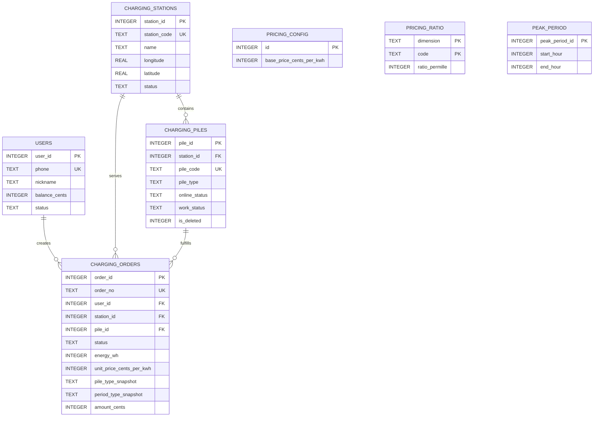
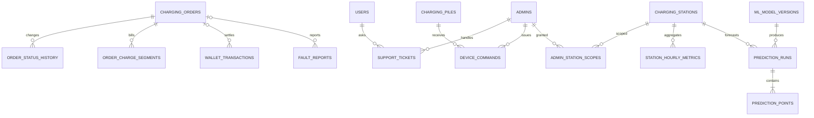
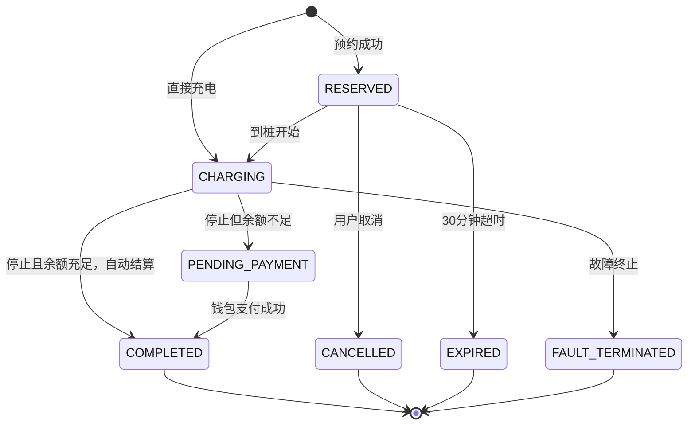
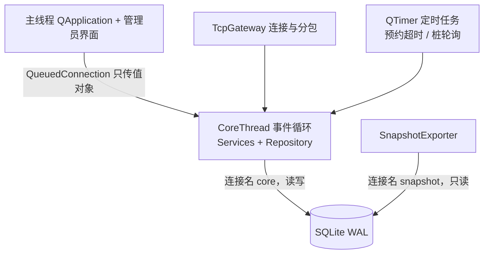

# 东软电动汽车充电桩应用管理平台：数据库目标模型（扩展参考草案）

> 文档版本：V1.2-reference.1
>
> 扩展状态：**候选设计，尚未激活**
>
> 目标环境：Ubuntu 22.04+、Qt 6.2+、SQLite 3、C++/Qt Widgets
>
> 当前权威：[Demo 数据库设计](../design/demo-database-design.md)、[Demo 整体接口契约](../../contracts/overall-interface-v1.md)
>
> 本文定位：保留早期 24 表目标态、事务和运维方案，供未来按功能包迁移时参考。

> [!CAUTION]
> 本文不是当前课程 Demo 的实现基线。严禁把 §5 的整库 DDL 执行到已有五表 Demo 数据库：五张同名表会被 `CREATE TABLE IF NOT EXISTS` 跳过，而依赖新列的其他表、索引和视图仍会继续创建，形成不可用的“半迁移数据库”。实际复核已出现缺少 `is_deleted`、`reservation_expires_at`、`station_code` 以及外键不匹配。扩展必须使用 §14 的编号增量迁移或新库重建路线。

> **V1.2 变更摘要**（相对 V1.1）
>
> 1. **连接模型改为双连接**（§6.1 重写）：废弃"只读线程池 + 单写线程"，改为 CoreThread 独占一个读写连接 `core` + 快照导出专用只读连接 `snapshot`，全进程共 2 个。依据《模块接口规划》§1 与参考项目 QTChatroom。
> 2. **§1.2 边界 2/3 同步修订**：删除"写队列"表述；明确连接必须在 CoreThread 内部创建。
> 3. **补齐 `users` 三列**（缺口 G2，需求 4/7）：`last_lng` / `last_lat` / `last_location_label`，支撑"用户之前手动设置的位置"作为导航起点。
> 4. **新增 `faq_entries` 表**（缺口 G3，需求 13）：同时供客服界面的常见问题快捷按钮与无网时 `CannedLlm` 的兜底回答使用。
> 5. **§8.2 补齐 5 条消息**（缺口 G1，需求 31）：`admin.account.list/create/update/password.change` 与 `support.faq.list`。
> 6. **§8 新增 8.0 节**：历史上曾说明数据库文档与协议文档的分工；当前网络事实源已经统一为 [`contracts/overall-interface-v1.md`](../../contracts/overall-interface-v1.md)。
> 7. **§4.3 补充缓存策略说明**（需求 41）。
> 8. **头像传输方式定案**（缺口 G5）与 **ML 输出边界声明**（缺口 G4）。
> 9. **修正停用站点的可用桩统计**：`v_station_runtime_summary.available_pile_count` 增加站点 `ACTIVE` 条件。
> 10. **补齐订单—电桩状态反向一致性检查**：新增 A2，可发现活跃订单与桩 `work_status` 不一致。

> **V1.1 变更摘要**（相对 V1.0）
>
> 1. **计价改为统一折算比例**：移除 `tariff_rules`，新增 `pricing_config` / `pricing_ratio` / `peak_period`（需求 6「计价规则对所有充电桩是一样的内容」）。
> 2. **补齐 6 条能造成脏数据的约束**：`RESERVED` 必须有到期时间、`DIRECT` 不得伪装预约、有电量必须有金额、结算态必须有三个快照、一笔支付只能退款一次、待支付订单纳入用户活跃单唯一索引（需求 8）。
> 3. **月违约次数落地**（需求 9）：从 `EXPIRED` 订单按业务月派生，不设计数列。
> 4. **营收口径修正**：`v_daily_revenue_cn` 原先漏减退款，会把全额退款的订单算成收入。
> 5. **`is_deleted` 与 `DISABLED` 分离**：原设计中停用坏桩会让在线率不降反升。
> 6. **新增 `support_tickets`**（需求 13 AI 客服转人工）。
> 7. `synchronous` 由 `FULL` 降为 WAL 下推荐的 `NORMAL`；种子数据由 30 天提到 90 天且改为聚合生成。

## 1. 设计结论与边界

### 1.1 总体结论

数据库采用“**服务端集中访问 SQLite**”的单一事实源架构：Qt 用户端、Qt 管理端、Web 大屏和机器学习脚本均不得绕过业务服务直接修改数据库。所有会改变订单、设备或余额的操作都由 TCP 业务服务执行校验、事务和审计。

本文目标态共列出 24 张候选表，分为五层。它们不是必须整体启用的“首版”，应按 §14 功能包逐项迁移：

| 层次 | 作用 | 主要表 |
| --- | --- | --- |
| 身份与权限 | 用户、管理员、会话、站点授权 | `users`、`admins`、`auth_sessions`、`admin_station_scopes` |
| 站桩与计价 | 站点、电桩、统一折算比例计价 | `charging_stations`、`charging_piles`、`pricing_config`、`pricing_ratio`、`peak_period` |
| 核心交易 | 预约、充电、结算和钱包 | `charging_orders`、`order_charge_segments`、`order_status_history`、`wallet_transactions` |
| 运维与可靠性 | 报修、客服、知识库、设备命令、审计、幂等 | `fault_reports`、`support_tickets`、`faq_entries`、`device_commands`、`audit_logs`、`idempotency_records` |
| 统计与智能 | 小时聚合、模型和预测曲线 | `station_hourly_metrics`、`ml_model_versions`、`prediction_runs`、`prediction_points` |

### 1.2 必须遵守的工程边界

1. **客户端不直连数据库。** 数据库文件只部署在业务服务所在主机，避免绕过状态机、权限和审计。
2. **SQLite 只允许一个同时写事务。** WAL 模式可让读写并行，但不能产生多个同时写入者，因此预约、停止充电和支付必须是短事务。本项目通过"业务读写全部在 CoreThread 单连接内串行执行"从结构上保证这一点（见 6.1）。SQLite 官方说明 WAL 仍然只有一个写入者。[SQLite WAL](https://sqlite.org/wal.html)
3. **连接必须在使用它的线程内部创建。** `QSqlDatabase` 只能由创建它的线程访问；不得把连接对象或 `QSqlQuery` 跨线程传递，也不得在 `main()` 中建好再交给工作线程。[Qt SQL 线程规则](https://doc.qt.io/qt-6/threads-modules.html#threads-and-the-sql-module)
4. **外键按连接开启。** SQLite 外键约束需要每个连接显式执行 `PRAGMA foreign_keys=ON`，不能依赖默认值。[SQLite 外键](https://sqlite.org/foreignkeys.html)
5. **业务金额不用浮点数。** 金额保存为“分” (`INTEGER`)，电量保存为 Wh (`INTEGER`)，展示时再换算为元和 kWh，避免二进制浮点累计误差。
6. **时间统一存 UTC。** 数据库以 ISO 8601 UTC 文本保存，如 `2026-09-02T08:30:15.123Z`；接口同样使用 UTC。中国区运营报表按 `Asia/Shanghai`（UTC+8）换算业务日。
7. **历史数据不物理删除。** 有订单引用的站点、电桩、用户、管理员和计价规则只停用；订单、钱包流水和审计日志原则上只追加，不覆盖历史事实。
8. **扩展启用后 Mock 与真实实现遵守同一约束。** 只有当流水、审计或设备命令功能包被激活后，模拟操作才必须写对应正式记录；激活前继续遵守 Demo 契约，不提前造空表。

### 1.3 来源要求到设计的对应

| 项目要求 | 数据库落点 | 接口落点 |
| --- | --- | --- |
| 手机号登录、自动创建用户、个人中心 | `users`、`auth_sessions` | `auth.user.login`、`user.profile.get/update` |
| 可选的跨设备位置同步 | 激活位置同步扩展后才增加 `users.last_lng/last_lat/last_location_label` | 另行扩展资料接口；当前请求坐标不入库 |
| 附近站点、站点详情、桩状态和价格 | `charging_stations`、`charging_piles`、`pricing_config`/`pricing_ratio`/`peak_period`、`v_station_runtime_summary` | `station.list/detail` |
| 预约—充电—计费—支付闭环 | `charging_orders`、状态历史、计费段、钱包流水 | `order.reserve/start/stop/pay` |
| 多人预约冲突和未支付拦截 | 条件更新、部分唯一索引、短写事务 | `40901/40902/40903` 冲突响应 |
| 月违约 3 次禁止预约 | `charging_orders.status='EXPIRED'` 按业务月派生 | `40905` 违约超限 |
| 管理端站桩、用户、订单、营收 | 核心表、审计表、统计视图 | `admin.*`、`metrics.*` |
| 模拟远程重启、故障处理 | `device_commands`、`fault_reports`、`audit_logs` | `admin.pile.restart`、`fault.*` |
| AI 客服与转人工 | `support_tickets`、`faq_entries` | `support.ask`、`support.escalate`、`support.faq.list` |
| 管理员账号与权限管理 | `admins`、`admin_station_scopes` | `admin.account.list/create/update/password.change` |
| Web 大屏 | 只读视图、小时聚合、预测表 | `/api/v1/dashboard/*` 只读接口 |
| 1/6/24 小时负荷预测 | `station_hourly_metrics`、模型、预测运行和点 | `prediction.latest` |
| Socket、多线程、错误处理 | 幂等表、审计表、连接规范 | 4 字节长度头 + JSON、标准错误码 |

## 2. 概念结构设计

### 2.1 核心业务实体、属性和关系



计价是**全局单例**，不与任何站点关联：`pricing_config` 恒一行给基准价，`pricing_ratio` 给桩型和时段两个维度的折算比例，`peak_period` 给峰时小时区间。订单只保存算完的单价与两个维度快照，不引用计价表主键，因此调价永远不会影响历史账单。

核心含义：

- 一个用户可有多个历史订单，但同一时刻最多一个“预约中、充电中或待支付”订单。
- 一个电站包含多个电桩；电桩编号全局唯一。
- 全平台共用一套计价参数，所有站点同桩型同时段价格一致（需求 6）。
- 订单保存单价和桩型/时段快照；后续调价不改变历史账单。
- 电桩在线状态和工作状态分离：离线不等于故障，闲置也不代表可用；“可用”必须同时满足在线、闲置、未删除和所属站启用。

### 2.2 支撑实体关系



支撑表承担三类职责：

- **可追溯：**订单状态历史、钱包流水、设备命令和审计日志只追加，回答“谁在何时做了什么、结果如何”。
- **可恢复：**会话、请求幂等记录和订单当前进度支持断线重试、客户端重启和重复请求。
- **可分析：**小时聚合表与预测表隔离在线业务表，避免大屏和模型反复扫描全部订单。

## 3. 状态机与跨实体约束

### 3.1 订单状态机



| 状态码 | 中文 | 允许后继 | 关键约束 |
| --- | --- | --- | --- |
| `RESERVED` | 预约中 | `CHARGING`、`CANCELLED`、`EXPIRED` | 有 `reservation_expires_at`；桩为 `RESERVED` |
| `CHARGING` | 充电中 | `COMPLETED`、`PENDING_PAYMENT`、`FAULT_TERMINATED` | 桩为 `CHARGING`；持续更新电量和时长 |
| `PENDING_PAYMENT` | 待支付 | `COMPLETED` | 桩已释放；余额不足时保持本状态 |
| `COMPLETED` | 已完成 | 无 | 必须有成功支付流水和 `paid_at` |
| `CANCELLED` | 已取消 | 无 | 不产生费用；释放预约桩 |
| `EXPIRED` | 预约违约 | 无 | 不产生费用；释放预约桩；计入月违约 |
| `FAULT_TERMINATED` | 故障终止 | 无 | 保留模拟电量和故障原因，但按当前需求不收费 |

数据库 `CHECK` 负责限定状态集合；“哪些状态可以互转”和“状态变化时桩应变为什么”由服务层事务负责，不能由界面直接 `UPDATE`。

**月违约次数口径（需求 9）**：违约**只由 `EXPIRED` 产生**，用户主动 `CANCELLED` 不计违约（需求 9 原文是“未取消且未使用”才违约）。次数**不设计数列**，一律从订单表按中国业务月实时派生，避免月初重置定时任务和缓存不一致：

```sql
-- 本月违约次数；累计 3 次后本月禁止预约
SELECT COUNT(*) FROM charging_orders
WHERE user_id = :uid
  AND status = 'EXPIRED'
  AND strftime('%Y-%m', created_at, '+8 hours') = strftime('%Y-%m', 'now', '+8 hours');
```

该查询走 `idx_orders_user_status_created`，不需要额外索引。预约事务、`user.profile.get` 和管理端用户详情必须调用同一个方法，不得各自实现。

### 3.2 电桩状态

| 维度 | 值 | 说明 |
| --- | --- | --- |
| `online_status` | `ONLINE`、`OFFLINE` | 连接/心跳维度 |
| `work_status` | `IDLE`、`RESERVED`、`CHARGING`、`FAULT`、`DISABLED` | 业务占用与运维维度 |
| `is_deleted` | `0`、`1` | 软删除标记，与 `DISABLED` 分离 |

`DISABLED` 与 `is_deleted` 必须分开，不能一值兼两职：`DISABLED` 表示“管理员临时停用（如待维修）”，桩仍属于该站的设备资产；`is_deleted=1` 表示“设备已拆除”，退出所有统计。若用 `DISABLED` 兼作软删标记，则**运维停用坏桩反而会让在线率分母变小、数字变好看**（停了 3 个坏桩在线率不降反升），大屏上无法解释。因此在线率分母一律用 `is_deleted = 0`。

关键不变量：

- 可预约/可直接充电 = 站点 `ACTIVE` 且桩 `is_deleted=0`、`ONLINE + IDLE`。
- `RESERVED` 桩必须且只能对应一张 `RESERVED` 订单。
- `CHARGING` 桩必须且只能对应一张 `CHARGING` 订单。
- 订单正常停止时总会释放桩；余额足够则在同一 Service 事务中扣款、记 PAYMENT 流水并直接进入 `COMPLETED`，余额不足才进入 `PENDING_PAYMENT`。两种结果都与后续设备占用解耦。
- 离线、故障、停用、已删除的桩不能创建新订单；正在预约或充电的桩不能由管理员直接停用或删除。
- `OFFLINE` 与 `IDLE` 可以并存，表示设备当前没有业务但网络不可达；查询可用桩时仍会排除它。

### 3.3 计价口径

需求一览表第 6 条明确“计价规则**对所有充电桩是一样的内容**”，因此本平台**不做按站点定价**，采用「一个基准价 × 两个折算比例」的统一模型：

$$
单价（分/kWh） = \operatorname{round}\left(\frac{基准价 \times 桩型比例 \times 时段比例}{1000000}\right)
$$

$$
金额（分） = \operatorname{round}\left(\frac{电量（Wh） \times 单价（分/kWh）}{1000}\right)
$$

比例统一用**千分数整数**保存（`1500` 表示 1.5 倍），避免浮点误差。默认档位：

| 维度 | 取值 | 比例 | 含义 |
| --- | --- | --- | --- |
| 基准价 | — | `100` 分/kWh | 1.00 元/度 |
| `PILE_TYPE` | `FAST` | `1500` | 快充 1.5 倍 |
| `PILE_TYPE` | `SLOW` | `1000` | 慢充 1.0 倍 |
| `PERIOD` | `PEAK` | `1200` | 峰时 1.2 倍 |
| `PERIOD` | `NORMAL` | `1000` | 平时 1.0 倍 |

四种组合的单价：快充峰时 1.80、快充平时 1.50、慢充峰时 1.20、慢充平时 1.00 元/度。

计价规则：

- **两次取整，各取一次，不得回算。** 开始充电时算出 `unit_price_cents_per_kwh` 并立即写入订单快照；结算时用该快照乘电量再取整得 `amount_cents`。任何界面和报表都**不得**用「基准价 × 比例」重新推导历史账单。
- **时段在开单时冻结。** 订单以 `charging_started_at` 落在哪个时段来定 `period_type_snapshot`，跨峰谷不重新计价。首版就是这个口径，`order_charge_segments` 作为将来真做分段计费的预留表，每单只写一段或暂不写均可。
- **订单必须保存三个快照**：`unit_price_cents_per_kwh`（结算依据）、`pile_type_snapshot`、`period_type_snapshot`（账单可解释性）。有了后两个，界面可以展示“1.00 × 1.5 × 1.2 = 1.80 元/度”的推导过程，而不是只给一个数字。
- **⚠️ 峰段跨零点必须拆两行。** `peak_period` 的 `CHECK (start_hour < end_hour)` 无法表达 23:00–07:00 这种跨午夜区间，必须拆成 `[23,24)` 和 `[0,7)` 两条记录。这不只是种子数据的写法要求，而是计价服务和管理端配置界面都必须遵守的约束。
- 峰段表只有个位数行，重叠与否肉眼可查，因此**不需要**在服务层实现跨行重叠校验事务。这是相对按站点定价方案省下的一个模块。

> **设计变更说明：** V1.0 曾采用 `tariff_rules(station_id, pile_type, start_minute, end_minute, unit_price_cents_per_kwh, effective_from/to)` 按站点存显式单价。该方案允许 A 站快充 1.8 元、B 站快充 2.0 元，与需求第 6 条冲突，且需要额外实现“同站点、同桩型、生效期与日内时段四维不重叠”的跨行校验。V1.1 起改为本节的统一折算比例模型，`tariff_rules` 表整体移除。

## 4. 逻辑结构设计

### 4.1 关系模式总览

| 表名 | 主键 | 主要外键 | 用途和删除策略 |
| --- | --- | --- | --- |
| `schema_migrations` | `version` | — | 记录已执行迁移；不可随意删除 |
| `users` | `user_id` | — | 用户、缓存余额与最后定位；只冻结不删除 |
| `admins` | `admin_id` | — | 管理员、角色和密码哈希；只停用不删除 |
| `auth_sessions` | `session_id` | 用户或管理员 | 统一会话；退出/冻结时撤销 |
| `charging_stations` | `station_id` | — | 电站；历史关联存在时只停用 |
| `admin_station_scopes` | 复合主键 | 管理员、站点 | 站点管理员数据范围 |
| `charging_piles` | `pile_id` | 站点 | 电桩双状态和累计值；停用或软删，不物理删除 |
| `pricing_config` | `id`（恒为 1） | — | 全局基准价，单行配置 |
| `pricing_ratio` | `(dimension, code)` | — | 桩型与时段折算比例（千分数） |
| `peak_period` | `peak_period_id` | — | 峰时小时区间；跨零点拆两行 |
| `charging_orders` | `order_id` | 用户、站点、桩 | 订单当前态和账单快照；不删除 |
| `order_charge_segments` | `segment_id` | 订单 | 分段计价扩展与复核依据 |
| `order_status_history` | `history_id` | 订单 | 状态审计，只追加 |
| `wallet_transactions` | `wallet_txn_id` | 用户、订单 | 充值/支付/退款/调整不可变流水 |
| `fault_reports` | `fault_report_id` | 用户、订单、站、桩、管理员 | 报修闭环 |
| `support_tickets` | `support_ticket_id` | 用户、管理员 | AI 客服问答与转人工工单 |
| `faq_entries` | `faq_id` | — | 常见问题知识库；供快捷按钮与无网兜底回答 |
| `device_commands` | `command_id` | 桩、管理员 | 模拟重启/启停/修复命令日志 |
| `audit_logs` | `audit_id` | — | 通用审计；多态对象使用文本标识 |
| `idempotency_records` | `request_id` | — | 写请求去重与响应重放 |
| `station_hourly_metrics` | 复合主键 | 站点 | 大屏与模型的小时聚合事实 |
| `ml_model_versions` | `model_version_id` | — | 模型、训练区间和评估指标 |
| `prediction_runs` | `prediction_run_id` | 站点、模型 | 一次 1/6/24 小时预测任务 |
| `prediction_points` | `prediction_point_id` | 预测任务 | 预测曲线上的时间点 |

### 4.2 字段与类型统一规则

| 数据类别 | SQLite 类型 | 规则 |
| --- | --- | --- |
| 内部主键 | `INTEGER PRIMARY KEY` | 服务端生成；接口优先暴露业务编号而不是连续主键 |
| 业务编号 | `TEXT UNIQUE` | 订单 `ORD...`、站点 `ST...`、电桩 `PILE...`、流水 `WT...` |
| 金额 | `INTEGER` | 单位为分，非负余额，流水金额允许正负但不得为 0 |
| 电量 | `INTEGER` | 单位 Wh；接口展示时除以 1000 |
| 功率 | `REAL` | 单位 kW，必须大于 0；测量/预测允许小数 |
| 经纬度 | `REAL` | 经度 `[-180,180]`，纬度 `[-90,90]` |
| 时间点 | `TEXT` | UTC ISO 8601 且带毫秒与 `Z`；通过 Qt `ISODateWithMs` 序列化 |
| 枚举 | `TEXT + CHECK` | 可读、便于 Qt/JSON 映射；变更需迁移 |
| 布尔值 | `INTEGER` | 仅允许 `0/1` |
| JSON 扩展 | `TEXT` | 用于日志详情和幂等响应，不在核心字段中塞业务 JSON |

SQLite 采用动态类型，因此即使声明了 `INTEGER`，应用仍需绑定正确类型并保留 `CHECK`。Qt 官方也提示 SQLite 字段声明并不等同于强制类型。[Qt QSQLITE 驱动](https://doc.qt.io/qt-6/sql-driver.html#qsqlite-for-sqlite-version-3-and-above)

### 4.3 规范化和可控冗余

- 模型总体满足第三范式：站、桩、用户、管理员、计价参数和订单各自保存自己的事实。
- `charging_orders.station_id` 看似可经由桩推导，但保留它用于历史查询和统计；同时用复合外键保证订单中的站与桩归属一致。
- `charging_orders` 的 `unit_price_cents_per_kwh`、`pile_type_snapshot`、`period_type_snapshot` 是**刻意冗余的账单快照**，不引用计价表主键。理由是计价参数会被管理员修改，而历史账单必须永久可复现、可解释。
- `users.balance_cents` 是钱包流水的性能缓存。每次余额变化必须与流水在同一事务完成，并定期执行余额—流水对账。
- `charging_piles.cumulative_charge_count/seconds` 是管理端高频展示缓存，只在订单成功结束事务中累计；权威历史仍是订单。
- `station_hourly_metrics` 是可重建聚合表，不可作为订单或钱包的权威来源。
- **月违约次数不冗余**，一律从 `charging_orders` 派生（见 3.1），避免月初重置任务和缓存不一致。
- **用户登录状态不冗余**，从 `auth_sessions` 派生（`revoked_at IS NULL AND expires_at > now`），不得在 `users` 上加 `is_online` 列。

**需求 41「数据库缓存」的落地方式：** 分两层，都不引入外部中间件。

| 层次 | 内容 | 失效策略 |
| --- | --- | --- |
| 表内冗余（已有） | `users.balance_cents`、`charging_piles.cumulative_*`、`station_hourly_metrics` | 与权威数据在同一事务内更新；定期用 7.3 对账 |
| 进程内缓存（新增） | CoreThread 内一个 `QCache`，只缓存**低频变更、高频读取**的数据：`pricing_config`/`pricing_ratio`/`peak_period` 三张计价表、站点静态信息（名称、地址、经纬度） | **写时立即失效**：管理员改价或改站点信息的事务提交后，同步清空对应缓存项 |

进程内缓存能成立的前提是 6.1 的单线程模型——缓存与写事务在同一线程内串行执行，不存在"读到半更新状态"的窗口，因此不需要读写锁。
**不缓存**订单、桩状态、余额：这些是高频变更数据，缓存收益为负。

**头像默认裁决：** 当前头像只存客户端本地配置，服务端数据库不保存客户端文件路径，也不接收图片二进制。需要跨设备同步时应单独激活资产扩展，增加服务端资源表和 `users.avatar_asset_id`，并使用受限上传接口；不要在普通业务 JSON 中发送大块 Base64。

**机器学习输出的边界（定案）：** `ml_model_versions` / `prediction_runs` / `prediction_points` 三表的字段（`mae_kw`、`predicted_load_kw` 等）**只支持回归型负荷预测**，即需求 43（负荷预测）、45（拥堵预警）、44（推荐排序，消费预测结果）。
需求 46（异常/故障风险）、47（用户行为聚类）、48（区域调度建议）的输出是分类标签与文本建议，**本版不设计对应表，不实现**。如后续要做，追加一张通用 `ml_insights(target_type, target_id, insight_type, level, message, generated_at)`，不要往现有三表里塞。

## 5. 目标态空库结构快照（仅供设计参考）

> [!WARNING]
> 以下 SQL 只用于理解并在全新空库中验证目标模型，不是从 Demo 升级的迁移脚本。严禁在已有 Demo 数据库执行；`CREATE TABLE IF NOT EXISTS` 不会给同名表补列，却会继续创建依赖新列的对象。真正扩展时必须编写新的编号迁移并做数据映射。

```sql
PRAGMA foreign_keys = ON;

CREATE TABLE IF NOT EXISTS schema_migrations (
    version              INTEGER PRIMARY KEY,
    name                 TEXT NOT NULL UNIQUE,
    checksum_sha256      TEXT NOT NULL,
    applied_at           TEXT NOT NULL
                         DEFAULT (strftime('%Y-%m-%dT%H:%M:%fZ', 'now'))
);

-- 注意：users 刻意没有密码列。需求 1 是「11 位手机号免密登录，不存在则自动注册」，
-- 因此用户侧不存储任何口令。只有 admins 表有 password_hash（需求 21 账号密码登录）。
CREATE TABLE IF NOT EXISTS users (
    user_id              INTEGER PRIMARY KEY,
    phone                TEXT NOT NULL UNIQUE
                         CHECK (length(phone) = 11 AND phone NOT GLOB '*[^0-9]*'),
    nickname             TEXT NOT NULL CHECK (length(trim(nickname)) BETWEEN 1 AND 32),
    balance_cents        INTEGER NOT NULL DEFAULT 0 CHECK (balance_cents >= 0),
    status               TEXT NOT NULL DEFAULT 'ACTIVE'
                         CHECK (status IN ('ACTIVE', 'FROZEN')),
    -- 需求 4/7：用户手动设置的定位，作为下次导航的默认起点。三列同生同灭。
    last_lng             REAL CHECK (last_lng BETWEEN -180.0 AND 180.0),
    last_lat             REAL CHECK (last_lat BETWEEN -90.0 AND 90.0),
    last_location_label  TEXT CHECK (last_location_label IS NULL
                                     OR length(trim(last_location_label)) BETWEEN 1 AND 128),
    registered_at        TEXT NOT NULL
                         DEFAULT (strftime('%Y-%m-%dT%H:%M:%fZ', 'now')),
    updated_at           TEXT NOT NULL
                         DEFAULT (strftime('%Y-%m-%dT%H:%M:%fZ', 'now')),
    version              INTEGER NOT NULL DEFAULT 0 CHECK (version >= 0),
    -- 经纬度要么都有要么都没有，避免出现只有纬度的半截坐标
    CHECK ((last_lng IS NULL) = (last_lat IS NULL))
);

CREATE TABLE IF NOT EXISTS admins (
    admin_id             INTEGER PRIMARY KEY,
    username             TEXT NOT NULL UNIQUE CHECK (length(username) BETWEEN 3 AND 32),
    password_hash        TEXT NOT NULL,
    password_algorithm   TEXT NOT NULL DEFAULT 'ARGON2ID',
    display_name         TEXT NOT NULL CHECK (length(trim(display_name)) BETWEEN 1 AND 32),
    role                 TEXT NOT NULL
                         CHECK (role IN ('SYS_ADMIN', 'STATION_ADMIN', 'USER_ADMIN')),
    status               TEXT NOT NULL DEFAULT 'ACTIVE'
                         CHECK (status IN ('ACTIVE', 'DISABLED')),
    must_change_password INTEGER NOT NULL DEFAULT 1
                         CHECK (must_change_password IN (0, 1)),
    last_login_at        TEXT,
    created_at           TEXT NOT NULL
                         DEFAULT (strftime('%Y-%m-%dT%H:%M:%fZ', 'now')),
    updated_at           TEXT NOT NULL
                         DEFAULT (strftime('%Y-%m-%dT%H:%M:%fZ', 'now')),
    version              INTEGER NOT NULL DEFAULT 0 CHECK (version >= 0)
);

CREATE TABLE IF NOT EXISTS auth_sessions (
    session_id           TEXT PRIMARY KEY,
    token_hash           TEXT NOT NULL UNIQUE,
    principal_type       TEXT NOT NULL CHECK (principal_type IN ('USER', 'ADMIN')),
    user_id              INTEGER REFERENCES users(user_id) ON DELETE CASCADE,
    admin_id             INTEGER REFERENCES admins(admin_id) ON DELETE CASCADE,
    client_type          TEXT NOT NULL CHECK (client_type IN ('USER_QT', 'ADMIN_QT', 'WEB')),
    issued_at            TEXT NOT NULL,
    expires_at           TEXT NOT NULL,
    last_seen_at         TEXT NOT NULL,
    revoked_at           TEXT,
    CHECK (
        (principal_type = 'USER' AND user_id IS NOT NULL AND admin_id IS NULL) OR
        (principal_type = 'ADMIN' AND admin_id IS NOT NULL AND user_id IS NULL)
    ),
    CHECK (expires_at > issued_at),
    CHECK (revoked_at IS NULL OR revoked_at >= issued_at)
);

CREATE TABLE IF NOT EXISTS charging_stations (
    station_id           INTEGER PRIMARY KEY,
    station_code         TEXT NOT NULL UNIQUE CHECK (length(station_code) BETWEEN 3 AND 32),
    name                 TEXT NOT NULL CHECK (length(trim(name)) BETWEEN 1 AND 64),
    address              TEXT NOT NULL CHECK (length(trim(address)) BETWEEN 1 AND 256),
    region_code          TEXT,
    longitude            REAL NOT NULL CHECK (longitude BETWEEN -180.0 AND 180.0),
    latitude             REAL NOT NULL CHECK (latitude BETWEEN -90.0 AND 90.0),
    status               TEXT NOT NULL DEFAULT 'ACTIVE'
                         CHECK (status IN ('ACTIVE', 'DISABLED')),
    created_at           TEXT NOT NULL
                         DEFAULT (strftime('%Y-%m-%dT%H:%M:%fZ', 'now')),
    updated_at           TEXT NOT NULL
                         DEFAULT (strftime('%Y-%m-%dT%H:%M:%fZ', 'now')),
    version              INTEGER NOT NULL DEFAULT 0 CHECK (version >= 0)
);

CREATE TABLE IF NOT EXISTS admin_station_scopes (
    admin_id             INTEGER NOT NULL REFERENCES admins(admin_id) ON DELETE CASCADE,
    station_id           INTEGER NOT NULL REFERENCES charging_stations(station_id) ON DELETE CASCADE,
    granted_at           TEXT NOT NULL
                         DEFAULT (strftime('%Y-%m-%dT%H:%M:%fZ', 'now')),
    granted_by_admin_id  INTEGER REFERENCES admins(admin_id) ON DELETE SET NULL,
    PRIMARY KEY (admin_id, station_id)
);

CREATE TABLE IF NOT EXISTS charging_piles (
    pile_id                     INTEGER PRIMARY KEY,
    station_id                  INTEGER NOT NULL
                                REFERENCES charging_stations(station_id) ON DELETE RESTRICT,
    pile_code                   TEXT NOT NULL UNIQUE CHECK (length(pile_code) BETWEEN 3 AND 32),
    pile_type                   TEXT NOT NULL CHECK (pile_type IN ('FAST', 'SLOW')),
    rated_power_kw              REAL NOT NULL CHECK (rated_power_kw > 0),
    online_status               TEXT NOT NULL DEFAULT 'OFFLINE'
                                CHECK (online_status IN ('ONLINE', 'OFFLINE')),
    work_status                 TEXT NOT NULL DEFAULT 'IDLE'
                                CHECK (work_status IN
                                  ('IDLE', 'RESERVED', 'CHARGING', 'FAULT', 'DISABLED')),
    is_deleted                  INTEGER NOT NULL DEFAULT 0 CHECK (is_deleted IN (0, 1)),
    last_heartbeat_at           TEXT,
    cumulative_charge_count     INTEGER NOT NULL DEFAULT 0
                                CHECK (cumulative_charge_count >= 0),
    cumulative_charge_seconds   INTEGER NOT NULL DEFAULT 0
                                CHECK (cumulative_charge_seconds >= 0),
    created_at                  TEXT NOT NULL
                                DEFAULT (strftime('%Y-%m-%dT%H:%M:%fZ', 'now')),
    updated_at                  TEXT NOT NULL
                                DEFAULT (strftime('%Y-%m-%dT%H:%M:%fZ', 'now')),
    version                     INTEGER NOT NULL DEFAULT 0 CHECK (version >= 0),
    -- 已删除的桩不得残留业务占用状态
    CHECK (is_deleted = 0 OR work_status NOT IN ('RESERVED', 'CHARGING')),
    UNIQUE (pile_id, station_id)
);

-- ============ 统一折算比例计价（需求 6：所有充电桩计价规则一致）============
-- 单价 = round(基准价 × 桩型比例 × 时段比例 / 1000000)
-- 三张表都是全局单例配置，不按站点区分。

CREATE TABLE IF NOT EXISTS pricing_config (
    id                          INTEGER PRIMARY KEY CHECK (id = 1),  -- 恒一行
    base_price_cents_per_kwh    INTEGER NOT NULL
                                CHECK (base_price_cents_per_kwh > 0),
    updated_by_admin_id         INTEGER REFERENCES admins(admin_id) ON DELETE SET NULL,
    updated_at                  TEXT NOT NULL
                                DEFAULT (strftime('%Y-%m-%dT%H:%M:%fZ', 'now'))
);

CREATE TABLE IF NOT EXISTS pricing_ratio (
    dimension                   TEXT NOT NULL
                                CHECK (dimension IN ('PILE_TYPE', 'PERIOD')),
    code                        TEXT NOT NULL,
    ratio_permille              INTEGER NOT NULL
                                CHECK (ratio_permille BETWEEN 1 AND 100000),
    label                       TEXT NOT NULL CHECK (length(trim(label)) BETWEEN 1 AND 32),
    updated_at                  TEXT NOT NULL
                                DEFAULT (strftime('%Y-%m-%dT%H:%M:%fZ', 'now')),
    PRIMARY KEY (dimension, code),
    -- 枚举取值与桩型、时段定义保持一致，防止写入无法命中的比例行
    CHECK (
        (dimension = 'PILE_TYPE' AND code IN ('FAST', 'SLOW')) OR
        (dimension = 'PERIOD'    AND code IN ('PEAK', 'NORMAL'))
    )
) WITHOUT ROWID;

-- 峰时小时区间，左闭右开 [start_hour, end_hour)。
-- 跨零点（如 23:00-07:00）必须拆成 [23,24) 与 [0,7) 两行，CHECK 不允许 start >= end。
CREATE TABLE IF NOT EXISTS peak_period (
    peak_period_id              INTEGER PRIMARY KEY,
    start_hour                  INTEGER NOT NULL CHECK (start_hour BETWEEN 0 AND 23),
    end_hour                    INTEGER NOT NULL CHECK (end_hour BETWEEN 1 AND 24),
    label                       TEXT NOT NULL CHECK (length(trim(label)) BETWEEN 1 AND 32),
    CHECK (start_hour < end_hour),
    UNIQUE (start_hour, end_hour)
);

CREATE TABLE IF NOT EXISTS charging_orders (
    order_id                    INTEGER PRIMARY KEY,
    order_no                    TEXT NOT NULL UNIQUE CHECK (length(order_no) BETWEEN 10 AND 40),
    user_id                     INTEGER NOT NULL REFERENCES users(user_id) ON DELETE RESTRICT,
    station_id                  INTEGER NOT NULL
                                REFERENCES charging_stations(station_id) ON DELETE RESTRICT,
    pile_id                     INTEGER NOT NULL,
    start_mode                  TEXT NOT NULL CHECK (start_mode IN ('RESERVATION', 'DIRECT')),
    status                      TEXT NOT NULL CHECK (status IN
                                  ('RESERVED', 'CHARGING', 'PENDING_PAYMENT', 'COMPLETED',
                                   'CANCELLED', 'EXPIRED', 'FAULT_TERMINATED')),
    reserved_at                 TEXT,
    reservation_expires_at      TEXT,
    charging_started_at         TEXT,
    charging_ended_at           TEXT,
    paid_at                     TEXT,
    last_meter_at               TEXT,
    duration_seconds            INTEGER NOT NULL DEFAULT 0 CHECK (duration_seconds >= 0),
    energy_wh                   INTEGER NOT NULL DEFAULT 0 CHECK (energy_wh >= 0),
    unit_price_cents_per_kwh    INTEGER CHECK (unit_price_cents_per_kwh > 0),
    -- 账单快照：开始充电时冻结，供界面展示「1.00 × 1.5 × 1.2 = 1.80 元/度」
    pile_type_snapshot          TEXT CHECK (pile_type_snapshot IN ('FAST', 'SLOW')),
    period_type_snapshot        TEXT CHECK (period_type_snapshot IN ('PEAK', 'NORMAL')),
    amount_cents                INTEGER NOT NULL DEFAULT 0 CHECK (amount_cents >= 0),
    fault_reason                TEXT,
    created_at                  TEXT NOT NULL
                                DEFAULT (strftime('%Y-%m-%dT%H:%M:%fZ', 'now')),
    updated_at                  TEXT NOT NULL
                                DEFAULT (strftime('%Y-%m-%dT%H:%M:%fZ', 'now')),
    version                     INTEGER NOT NULL DEFAULT 0 CHECK (version >= 0),
    FOREIGN KEY (pile_id, station_id)
        REFERENCES charging_piles(pile_id, station_id) ON DELETE RESTRICT,
    CHECK (
        (start_mode = 'RESERVATION' AND reserved_at IS NOT NULL) OR
        (start_mode = 'DIRECT')
    ),
    -- 直接充电单不得伪装成预约单
    CHECK (start_mode <> 'DIRECT'
           OR (reserved_at IS NULL AND reservation_expires_at IS NULL)),
    -- RESERVED 必须有到期时间，否则超时扫描永远扫不到，桩被永久占用
    CHECK (status <> 'RESERVED' OR reservation_expires_at IS NOT NULL),
    CHECK (
        status NOT IN ('PENDING_PAYMENT', 'COMPLETED') OR
        (charging_started_at IS NOT NULL AND charging_ended_at IS NOT NULL
         AND unit_price_cents_per_kwh IS NOT NULL
         AND pile_type_snapshot IS NOT NULL
         AND period_type_snapshot IS NOT NULL)
    ),
    -- 有电量就必须有金额，防止「充了 50 度收 0 元」的已完成订单
    CHECK (status NOT IN ('PENDING_PAYMENT', 'COMPLETED')
           OR energy_wh = 0 OR amount_cents > 0),
    CHECK (status <> 'COMPLETED' OR paid_at IS NOT NULL),
    CHECK (status NOT IN ('CANCELLED', 'EXPIRED', 'FAULT_TERMINATED')
           OR amount_cents = 0)
);

CREATE TABLE IF NOT EXISTS order_charge_segments (
    segment_id                  INTEGER PRIMARY KEY,
    order_id                    INTEGER NOT NULL
                                REFERENCES charging_orders(order_id) ON DELETE CASCADE,
    segment_no                  INTEGER NOT NULL CHECK (segment_no > 0),
    segment_started_at          TEXT NOT NULL,
    segment_ended_at            TEXT NOT NULL,
    energy_wh                   INTEGER NOT NULL CHECK (energy_wh >= 0),
    unit_price_cents_per_kwh    INTEGER NOT NULL CHECK (unit_price_cents_per_kwh > 0),
    amount_cents                INTEGER NOT NULL CHECK (amount_cents >= 0),
    UNIQUE (order_id, segment_no),
    CHECK (segment_ended_at >= segment_started_at)
);

CREATE TABLE IF NOT EXISTS order_status_history (
    history_id                  INTEGER PRIMARY KEY,
    order_id                    INTEGER NOT NULL
                                REFERENCES charging_orders(order_id) ON DELETE CASCADE,
    from_status                 TEXT CHECK (from_status IS NULL OR from_status IN
                                  ('RESERVED', 'CHARGING', 'PENDING_PAYMENT', 'COMPLETED',
                                   'CANCELLED', 'EXPIRED', 'FAULT_TERMINATED')),
    to_status                   TEXT NOT NULL CHECK (to_status IN
                                  ('RESERVED', 'CHARGING', 'PENDING_PAYMENT', 'COMPLETED',
                                   'CANCELLED', 'EXPIRED', 'FAULT_TERMINATED')),
    actor_type                  TEXT NOT NULL CHECK (actor_type IN ('USER', 'ADMIN', 'SYSTEM')),
    actor_id                    TEXT,
    reason                      TEXT,
    request_id                  TEXT,
    changed_at                  TEXT NOT NULL
                                DEFAULT (strftime('%Y-%m-%dT%H:%M:%fZ', 'now'))
);

CREATE TABLE IF NOT EXISTS wallet_transactions (
    wallet_txn_id               INTEGER PRIMARY KEY,
    txn_no                      TEXT NOT NULL UNIQUE,
    user_id                     INTEGER NOT NULL REFERENCES users(user_id) ON DELETE RESTRICT,
    txn_type                    TEXT NOT NULL
                                CHECK (txn_type IN ('RECHARGE', 'PAYMENT', 'REFUND', 'ADJUSTMENT')),
    amount_cents                INTEGER NOT NULL CHECK (amount_cents <> 0),
    balance_before_cents        INTEGER NOT NULL CHECK (balance_before_cents >= 0),
    balance_after_cents         INTEGER NOT NULL CHECK (balance_after_cents >= 0),
    order_id                    INTEGER REFERENCES charging_orders(order_id) ON DELETE RESTRICT,
    reversal_of_txn_id          INTEGER REFERENCES wallet_transactions(wallet_txn_id) ON DELETE RESTRICT,
    request_id                  TEXT NOT NULL UNIQUE,
    remark                      TEXT,
    created_at                  TEXT NOT NULL
                                DEFAULT (strftime('%Y-%m-%dT%H:%M:%fZ', 'now')),
    CHECK (balance_after_cents = balance_before_cents + amount_cents),
    CHECK ((txn_type IN ('RECHARGE', 'REFUND') AND amount_cents > 0)
        OR (txn_type = 'PAYMENT' AND amount_cents < 0 AND order_id IS NOT NULL)
        OR (txn_type = 'ADJUSTMENT')),
    CHECK (txn_type <> 'REFUND' OR reversal_of_txn_id IS NOT NULL),
    -- 只有 REFUND 能引用被冲销流水，防止其他类型乱挂
    CHECK (reversal_of_txn_id IS NULL OR txn_type = 'REFUND'),
    CHECK (reversal_of_txn_id IS NULL OR reversal_of_txn_id <> wallet_txn_id)
);

CREATE TABLE IF NOT EXISTS fault_reports (
    fault_report_id             INTEGER PRIMARY KEY,
    report_no                   TEXT NOT NULL UNIQUE,
    user_id                     INTEGER REFERENCES users(user_id) ON DELETE SET NULL,
    order_id                    INTEGER REFERENCES charging_orders(order_id) ON DELETE RESTRICT,
    station_id                  INTEGER NOT NULL
                                REFERENCES charging_stations(station_id) ON DELETE RESTRICT,
    pile_id                     INTEGER NOT NULL,
    fault_type                  TEXT NOT NULL CHECK (length(trim(fault_type)) BETWEEN 1 AND 64),
    description                 TEXT NOT NULL CHECK (length(trim(description)) BETWEEN 1 AND 1000),
    status                      TEXT NOT NULL DEFAULT 'PENDING'
                                CHECK (status IN ('PENDING', 'ACCEPTED', 'PROCESSING',
                                                  'RESOLVED', 'REJECTED')),
    handler_admin_id            INTEGER REFERENCES admins(admin_id) ON DELETE SET NULL,
    handling_note               TEXT,
    submitted_at                TEXT NOT NULL
                                DEFAULT (strftime('%Y-%m-%dT%H:%M:%fZ', 'now')),
    handled_at                  TEXT,
    updated_at                  TEXT NOT NULL
                                DEFAULT (strftime('%Y-%m-%dT%H:%M:%fZ', 'now')),
    FOREIGN KEY (pile_id, station_id)
        REFERENCES charging_piles(pile_id, station_id) ON DELETE RESTRICT
);

-- 需求 13：AI 客服问答与转人工。与 fault_reports 分开——报修针对具体设备，
-- 客服针对用户咨询，两者的处理人、SLA 和统计口径都不同，不要混用一张表。
CREATE TABLE IF NOT EXISTS support_tickets (
    support_ticket_id           INTEGER PRIMARY KEY,
    ticket_no                   TEXT NOT NULL UNIQUE,
    user_id                     INTEGER NOT NULL REFERENCES users(user_id) ON DELETE RESTRICT,
    question                    TEXT NOT NULL CHECK (length(trim(question)) BETWEEN 1 AND 1000),
    ai_answer                   TEXT,
    human_answer                TEXT,
    source                      TEXT NOT NULL DEFAULT 'AI'
                                CHECK (source IN ('AI', 'HUMAN')),
    status                      TEXT NOT NULL DEFAULT 'AI_ANSWERED'
                                CHECK (status IN ('AI_ANSWERED', 'ESCALATED',
                                                  'HUMAN_REPLIED', 'CLOSED')),
    handler_admin_id            INTEGER REFERENCES admins(admin_id) ON DELETE SET NULL,
    created_at                  TEXT NOT NULL
                                DEFAULT (strftime('%Y-%m-%dT%H:%M:%fZ', 'now')),
    escalated_at                TEXT,
    replied_at                  TEXT,
    CHECK (status <> 'AI_ANSWERED' OR ai_answer IS NOT NULL),
    CHECK (status <> 'ESCALATED'   OR escalated_at IS NOT NULL),
    CHECK (status <> 'HUMAN_REPLIED'
           OR (human_answer IS NOT NULL AND handler_admin_id IS NOT NULL
               AND replied_at IS NOT NULL))
);

-- 需求 13：常见问题知识库。一表两用：
--   1) 客服界面顶部的「常见问题快捷按钮」直接读它；
--   2) 无外网时 CannedLlm 用它做关键词兜底回答，保证 AI 客服在答辩机断网时仍可演示。
CREATE TABLE IF NOT EXISTS faq_entries (
    faq_id                      INTEGER PRIMARY KEY,
    category                    TEXT NOT NULL
                                CHECK (length(trim(category)) BETWEEN 1 AND 32),
    question                    TEXT NOT NULL UNIQUE
                                CHECK (length(trim(question)) BETWEEN 1 AND 200),
    answer                      TEXT NOT NULL
                                CHECK (length(trim(answer)) BETWEEN 1 AND 2000),
    -- 空格分隔的关键词，供 CannedLlm 做无网兜底匹配；为空表示只做快捷按钮不参与匹配
    keywords                    TEXT,
    sort_order                  INTEGER NOT NULL DEFAULT 100 CHECK (sort_order >= 0),
    is_active                   INTEGER NOT NULL DEFAULT 1 CHECK (is_active IN (0, 1)),
    updated_at                  TEXT NOT NULL
                                DEFAULT (strftime('%Y-%m-%dT%H:%M:%fZ', 'now'))
);

CREATE TABLE IF NOT EXISTS device_commands (
    command_id                  INTEGER PRIMARY KEY,
    command_no                  TEXT NOT NULL UNIQUE,
    pile_id                     INTEGER NOT NULL REFERENCES charging_piles(pile_id) ON DELETE RESTRICT,
    issued_by_admin_id          INTEGER NOT NULL REFERENCES admins(admin_id) ON DELETE RESTRICT,
    command_type                TEXT NOT NULL
                                CHECK (command_type IN ('RESTART', 'ENABLE', 'DISABLE', 'MARK_REPAIRED')),
    status                      TEXT NOT NULL DEFAULT 'PENDING'
                                CHECK (status IN ('PENDING', 'SUCCESS', 'FAILED', 'TIMEOUT')),
    before_online_status        TEXT CHECK (before_online_status IN ('ONLINE', 'OFFLINE')),
    before_work_status          TEXT CHECK (before_work_status IN
                                  ('IDLE', 'RESERVED', 'CHARGING', 'FAULT', 'DISABLED')),
    after_online_status         TEXT CHECK (after_online_status IN ('ONLINE', 'OFFLINE')),
    after_work_status           TEXT CHECK (after_work_status IN
                                  ('IDLE', 'RESERVED', 'CHARGING', 'FAULT', 'DISABLED')),
    request_id                  TEXT NOT NULL UNIQUE,
    result_message              TEXT,
    issued_at                   TEXT NOT NULL
                                DEFAULT (strftime('%Y-%m-%dT%H:%M:%fZ', 'now')),
    completed_at                TEXT
);

CREATE TABLE IF NOT EXISTS audit_logs (
    audit_id                    INTEGER PRIMARY KEY,
    actor_type                  TEXT NOT NULL CHECK (actor_type IN ('USER', 'ADMIN', 'SYSTEM')),
    actor_id                    TEXT,
    action                      TEXT NOT NULL,
    target_type                 TEXT NOT NULL,
    target_id                   TEXT,
    request_id                  TEXT,
    result_code                 INTEGER NOT NULL,
    client_ip                   TEXT,
    details_json                TEXT,
    created_at                  TEXT NOT NULL
                                DEFAULT (strftime('%Y-%m-%dT%H:%M:%fZ', 'now'))
);

CREATE TABLE IF NOT EXISTS idempotency_records (
    request_id                  TEXT PRIMARY KEY,
    principal_key              TEXT NOT NULL,
    request_type               TEXT NOT NULL,
    payload_sha256              TEXT NOT NULL,
    status                      TEXT NOT NULL
                                CHECK (status IN ('PROCESSING', 'COMPLETED', 'FAILED')),
    response_code               INTEGER,
    response_json               TEXT,
    created_at                  TEXT NOT NULL
                                DEFAULT (strftime('%Y-%m-%dT%H:%M:%fZ', 'now')),
    expires_at                  TEXT NOT NULL
);

CREATE TABLE IF NOT EXISTS station_hourly_metrics (
    station_id                  INTEGER NOT NULL
                                REFERENCES charging_stations(station_id) ON DELETE RESTRICT,
    bucket_started_at           TEXT NOT NULL,
    order_count                 INTEGER NOT NULL DEFAULT 0 CHECK (order_count >= 0),
    completed_order_count       INTEGER NOT NULL DEFAULT 0 CHECK (completed_order_count >= 0),
    energy_wh                   INTEGER NOT NULL DEFAULT 0 CHECK (energy_wh >= 0),
    revenue_cents               INTEGER NOT NULL DEFAULT 0 CHECK (revenue_cents >= 0),
    charging_seconds            INTEGER NOT NULL DEFAULT 0 CHECK (charging_seconds >= 0),
    occupancy_rate_bp           INTEGER NOT NULL DEFAULT 0 CHECK (occupancy_rate_bp BETWEEN 0 AND 10000),
    generated_at                TEXT NOT NULL
                                DEFAULT (strftime('%Y-%m-%dT%H:%M:%fZ', 'now')),
    PRIMARY KEY (station_id, bucket_started_at)
);

CREATE TABLE IF NOT EXISTS ml_model_versions (
    model_version_id            INTEGER PRIMARY KEY,
    model_name                  TEXT NOT NULL,
    version                     TEXT NOT NULL,
    algorithm                   TEXT NOT NULL,
    training_started_at         TEXT NOT NULL,
    training_ended_at           TEXT NOT NULL,
    sample_count                INTEGER NOT NULL CHECK (sample_count > 0),
    mae_kw                      REAL CHECK (mae_kw >= 0),
    rmse_kw                     REAL CHECK (rmse_kw >= 0),
    artifact_path               TEXT NOT NULL,
    status                      TEXT NOT NULL
                                CHECK (status IN ('CANDIDATE', 'ACTIVE', 'RETIRED', 'FAILED')),
    created_at                  TEXT NOT NULL
                                DEFAULT (strftime('%Y-%m-%dT%H:%M:%fZ', 'now')),
    UNIQUE (model_name, version),
    CHECK (training_ended_at >= training_started_at)
);

CREATE TABLE IF NOT EXISTS prediction_runs (
    prediction_run_id           INTEGER PRIMARY KEY,
    station_id                  INTEGER NOT NULL
                                REFERENCES charging_stations(station_id) ON DELETE RESTRICT,
    model_version_id            INTEGER NOT NULL
                                REFERENCES ml_model_versions(model_version_id) ON DELETE RESTRICT,
    forecast_base_at            TEXT NOT NULL,
    horizon_hours               INTEGER NOT NULL CHECK (horizon_hours IN (1, 6, 24)),
    peak_started_at             TEXT,
    peak_ended_at               TEXT,
    summary_congestion_level    TEXT NOT NULL
                                CHECK (summary_congestion_level IN ('LOW', 'MEDIUM', 'HIGH')),
    generated_at                TEXT NOT NULL
                                DEFAULT (strftime('%Y-%m-%dT%H:%M:%fZ', 'now')),
    UNIQUE (station_id, model_version_id, forecast_base_at, horizon_hours),
    CHECK (peak_ended_at IS NULL OR peak_started_at IS NOT NULL),
    CHECK (peak_ended_at IS NULL OR peak_ended_at >= peak_started_at)
);

CREATE TABLE IF NOT EXISTS prediction_points (
    prediction_point_id         INTEGER PRIMARY KEY,
    prediction_run_id           INTEGER NOT NULL
                                REFERENCES prediction_runs(prediction_run_id) ON DELETE CASCADE,
    forecast_at                 TEXT NOT NULL,
    predicted_load_kw           REAL NOT NULL CHECK (predicted_load_kw >= 0),
    predicted_idle_piles        INTEGER NOT NULL CHECK (predicted_idle_piles >= 0),
    congestion_level            TEXT NOT NULL
                                CHECK (congestion_level IN ('LOW', 'MEDIUM', 'HIGH')),
    UNIQUE (prediction_run_id, forecast_at)
);

CREATE INDEX IF NOT EXISTS idx_sessions_principal_expiry
    ON auth_sessions(principal_type, user_id, admin_id, expires_at);
CREATE INDEX IF NOT EXISTS idx_scopes_station
    ON admin_station_scopes(station_id, admin_id);
CREATE INDEX IF NOT EXISTS idx_piles_station_availability
    ON charging_piles(station_id, is_deleted, online_status, work_status, pile_type);
CREATE INDEX IF NOT EXISTS idx_orders_user_status_created
    ON charging_orders(user_id, status, created_at DESC);
CREATE INDEX IF NOT EXISTS idx_orders_pile_status
    ON charging_orders(pile_id, status, created_at DESC);
CREATE INDEX IF NOT EXISTS idx_orders_expiry
    ON charging_orders(status, reservation_expires_at)
    WHERE status = 'RESERVED';
-- 需求 8：待支付订单也必须拦截新订单，因此 PENDING_PAYMENT 纳入唯一约束。
-- 这不影响「支付与设备占用解耦」——桩在进入 PENDING_PAYMENT 时已释放，
-- 被挡住的只是用户，正是需求要的效果。
CREATE UNIQUE INDEX IF NOT EXISTS uq_user_one_active_order
    ON charging_orders(user_id)
    WHERE status IN ('RESERVED', 'CHARGING', 'PENDING_PAYMENT');
CREATE UNIQUE INDEX IF NOT EXISTS uq_pile_one_active_order
    ON charging_orders(pile_id)
    WHERE status IN ('RESERVED', 'CHARGING');
CREATE INDEX IF NOT EXISTS idx_order_history_order_time
    ON order_status_history(order_id, changed_at);
CREATE INDEX IF NOT EXISTS idx_wallet_user_time
    ON wallet_transactions(user_id, created_at DESC);
CREATE INDEX IF NOT EXISTS idx_wallet_order
    ON wallet_transactions(order_id, txn_type);
-- 营收视图按 created_at 分组，需要这个索引；注意 date(created_at,'+8 hours')
-- 是函数包裹列，无法走索引，演示数据量下可接受全表扫描。
CREATE INDEX IF NOT EXISTS idx_wallet_type_time
    ON wallet_transactions(txn_type, created_at);
-- 一笔支付只能被冲销一次，防止重复退款凭空造钱
CREATE UNIQUE INDEX IF NOT EXISTS uq_wallet_one_reversal
    ON wallet_transactions(reversal_of_txn_id)
    WHERE reversal_of_txn_id IS NOT NULL;
CREATE INDEX IF NOT EXISTS idx_fault_status_time
    ON fault_reports(status, submitted_at DESC);
CREATE INDEX IF NOT EXISTS idx_fault_pile_status
    ON fault_reports(pile_id, status);
CREATE INDEX IF NOT EXISTS idx_support_status_time
    ON support_tickets(status, created_at DESC);
CREATE INDEX IF NOT EXISTS idx_support_user_time
    ON support_tickets(user_id, created_at DESC);
CREATE INDEX IF NOT EXISTS idx_faq_active_order
    ON faq_entries(is_active, category, sort_order);
CREATE INDEX IF NOT EXISTS idx_device_commands_pile_time
    ON device_commands(pile_id, issued_at DESC);
CREATE INDEX IF NOT EXISTS idx_audit_actor_time
    ON audit_logs(actor_type, actor_id, created_at DESC);
CREATE INDEX IF NOT EXISTS idx_audit_target_time
    ON audit_logs(target_type, target_id, created_at DESC);
CREATE INDEX IF NOT EXISTS idx_idempotency_expiry
    ON idempotency_records(expires_at);
CREATE INDEX IF NOT EXISTS idx_prediction_latest
    ON prediction_runs(station_id, horizon_hours, forecast_base_at DESC);

-- 在线率分母用 is_deleted=0（设备资产总数），不用 work_status<>'DISABLED'，
-- 否则运维停用坏桩会让分母变小、在线率不降反升，大屏上无法解释。
CREATE VIEW IF NOT EXISTS v_station_runtime_summary AS
SELECT
    s.station_id,
    s.station_code,
    s.name,
    s.address,
    s.longitude,
    s.latitude,
    s.status,
    SUM(CASE WHEN p.is_deleted = 0 THEN 1 ELSE 0 END) AS total_pile_count,
    SUM(CASE WHEN p.is_deleted = 0 AND p.work_status <> 'DISABLED'
             THEN 1 ELSE 0 END) AS enabled_pile_count,
    SUM(CASE WHEN p.is_deleted = 0 AND p.online_status = 'ONLINE'
             THEN 1 ELSE 0 END) AS online_pile_count,
    SUM(CASE WHEN s.status = 'ACTIVE'
                  AND p.is_deleted = 0 AND p.online_status = 'ONLINE'
                  AND p.work_status = 'IDLE'
             THEN 1 ELSE 0 END) AS available_pile_count,
    CASE
      WHEN SUM(CASE WHEN p.is_deleted = 0 THEN 1 ELSE 0 END) = 0 THEN 0.0
      ELSE ROUND(
        100.0 * SUM(CASE WHEN p.is_deleted = 0
                          AND p.online_status = 'ONLINE' THEN 1 ELSE 0 END)
        / SUM(CASE WHEN p.is_deleted = 0 THEN 1 ELSE 0 END), 2)
    END AS online_rate_percent
FROM charging_stations s
LEFT JOIN charging_piles p ON p.station_id = s.station_id
GROUP BY s.station_id;

-- 营收 = 支付流水 - 退款流水。PAYMENT 为负、REFUND 为正，
-- 统一取 SUM(-amount_cents) 即可自然抵消；漏掉 REFUND 会把全额退款的单算成收入。
CREATE VIEW IF NOT EXISTS v_daily_revenue_cn AS
SELECT
    date(w.created_at, '+8 hours') AS business_date,
    o.station_id,
    COUNT(DISTINCT CASE WHEN w.txn_type = 'PAYMENT' THEN o.order_id END)
        AS paid_order_count,
    COUNT(DISTINCT CASE WHEN w.txn_type = 'REFUND' THEN o.order_id END)
        AS refunded_order_count,
    SUM(-w.amount_cents) AS revenue_cents
FROM wallet_transactions w
JOIN charging_orders o ON o.order_id = w.order_id
WHERE w.txn_type IN ('PAYMENT', 'REFUND')
  AND o.status = 'COMPLETED'
GROUP BY date(w.created_at, '+8 hours'), o.station_id;

CREATE VIEW IF NOT EXISTS v_order_detail AS
SELECT
    o.*,
    u.phone,
    u.nickname,
    s.station_code,
    s.name AS station_name,
    p.pile_code,
    p.pile_type,
    p.rated_power_kw
FROM charging_orders o
JOIN users u ON u.user_id = o.user_id
JOIN charging_stations s ON s.station_id = o.station_id
JOIN charging_piles p ON p.pile_id = o.pile_id;

-- ============ 计价参数初始值（属于 001_init.sql 的一部分）============
-- 必须随建表一起写入，否则计价服务查不到基准价，第一笔充电就会失败。
INSERT INTO pricing_config (id, base_price_cents_per_kwh)
VALUES (1, 100)
ON CONFLICT(id) DO NOTHING;

INSERT INTO pricing_ratio (dimension, code, ratio_permille, label) VALUES
    ('PILE_TYPE', 'FAST',   1500, '快充'),
    ('PILE_TYPE', 'SLOW',   1000, '慢充'),
    ('PERIOD',    'PEAK',   1200, '峰时'),
    ('PERIOD',    'NORMAL', 1000, '平时')
ON CONFLICT(dimension, code) DO NOTHING;

-- 峰时区间，左闭右开。跨零点必须拆两行（本例未跨零点）。
INSERT INTO peak_period (start_hour, end_hour, label) VALUES
    (8,  11, '早高峰'),
    (18, 21, '晚高峰')
ON CONFLICT(start_hour, end_hour) DO NOTHING;
```

四种组合算出的单价（供自测核对）：

| 桩型 | 时段 | 计算 | 单价 |
| --- | --- | --- | --- |
| 快充 | 峰时 | `round(100 × 1500 × 1200 / 1000000)` | `180` 分 = 1.80 元/度 |
| 快充 | 平时 | `round(100 × 1500 × 1000 / 1000000)` | `150` 分 = 1.50 元/度 |
| 慢充 | 峰时 | `round(100 × 1000 × 1200 / 1000000)` | `120` 分 = 1.20 元/度 |
| 慢充 | 平时 | `round(100 × 1000 × 1000 / 1000000)` | `100` 分 = 1.00 元/度 |

### 5.1 DDL 使用注意

- `CREATE TABLE IF NOT EXISTS` 只保证首次创建不报错，**不能替代迁移**。字段变更必须新增 `002_*.sql`，并记录校验和。
- 首版没有用触发器自动改状态或更新时间，避免业务规则分散。服务层必须显式更新 `updated_at`、`version` 并写审计。
- SQLite 部分索引非常适合“只允许一张活跃订单”，其 `WHERE` 条件只索引一部分行。[SQLite Partial Indexes](https://sqlite.org/partialindex.html)
- CHECK 只能约束单行。以下规则**必须**在服务事务中检查，DDL 挡不住：
  - 退款金额等于原支付金额、且退款与原支付属于同一用户（`uq_wallet_one_reversal` 只保证不重复退，不保证金额对）。
  - `peak_period` 各行之间不重叠（表只有个位数行，可在管理端保存时校验）。
  - 不能停用最后一名系统管理员。
  - 桩的 `work_status` 与其活跃订单一一对应（见 7.3 检查 A）。

## 6. 事务、并发和幂等设计

### 6.1 线程与连接模型

**结论：全进程 2 个数据库连接，业务读写全部在 CoreThread 内串行执行。**



| 连接名 | 归属线程 | 用途 | 打开方式 |
| --- | --- | --- | --- |
| `core` | CoreThread | 全部业务读写 | 读写 |
| `snapshot` | CoreThread（同线程内的定时任务） | 大屏快照导出 | **只读** |

**为什么 `snapshot` 单列一个连接：** 它与 `core` 在同一线程、同一事件循环内串行执行，**不构成并发**。单列的唯一目的是能给它设置 `QSQLITE_OPEN_READONLY`，从代码层面保证快照导出永远不可能写库——这是一道编译期/打开期的防线，不是性能优化。

**为什么不用连接池 + 写队列：** 本项目为单机演示规模，全部业务在一个事件循环内串行执行即可，且这样做消除了 Service 层的全部锁设计、使断点调试可用、使崩溃栈唯一。参考项目 [omigeft/QTChatroom](https://github.com/omigeft/QTChatroom) 采用的也是全进程单连接（`server/src/servercore.cpp:84-95`）。

**与参考项目的唯一偏离：** 参考项目在主线程创建默认连接；本项目数据库在 CoreThread，因此必须在 CoreThread 内部创建**具名**连接。

```cpp
// 必须在 CoreThread 的初始化槽内执行，不能在 main() 里建好再传进去
QSqlDatabase db = QSqlDatabase::addDatabase("QSQLITE", "core");
db.setDatabaseName(databasePath);
db.setConnectOptions("QSQLITE_BUSY_TIMEOUT=5000");
if (!db.open()) { /* 记录并终止启动 */ }

execRequired(db, "PRAGMA foreign_keys=ON");
execRequired(db, "PRAGMA synchronous=NORMAL");
execRequired(db, "PRAGMA busy_timeout=5000");
// journal_mode=WAL 在初始化连接上设置一次，并在启动时读回验证。

// 只读连接
QSqlDatabase ro = QSqlDatabase::addDatabase("QSQLITE", "snapshot");
ro.setDatabaseName(databasePath);
ro.setConnectOptions("QSQLITE_OPEN_READONLY;QSQLITE_BUSY_TIMEOUT=5000");
```

- 线程之间传递 DTO/值对象，**不传** `QSqlDatabase`、`QSqlQuery` 或活动结果集。
- 不启用 SQLite shared-cache。
- 长报表从 `station_hourly_metrics` 和视图读取，避免持有长时间读事务阻碍 WAL checkpoint。
- 连接选项由 Qt 的 SQLite 驱动支持。[Qt QSQLITE 连接选项](https://doc.qt.io/qt-6/sql-driver.html#connection-options)

**以下防线全部保留，不因为"只有一个写连接"而省略：**

| 防线 | 为什么单连接下仍然必要 |
| --- | --- |
| `BEGIN IMMEDIATE` | `snapshot` 连接、`sqlite3` CLI、备份脚本都是进程外/连接外的潜在竞争者 |
| `busy_timeout=5000` | 同上；另外 WAL checkpoint 也可能短暂持锁 |
| 部分唯一索引（`uq_user_one_active_order` 等） | 防的是**业务逻辑写错**，不是并发。串行执行不能阻止一段错误代码插入第二张活跃订单 |
| 条件更新 + 检查 `rowsAffected` | 同上，且是把"当前状态是否允许"这一判断下沉到数据库的唯一手段 |

**为什么是 `NORMAL` 而不是 `FULL`：** WAL 模式下 `synchronous=NORMAL` 是官方推荐配置，只在断电或系统崩溃时可能丢失最后几个已提交事务，**不会**损坏数据库；`FULL` 要求每次提交都 `fsync`，会显著拖慢预约和支付这类短写事务。本项目是课程演示，`NORMAL` 是正确取舍。[SQLite PRAGMA synchronous](https://sqlite.org/pragma.html#pragma_synchronous)

Qt 文档要求事务先于参与事务的查询对象创建；SQL 必须使用 `prepare()` 和 `bindValue()`，**禁止任何形式的 SQL 字符串拼接**。[QSqlDatabase 事务](https://doc.qt.io/qt-6/qsqldatabase.html)、[QSqlQuery 参数绑定](https://doc.qt.io/qt-6/qsqlquery.html)

### 6.2 原子预约事务

预约使用 `BEGIN IMMEDIATE` 提前竞争唯一写锁；如果其他写者占用，则在忙等待超时后返回可重试错误。SQLite 官方说明 `BEGIN IMMEDIATE` 会立即开始写事务，且可能返回 `SQLITE_BUSY`。[SQLite 事务](https://sqlite.org/lang_transaction.html)

```sql
BEGIN IMMEDIATE;

-- 1. 插入幂等占位；同 request_id 已完成则直接返回旧响应。
-- 2. 检查用户 ACTIVE、无待支付订单、无活跃订单、本月违约 < 3 次（见 3.1 派生 SQL）。
-- 3. 只有当前仍可用时才占桩。
UPDATE charging_piles
SET work_status = 'RESERVED',
    updated_at = :now,
    version = version + 1
WHERE pile_id = :pile_id
  AND is_deleted = 0
  AND online_status = 'ONLINE'
  AND work_status = 'IDLE'
  AND EXISTS (
      SELECT 1 FROM charging_stations s
      WHERE s.station_id = charging_piles.station_id AND s.status = 'ACTIVE'
  );

-- 服务端必须检查 rowsAffected == 1，否则 ROLLBACK 并返回 40901。
-- 4. INSERT charging_orders(status='RESERVED', reservation_expires_at=now+30min)。
--    CHECK 强制 RESERVED 必须带到期时间，漏填会直接失败而不是产生永不超时的僵尸单。
-- 5. INSERT order_status_history。
-- 6. 将幂等记录置 COMPLETED 并保存响应。
COMMIT;
```

即使两个请求同时通过前置查询，也只有一个条件更新能成功；两个部分唯一索引继续防止用户或电桩出现多张活跃订单。注意 `uq_user_one_active_order` 已覆盖 `PENDING_PAYMENT`，因此“有未支付订单就不能下新单”（需求 8）在数据库层也有终防线，不只依赖第 2 步的服务层检查。

### 6.3 开始与结束充电

开始充电事务：

1. 校验会话、用户状态、待支付拦截和桩状态。
2. 若从预约开始，条件更新本用户的 `RESERVED` 订单为 `CHARGING`；若直接开始，先条件占用 `ONLINE + IDLE` 桩再新建 `CHARGING` 订单。
3. 按 3.3 的统一折算比例算出单价：读 `pricing_config` 基准价，按桩型和 `charging_started_at` 所在小时是否落在 `peak_period` 取两个 `ratio_permille`，`round(base × r1 × r2 / 1000000)` 得 `unit_price_cents_per_kwh`，连同 `pile_type_snapshot`、`period_type_snapshot` 一并写入订单快照。此后结算只用快照，不再回算。
4. 更新桩为 `CHARGING`，写状态历史和幂等响应后提交。

结束充电事务：

1. 只接受订单当前为 `CHARGING` 的请求；重复请求从幂等表返回原结果。
2. 服务端确定最终 `energy_wh`、`duration_seconds` 和 `amount_cents`，不接受客户端上报最终金额。
3. 桩从 `CHARGING` 恢复 `IDLE`，累计次数和时长增加；写计费段。
4. 若余额足够，同一事务扣款、追加负数 `PAYMENT` 流水并把订单改为 `COMPLETED`；若余额不足，不部分扣款，订单改为 `PENDING_PAYMENT`。
5. 写相应状态历史与幂等结果，提交后才向客户端返回最终账单、`paid` 和余额/差额。

### 6.4 钱包充值与支付

钱包流水是不可变账本。充值和支付均在 `BEGIN IMMEDIATE` 中进行，核心更新采用条件语句：

```sql
-- 支付示意；:amount_cents 必须来自数据库中的订单金额。
UPDATE users
SET balance_cents = balance_cents - :amount_cents,
    updated_at = :now,
    version = version + 1
WHERE user_id = :user_id
  AND status = 'ACTIVE'
  AND balance_cents >= :amount_cents;
```

`rowsAffected=0` 表示余额不足或用户不可支付。这段扣款能力既供 `order.stop` 的自动结算使用，也供余额不足后 `order.pay` 的补支付使用。成功后按顺序写负数 `PAYMENT` 流水、将订单改为 `COMPLETED`、写状态历史和幂等响应；补支付时要求原状态为 `PENDING_PAYMENT`，自动结算时要求原状态为 `CHARGING`。任何一步失败全部回滚。充值流水金额为正，支付流水为负；退款通过新建正数 `REFUND` 流水完成，不修改旧支付流水。

**退款必须由服务层额外校验两条 CHECK 管不到的规则**（`uq_wallet_one_reversal` 只保证一笔支付不被退两次，不保证退对）：

1. `REFUND.amount_cents` 必须等于 `-原支付.amount_cents`，不允许部分退或超额退；
2. 原支付流水的 `user_id`、`order_id` 必须与本次退款一致。

否则可以用一笔 `REFUND +99999` 去冲销一笔 `-1800` 的支付，账本自洽但金额凭空增加。

### 6.5 预约超时任务

服务端每 30～60 秒执行一次超时扫描：

- 使用 `idx_orders_expiry` 找到 `RESERVED` 且 `reservation_expires_at <= now` 的订单。
- 分小批次事务处理，条件更新订单为 `EXPIRED`，再把仍为 `RESERVED` 的对应桩恢复为 `IDLE`。
- 写状态历史，操作者为 `SYSTEM`。转 `EXPIRED` 即自动计入该用户当月违约（按 3.1 派生，无需另写计数）。
- 客户端倒计时只用于显示；最终状态以服务端时间和数据库为准。
- `RESERVED` 订单的 `reservation_expires_at` 由 CHECK 强制非空，因此不存在“扫不到的僵尸预约”。

### 6.6 幂等记录规则

| 项目 | 规则 |
| --- | --- |
| 请求 ID | UUID v4；所有写请求必填，查询请求也推荐填写 |
| 去重范围 | 全局 `request_id`；同时保存 `principal_key + request_type` |
| 载荷校验 | 同 ID、同哈希：返回原响应；同 ID、不同哈希：返回 `40909` |
| 处理中重入 | 返回 `40910 REQUEST_IN_PROGRESS`，客户端退避后查询 |
| 保存期 | 钱包/订单写请求至少 7 天；普通设备命令至少 24 小时 |
| 清理 | 只清理过期且非 `PROCESSING` 的记录；业务流水永不随之删除 |

## 7. 查询、视图和指标口径

### 7.1 站点卡片与详情

- 站点卡片从 `v_station_runtime_summary` 获取总桩、在线桩和可用桩。
- 当前参考价按用户选择的桩型和当前时段，用 3.3 的公式实时算出；接口必须同时返回 `priceLabel`（如“快充·峰时”）和推导过程，避免只给一个含义不清的数字。因为全平台共用一套计价参数，该结果与站点无关。
- 距离由服务端使用本次请求坐标和站点坐标计算；服务端不保存用户临时位置。
- 站点 `DISABLED` 不进入用户端附近列表，但管理端仍可查询。
- 用户「登录状态」（需求 30）从 `auth_sessions` 派生，不在 `users` 上加列：

```sql
SELECT u.user_id, u.phone, u.nickname, u.balance_cents, u.status,
       CASE WHEN EXISTS (
           SELECT 1 FROM auth_sessions s
           WHERE s.principal_type = 'USER' AND s.user_id = u.user_id
             AND s.revoked_at IS NULL
             AND s.expires_at > strftime('%Y-%m-%dT%H:%M:%fZ', 'now')
       ) THEN 1 ELSE 0 END AS is_online
FROM users u;
```

### 7.2 管理端和大屏指标

| 指标 | 权威定义 |
| --- | --- |
| 今日营收 | 中国业务日内，已完成订单的 `PAYMENT` 流水绝对值之和**减去** `REFUND` 流水之和 |
| 本月/总营收 | 同上，按支付时间而不是充电开始时间归属 |
| 今日订单数 | 中国业务日内创建的订单数；界面应注明“创建订单” |
| 今日充电量 | 今日结束的正常充电订单 `energy_wh` 之和；转换为 kWh |
| 在线率 | 在线桩数 ÷ **未删除**桩数（`is_deleted=0`）；无桩时为 0 |
| 可用桩数 | `is_deleted=0` 且 `ONLINE + IDLE` 且站点 `ACTIVE` |
| 状态分布 | 按 `work_status` 分组；在线/离线另行分组，不能混成同一饼图 |
| 占用率 | 统计周期内充电占用秒数 ÷ 启用桩可服务秒数；以基点保存 |
| 预测负荷 | `prediction_points.predicted_load_kw`；必须显示运行生成时间与模型版本 |
| 本月违约次数 | 该用户当月 `status='EXPIRED'` 订单数（见 3.1）；`CANCELLED` 不计 |

**营收的唯一权威是钱包流水，不是订单金额。** `charging_orders.amount_cents` 是账单快照，用于展示“这笔订单收了多少钱”，**任何报表、大屏和图表都不得用它求和当营收** —— 有退款时两者必然分叉（订单金额不变，实收为 0）。这条规则要写进代码评审清单。

管理端 QChart 与 Web ECharts 必须读取相同服务端聚合结果，不允许各自重新定义营收或在线率。

### 7.3 定期一致性检查

```sql
-- A1. 电桩处于业务占用状态，但没有且仅有一张同状态的活跃订单。
SELECT p.pile_id, p.pile_code, p.work_status
FROM charging_piles p
LEFT JOIN charging_orders o
  ON o.pile_id = p.pile_id
 AND o.status = CASE p.work_status
                  WHEN 'RESERVED' THEN 'RESERVED'
                  WHEN 'CHARGING' THEN 'CHARGING'
                END
WHERE p.work_status IN ('RESERVED', 'CHARGING')
GROUP BY p.pile_id
HAVING COUNT(o.order_id) <> 1;

-- A2. 订单处于活跃占用状态，但电桩未处于与订单相同的业务状态。
-- 补齐 A1 的反向检查，例如可发现「订单为 CHARGING，桩却为 IDLE」。
SELECT o.order_id, o.order_no, o.status AS order_status,
       p.pile_id, p.pile_code, p.work_status AS pile_work_status
FROM charging_orders o
JOIN charging_piles p ON p.pile_id = o.pile_id
WHERE o.status IN ('RESERVED', 'CHARGING')
  AND p.work_status <> o.status;

-- B. 已完成但没有支付流水的订单。
SELECT o.order_id, o.order_no
FROM charging_orders o
LEFT JOIN wallet_transactions w
  ON w.order_id = o.order_id AND w.txn_type = 'PAYMENT'
WHERE o.status = 'COMPLETED'
GROUP BY o.order_id
HAVING COUNT(w.wallet_txn_id) <> 1;

-- C. 用户缓存余额与最后一笔流水余额不一致。
SELECT u.user_id, u.balance_cents,
       (SELECT w.balance_after_cents
        FROM wallet_transactions w
        WHERE w.user_id = u.user_id
        ORDER BY w.wallet_txn_id DESC LIMIT 1) AS ledger_balance
FROM users u
WHERE EXISTS (SELECT 1 FROM wallet_transactions w WHERE w.user_id = u.user_id)
  AND u.balance_cents <>
      (SELECT w.balance_after_cents
       FROM wallet_transactions w
       WHERE w.user_id = u.user_id
       ORDER BY w.wallet_txn_id DESC LIMIT 1);

-- D. 订单账单金额与实收现金的差额；差额应恰好等于退款总额，否则说明有一方口径写错。
SELECT
    (SELECT COALESCE(SUM(amount_cents), 0) FROM charging_orders
      WHERE status = 'COMPLETED')                              AS order_amount_total,
    (SELECT COALESCE(SUM(-amount_cents), 0) FROM wallet_transactions
      WHERE txn_type IN ('PAYMENT', 'REFUND'))                 AS cash_net_total,
    (SELECT COALESCE(SUM(amount_cents), 0) FROM wallet_transactions
      WHERE txn_type = 'REFUND')                               AS refund_total;
-- 期望：order_amount_total - cash_net_total = refund_total
```

A1、A2、B、C 的结果都应为空，D 应满足等式；发现异常时应先停止相关写操作、保留备份，再由修复迁移处理，不能只改界面数字。

## 8. 历史对外接口设想（非网络契约）

### 8.0 本节与当前主线契约的分工

> **本节只说明目标数据能力可能支持哪些接口，不定义线上字段、信封或错误码。** 当前网络语义始终以 [`contracts/overall-interface-v1.md`](../../contracts/overall-interface-v1.md) 为准；以下内容是历史示意，不可直接复制到实现。
>
> | 文档 | 定义什么 | 权威性 |
> | --- | --- | --- |
> | 本节 8.1–8.5 | 历史信封、消息清单、错误码和大屏路径 | 仅扩展素材 |
> | 当前主线契约 | 当前每条消息的字段、约束、失败分支和 JSON | 唯一网络事实源 |
>
> 发生冲突时以当前主线契约为准。新增消息应先进入主线契约或单独批准的 V2，而不是先登记到本文。

**以下是历史复杂协议候选，尚未冻结：**

1. **错误同时给数字码与机器可读字符串**：`code` + `reason`，另有 `message` 供人阅读。客户端逻辑判断只允许依据 `code`/`reason`，**不得**匹配 `message` 文案。
2. **信封含顶层 `kind` 字段**：取值 `REQUEST` / `RESPONSE` / `EVENT`。客户端收帧后第一步按 `kind` 分流，不依赖 `type` 字符串前缀匹配。
3. **时间一律为 ISO 8601 UTC 字符串**（`2026-09-02T08:30:15.123Z`），与数据库存储格式完全一致，不使用 epoch 整数。

### 8.1 TCP 协议框架

TCP 是字节流，不能假定一次 `readyRead` 对应一条完整消息。采用：

```text
[4 字节无符号消息体长度，网络字节序/大端] + [UTF-8 JSON 消息体]
```

- 消息体最大 1 MiB；长度为 0 或超限立即返回协议错误并断开。
- 接收端维护连接级缓冲区：先读满 4 字节，再按长度读满 JSON，可循环解析多帧。
- `QTcpSocket` 使用异步信号；同步 `waitFor...` 不得放在 GUI 线程。Qt 官方将 TCP 描述为流式协议，并要求读取前确认可用字节数。[Qt Network](https://doc.qt.io/qt-6/qtnetwork-programming.html#using-tcp-with-qtcpsocket-and-qtcpserver)

请求信封：

```json
{
  "kind": "REQUEST",
  "protocolVersion": "1.0",
  "type": "order.reserve",
  "requestId": "5a9cf368-1bd8-4a42-8cb5-9665b622f410",
  "sessionToken": "<raw-token-only-over-the-wire>",
  "timestamp": "2026-09-02T08:30:15.123Z",
  "data": {
    "pileCode": "PILE-SY-0001"
  }
}
```

响应信封：

```json
{
  "kind": "RESPONSE",
  "protocolVersion": "1.0",
  "requestId": "5a9cf368-1bd8-4a42-8cb5-9665b622f410",
  "code": 0,
  "reason": "OK",
  "message": "预约成功",
  "serverTime": "2026-09-02T08:30:15.168Z",
  "data": {
    "orderNo": "ORD202609020001",
    "status": "RESERVED",
    "reservationExpiresAt": "2026-09-02T09:00:15.123Z"
  }
}
```

事件信封（服务端主动下发，**无 `requestId`**）：

```json
{
  "kind": "EVENT",
  "protocolVersion": "1.0",
  "type": "order.progress",
  "serverTime": "2026-09-02T08:35:20.004Z",
  "data": {
    "orderNo": "ORD202609020001",
    "energyWh": 3200,
    "durationSeconds": 305,
    "estimatedAmountCents": 480
  }
}
```

会话表只保存 token 的哈希，不保存或记录原始 token。除登录外，请求时间与服务器时间偏差建议不超过 5 分钟；超出返回时间戳错误。所有权限和对象归属均由服务端根据会话计算，客户端提交的 `userId/adminId/amount/status` 不可信。

### 8.2 首版消息类型

| 模块 | `type` | 访问者 | 主要请求/响应 |
| --- | --- | --- | --- |
| 身份 | `auth.user.login` | 匿名 | 手机号 → 用户资料、会话、过期时间 |
| 身份 | `auth.admin.login` | 匿名 | 账号密码 → 管理员、角色、会话 |
| 身份 | `auth.logout` | 已登录 | 撤销当前会话 |
| 用户 | `user.profile.get/update` | 用户 | 资料、脱敏手机号、余额、月违约数、最后定位 |
| 钱包 | `wallet.recharge` | 用户 | 模拟充值金额分 → 流水号、新余额 |
| 钱包 | `wallet.transactions.list` | 用户 | 分页流水列表 |
| 站点 | `station.list` | 用户 | 坐标/区域/桩型 → 站点卡片列表 |
| 站点 | `station.detail` | 用户 | 站点编码 → 站、桩、当前价/价格表 |
| 订单 | `order.reserve` | 用户 | 桩编码 → 预约订单和过期时间 |
| 订单 | `order.cancel` | 用户 | 订单号 → 取消结果 |
| 订单 | `order.start` | 用户 | 桩编码/预约订单号 → 充电订单 |
| 订单 | `order.progress` | 用户 | 订单号 → 时长、电量、预估金额 |
| 订单 | `order.stop` | 用户 | 订单号 → 最终账单 |
| 订单 | `order.pay` | 用户 | 订单号 → 支付流水、新余额、完成订单 |
| 订单 | `order.list/detail` | 用户 | 状态/分页或订单号 → 订单 DTO |
| 报修 | `fault.create` | 用户 | 订单、类型、描述 → 工单号 |
| 客服 | `support.ask` | 用户 | 问题 → AI 回答、工单号 |
| 客服 | `support.escalate` | 用户 | 工单号 → 转人工，状态置 `ESCALATED` |
| 客服 | `support.faq.list` | 用户 | 分类 → 常见问题快捷按钮列表（需求 13） |
| 管理 | `admin.station.create/update/list` | 管理员 | 站点 CRUD（删除表现为停用） |
| 管理 | `admin.pile.create/update/restart/list` | 管理员 | 电桩维护和模拟命令 |
| 管理 | `admin.user.freeze/unfreeze/list` | 用户管理员 | 用户状态操作，含登录状态 |
| 管理 | `admin.order.list/detail` | 管理员 | 多条件订单查询、状态历史和流水 |
| 管理 | `admin.pricing.get/update` | 系统管理员 | 基准价、两组折算比例、峰段区间 |
| 管理 | `admin.account.list` | 管理员 | 权限范围内的管理员列表（需求 31） |
| 管理 | `admin.account.create` | 系统管理员 | 新增管理员：账号、角色、初始密码 |
| 管理 | `admin.account.update` | 系统管理员 | 改角色、改站点范围、启用/停用 |
| 管理 | `admin.account.password.change` | 管理员本人 | 旧密码 + 新密码 → 清 `must_change_password` |
| 管理 | `admin.support.reply/list` | 管理员 | 人工客服回复与工单列表 |
| 管理 | `admin.fault.update/list` | 管理员 | 报修受理、处理、解决/驳回 |
| 指标 | `metrics.overview/revenue/pileStates` | 管理员 | KPI、趋势和状态分布 |
| 预测 | `prediction.latest` | 用户/管理员 | 站点、1/6/24 小时 → 最新预测运行和点 |

服务端主动下发的事件（`kind = "EVENT"`，无 `requestId`）：

| `type` | 接收方 | 触发时机 |
| --- | --- | --- |
| `order.progress` | 订单所属用户 | 充电中定期推送电量、时长、预估金额 |
| `order.statusChanged` | 订单所属用户 | 订单状态发生任何转换（超时、故障中止、被管理员干预） |
| `pile.statusChanged` | 正在查看该站的用户 | 桩上线/离线/故障/被远程重启 |
| `support.humanReplied` | 提问用户 | 人工客服回复了已转人工的工单 |

事件为**尽力送达**：客户端离线时不重发、不落地待发队列。客户端重新连接后通过 `order.detail` / `station.detail` 主动拉取当前状态对齐，不依赖事件补齐历史。

所有列表统一分页：

```json
{
  "page": 1,
  "pageSize": 20,
  "sort": [{"field": "createdAt", "direction": "DESC"}],
  "filters": {"status": ["PENDING_PAYMENT", "COMPLETED"]}
}
```

服务端限制 `pageSize <= 100`，排序字段使用白名单映射，绝不把客户端字段名直接拼入 SQL。

### 8.3 预约、支付接口样例

`order.reserve` 成功返回订单号、站桩摘要、服务端预约时间和过期时间；失败示例：

```json
{
  "kind": "RESPONSE",
  "protocolVersion": "1.0",
  "requestId": "5a9cf368-1bd8-4a42-8cb5-9665b622f410",
  "code": 40901,
  "reason": "PILE_NOT_AVAILABLE",
  "message": "该电桩刚被占用，请换一个",
  "serverTime": "2026-09-02T08:30:15.168Z",
  "data": {"pileCode": "PILE-SY-0001", "currentStatus": "RESERVED"}
}
```

`order.pay` 请求只提交订单号，不提交金额：

```json
{
  "kind": "REQUEST",
  "protocolVersion": "1.0",
  "type": "order.pay",
  "requestId": "40760c3e-5ef8-44f8-bbdc-8efe2a0da17e",
  "sessionToken": "<token>",
  "timestamp": "2026-09-02T09:18:20.000Z",
  "data": {"orderNo": "ORD202609020001"}
}
```

服务端从订单表读取应付金额，在事务中完成扣款。响应返回 `walletTxnNo`、`paidAmountCents`、`balanceCents` 和完成订单，不返回数据库内部 SQL 信息。

### 8.4 错误码

错误码是协议概念，与数据存储无关。当前错误码以 [Demo 整体接口契约](../../contracts/overall-interface-v1.md) 为准；复杂功能需要的新错误码应随对应接口一起评审，不能由数据库文档单独冻结。客户端不得匹配面向人的 `message` 文案。

### 8.5 Web 大屏只读 HTTP 预留

项目主链路仍使用 TCP。为 Web/ECharts 预留一个独立的只读 HTTP 适配层，内部调用同一统计服务：

| 方法与路径 | 结果 |
| --- | --- |
| `GET /api/v1/dashboard/overview` | 站点数、桩数、在线率、可用桩、今日订单/电量/营收、更新时间 |
| `GET /api/v1/dashboard/stations` | 地图站点、坐标、在线率、空闲桩、拥堵等级 |
| `GET /api/v1/dashboard/trends?from=&to=&granularity=day` | 订单、充电量、营收、负荷趋势 |
| `GET /api/v1/dashboard/pile-states` | 在线/离线和工作状态分布 |
| `GET /api/v1/predictions/latest?stationCode=&horizonHours=6` | 最新预测运行、曲线点和模型版本 |
| `GET /health` | 服务、数据库、最后聚合和最后预测状态；不泄露密钥 |

首版如果暂不实现 HTTP，可由服务端定时原子写入版本化 JSON 快照；但 Web 端仍不得直接打开业务 `.db` 文件，更不能写入。

## 9. 安全、审计、备份与保留

### 9.1 身份与敏感信息

- 说明书给出的 `admin / 123456` 只用于首次初始化；初始化器将密码哈希后写库，并设置 `must_change_password=1`。
- 推荐使用 libsodium 的密码哈希 API，其默认算法为 Argon2id；哈希字符串自带算法、盐和参数，不再单独设计盐字段。[libsodium password hashing](https://doc.libsodium.org/password_hashing/default_phf)
- 原始密码、原始会话 token、腾讯地图 Key 不进入数据库和日志。地图 Key、服务端口、数据库路径从环境变量或外部配置读取。
- 头像字段只保存受控相对路径或资源 ID，不接受 `../` 等路径穿越；图片文件单独限制类型、大小和存储目录。
- 所有 SQL 使用参数绑定；管理员查询的排序列和筛选列采用服务端白名单。
- 数据库目录建议权限 `750`，数据库和备份文件 `640`；服务以专用非 root 账号运行。

### 9.2 审计范围

必须写 `audit_logs` 的动作：管理员登录、密码修改、管理员增停、站点/电桩修改、用户冻结/解冻、计价变更、报修处理、设备命令、迁移、备份和关键失败。日志记录对象与结果，但手机号默认脱敏，`details_json` 不写密码、token、完整请求体或地图 Key。

### 9.3 备份与恢复

WAL 开启时不能在服务运行中只复制主 `.db` 文件。推荐：

```bash
sqlite3 data/ev_charge.db \
  "PRAGMA busy_timeout=5000; VACUUM INTO 'backups/ev_charge_YYYYMMDD_HHMMSS.db';"
sqlite3 backups/ev_charge_YYYYMMDD_HHMMSS.db "PRAGMA integrity_check;"
```

实际脚本必须用程序生成不重复的时间戳路径，并检查目标文件不存在。SQLite 官方说明 `VACUUM INTO` 会生成一致的压缩快照；也可以使用在线 Backup API。[SQLite VACUUM INTO](https://sqlite.org/lang_vacuum.html#vacuum_with_an_into_clause)、[SQLite Backup API](https://sqlite.org/backup.html)

建议策略：

- 课程开发：每次迁移前备份，保留最近 10 份。
- 演示阶段：每日一份，演示前额外备份并做 `integrity_check`。
- 恢复演练：停止服务 → 备份损坏库和 WAL/SHM → 校验备份 → 原子替换 → 启动并执行外键、一致性和接口冒烟测试。
- 不把本地数据库、备份、头像或模型文件提交到 Git；只提交迁移、种子生成器和示例配置。

### 9.4 数据保留

- 订单、钱包流水和审计日志在课程项目中全量保留。
- 过期会话可在 30 天后删除；过期幂等记录按第 6.6 节清理。
- 原始高频充电采样如果后续增加，保留 30～90 天，再汇总到小时指标；当前首版只保存订单最新进度和小时聚合。
- 冻结用户不删除订单和流水；面向展示时手机号脱敏。

## 10. 在 Ubuntu/Qt 中真实搭建数据库

### 10.1 第一步：安装依赖

Ubuntu 22.04 官方仓库提供 Qt 6.2.4 开发包和 Qt 6 SQLite 驱动，符合项目说明书的 Qt 6.2+ 基线。[Ubuntu qt6-base-dev](https://packages.ubuntu.com/jammy/qt6-base-dev)、[Ubuntu libqt6sql6-sqlite](https://packages.ubuntu.com/jammy/libqt6sql6-sqlite)

```bash
sudo apt update
sudo apt install build-essential cmake ninja-build pkg-config \
  qt6-base-dev libqt6sql6-sqlite sqlite3 libsqlite3-dev libsodium-dev

# 项目 UI 若同时需要图表和内嵌地图，再安装：
sudo apt install libqt6charts6-dev qt6-webengine-dev
```

验证：

```bash
sqlite3 --version
qmake6 --version
```

程序启动时还必须检查 `QSqlDatabase::isDriverAvailable("QSQLITE")`，如果插件缺失就终止启动并给出安装提示，不能静默创建空数据。

### 10.2 第二步：建立目录和配置

```text
project-root/
├── database/
│   ├── migrations/
│   │   ├── 001_init.sql
│   │   ├── 002_seed_reference_data.sql
│   │   └── ...
│   ├── seeds/
│   │   └── demo_seed.sql
│   └── checks/
│       └── consistency_checks.sql
├── src/server/db/
│   ├── DatabaseConnectionFactory.*
│   ├── MigrationRunner.*
│   ├── TransactionGuard.*
│   └── repositories/
├── config/
│   └── app.example.ini
├── data/                 # 运行时创建，不提交 Git
└── backups/              # 运行时创建，不提交 Git
```

生产数据库路径使用 `QStandardPaths::AppDataLocation` 或绝对配置路径；不要依赖当前工作目录。示例配置：

```ini
[server]
listenAddress=127.0.0.1
port=9527
maxFrameBytes=1048576

[database]
path=/var/lib/ev-charge/ev_charge.db
busyTimeoutMs=5000
reservationMinutes=30

[map]
apiKeyEnv=TENCENT_MAP_API_KEY
```

### 10.3 第三步：集成 Qt 模块

```cmake
find_package(Qt6 6.2 REQUIRED COMPONENTS Core Sql Network)
find_package(PkgConfig REQUIRED)
pkg_check_modules(SODIUM REQUIRED IMPORTED_TARGET libsodium)

target_link_libraries(ev_charge_server PRIVATE
    Qt6::Core
    Qt6::Sql
    Qt6::Network
    PkgConfig::SODIUM
)
```

如果使用 qmake：

```qmake
QT += core sql network
CONFIG += c++17
```

### 10.4 第四步：实现迁移器

迁移器在服务接受网络连接之前运行：

1. 创建数据库父目录并检查可写权限。
2. 打开单一初始化连接，设置 `journal_mode=WAL`、`foreign_keys=ON`、`synchronous=NORMAL` 和忙等待。
3. 若无 `schema_migrations`，执行 `001_init.sql`。
4. 按文件名前缀排序读取后续迁移；计算 SHA-256，与记录一致则跳过，不一致立即报错。
5. 每个迁移在独立事务中执行，成功后写版本、名称、校验和；失败回滚并停止服务。
6. 执行 `PRAGMA foreign_key_check` 与关键一致性检查；非空结果禁止启动写服务。
7. 迁移前自动生成备份；首建空库可跳过。

不要修改已经部署过的迁移文件；修复永远追加新迁移。

### 10.5 第五步：初始化安全管理员与演示数据

初始化器接收一次性环境变量 `EVCHARGE_ADMIN_INITIAL_PASSWORD`，缺省课程演示可为 `123456`，但数据库只写 Argon2id 哈希，并要求首次登录修改。

演示种子至少包括：

- 3 个站点，覆盖不同区域和经纬度。
- 每站 4～8 个快/慢充桩，包含在线闲置、离线和故障状态；至少一个 `is_deleted=1` 的桩，用于验证它不进任何统计。
- 计价参数已由 `001_init.sql` 写入（基准价 100 分、快充 1500‰、慢充 1000‰、峰时 1200‰、平时 1000‰、峰段 8-11 和 18-21），无需另行播种。若要演示跨零点谷时，追加 `[23,24)` 与 `[0,7)` 两行。
- 2 个普通用户、已完成/待支付/历史违约订单和对应钱包流水；至少一笔全额退款，用于验证营收视图会把它抵消掉。
- **最近 90 天的历史订单**，覆盖不同站点、桩型、时段和一周七天，供 QChart、ECharts 和模型基线使用。
- 一个基线模型版本和可识别为演示数据的预测运行；不得在正式界面把随机值标成真实模型结果。
- **至少 12 条 `faq_entries`**，覆盖登录、预约、计价、支付、报修五个分类，且都填 `keywords`。这是断网演示 AI 客服的唯一依靠，不能只放三条占位。

⚠️ **`station_hourly_metrics` 不要直接播种。** 它在 4.3 已被定义为“可重建聚合表”，如果一边直接插假聚合、一边只造 4 条订单，大屏会显示 90 天几千笔订单而订单列表里只有 4 条，演示时随手一点就穿帮。正确做法是**先生成 90 天订单和钱包流水，再运行一次真实的小时聚合任务**算出 metrics —— 顺带把聚合任务本身也演示了，还能用 7.3 的检查 D 验证两边对得上。

天数从 30 天提到 90 天的理由：ML 模块（需求 43-48）需要足够样本做训练/验证切分，营收趋势图也要有月度对比才看得出东西。

种子使用稳定业务编码和 `INSERT ... ON CONFLICT DO NOTHING`，重复执行不重复造数。钱包初始余额必须通过 `RECHARGE`/`ADJUSTMENT` 流水生成，不直接只改用户余额。

### 10.6 第六步：实现仓储与业务服务

推荐代码分层：

```text
TCP Handler → Application Service → Repository → QSqlQuery/SQLite
```

- Handler 只负责协议解析、会话提取和响应序列化。
- Application Service 负责状态机、权限、事务和幂等。
- Repository 只封装参数化 SQL，不自行决定业务状态转换。
- DTO 与数据库行模型分离；接口字段用 camelCase，数据库字段用 snake_case。
- 全部读写在 CoreThread 的 `core` 连接上串行执行（见 6.1），**不存在** `DbWriteWorker` 写队列；数据库异常映射为 8.4 的稳定业务错误码。

> **Repository 的编写顺序：** 先把 6.2–6.5 的四个事务写成独立的自由函数（如 `execReserveTx(db, ...)`），跑通并通过并发测试之后，再把它们提取为 `IOrderRepository` 等纯虚接口。
> 反过来做——先凭表结构设计 Repository 接口再填实现——容易得到 `getPile()` + `updatePile()` 这类表镜像方法，而预约实际需要的是一次原子条件更新。同线程同进程下提取接口的成本接近零，不值得提前设计。

### 10.7 第七步：首次建库和检查

迁移器完成后，可用 CLI 复核：

```bash
sqlite3 data/ev_charge.db ".tables"
sqlite3 data/ev_charge.db "PRAGMA journal_mode; PRAGMA foreign_keys;"
sqlite3 data/ev_charge.db "PRAGMA foreign_key_check;"
sqlite3 data/ev_charge.db "PRAGMA integrity_check;"
sqlite3 data/ev_charge.db "SELECT version, name, applied_at FROM schema_migrations ORDER BY version;"
```

预期：`journal_mode=wal`、运行连接内 `foreign_keys=1`、`foreign_key_check` 无行、`integrity_check=ok`。CLI 的外键设置只代表该 CLI 连接，不能替代程序对每个连接开启外键。

### 10.8 第八步：按顺序打通项目

1. 服务端启动、迁移、默认管理员登录和健康检查。
2. 用户登录/自动注册、会话和个人中心。
3. 站点列表/详情、桩状态和当前价格。
4. 预约、取消、超时任务与并发测试。
5. 直接/预约开始充电、进度恢复、停止与账单。
6. 充值、支付、余额/流水/订单对账。
7. 管理端站桩、用户、订单、报修、审计与统计。
8. Web 只读接口/快照和大屏。
9. 小时聚合、基线模型、1/6/24 小时预测回写。
10. 全链路异常、备份恢复和 8～12 分钟演示脚本。

## 11. 数据库独立开发的验收标准

本节**只列数据库层自己能验的东西**。判定不靠人工勾选，靠退出码：

```bash
./evc_dbtest migrate && ./evc_dbtest violate && ./evc_dbtest seed \
  && ./evc_dbtest race --all && ./evc_dbtest check
echo $?          # 必须为 0
```

`evc_dbtest` 是一个 `QT += core sql` 的命令行程序，**不含 widgets、不含 network**。
它不依赖协议、不依赖界面、不依赖任何其他模块，因此数据库可以完全独立开发到联调那天。

> **需要联调才能验的项目不在本节**，见 §11.6。不要让数据库负责人扛那些。

### 11.1 `migrate` —— 建得起来

| 检查 | 期望 |
| --- | --- |
| `PRAGMA integrity_check` | `ok` |
| `PRAGMA foreign_key_check` | 无输出 |
| `PRAGMA journal_mode` | `wal` |
| 运行连接内 `PRAGMA foreign_keys` | `1` |
| `.tables` | 24 张 |
| **重复执行 `migrate`** | 第二次无害，`schema_migrations` 不重复插行 |
| **`001_init.sql` 的 SHA-256** | 记入 `schema_migrations`；文件被改动则启动报错 |

最后一条是防呆关键：否则有人改了建表语句，两个人的库不一致，能查一整天。

### 11.2 `violate` —— 约束真的生效

DDL 已含 **121 个 `CHECK`** 与 **24 个 `UNIQUE`**，这些约束建表即生效，**不需要额外编码**。
本子命令故意插入违规数据，期望**全部失败**：

| # | 故意做的事 | 拦截者 |
| --- | --- | --- |
| 1 | `RESERVED` 订单不写 `reservation_expires_at` | `CHECK` |
| 2 | `start_mode='DIRECT'` 却写了 `reserved_at` | `CHECK` |
| 3 | 有电量的结算态订单金额为 0 | `CHECK` |
| 4 | 结算态订单缺三个快照之一 | `CHECK` |
| 5 | 同一用户插第二张活跃订单 | `uq_user_one_active_order` |
| 6 | 同一用户已有 `PENDING_PAYMENT` 时再插预约单 | 同上（该索引覆盖待支付态） |
| 7 | 同一电桩插第二张活跃订单 | `uq_pile_one_active_order` |
| 8 | 同一笔支付插第二条退款流水 | `uq_wallet_one_reversal` |
| 9 | 手机号、站/桩/订单/流水编号重复 | `UNIQUE` |
| 10 | 金额为负、坐标越界、状态非法值 | `CHECK` |

**这不是额外工作量，是把已有的东西证明一遍。** 半天可完成。

### 11.3 `seed` —— 造得出数据

- 3 个站点，每站 4–8 个快/慢充桩，覆盖在线闲置、离线、故障状态；至少一个 `is_deleted=1` 的桩。
- 2 个普通用户，含已完成/待支付/历史违约订单，至少一笔全额退款。
- **最近 90 天历史订单**，覆盖不同站点、桩型、时段、一周七天。
- 至少 12 条 `faq_entries`，覆盖 5 个分类且 `keywords` 填满。

两条硬性要求：

1. ⚠️ **`station_hourly_metrics` 不得直接播种。** 必须先生成 90 天订单，**再运行一次真实聚合**算出。
   直接插假聚合的后果是：大屏显示 90 天几千笔订单，订单列表里只有 4 条，**演示时随手一点就穿帮**。
2. ⚠️ **钱包余额不得直接 `UPDATE`。** 初始余额必须由 `RECHARGE`/`ADJUSTMENT` 流水产生，
   且与 `users.balance_cents` 在同一事务内更新。否则 §11.5 的检查 C 当场变红，
   演示时表现为"充值记录为空但账户有钱"。

### 11.4 `race` —— 并发能力扩展启用后的验收

当前 Demo 默认串行，不要求八线程压力测试。只有明确启用多请求并发、退款或预约超时竞争后，以下场景才成为对应扩展的必测项：

| 场景 | 期望结果 |
| --- | --- |
| 8 线程同时预约同一个桩 | 恰好 1 个成功，7 个失败 |
| 2 线程同时对同一笔支付发起退款 | 恰好 1 个成功 |
| 余额 1000 分，2 线程各扣 800 分 | 恰好 1 个成功；**余额不得为负** |
| 超时扫描与开始充电同时发生 | 订单不得同时进入 `EXPIRED` 和 `CHARGING` |

这类验证应在服务事务与数据库约束结合处完成，不能只靠界面测试。

前置条件：四个核心事务（预约 / 开始充电 / 结束充电 / 支付）已落成普通函数。
多人独立开发时先冻结面向业务能力的 Repository/ApplicationService 接口和 DTO；实现不能退化成由 UI 直接拼 SQL 的表镜像接口。

### 11.5 `check` —— 账目对得平

跑 §7.3 的四条 SQL，**任何一条返回行数 > 0 即退出码非 0**：

| # | 检查 |
| --- | --- |
| A1 | 桩处于占用状态，但没有且仅有一张同状态活跃订单 |
| A2 | 反向：订单为 `RESERVED`/`CHARGING`，桩却不是同一状态 |
| B | `COMPLETED` 订单没有对应的支付流水 |
| C | 用户余额 ≠ 最后一笔流水的 `balance_after_cents` |

另加三条演示相关的（**不能省，答辩现场点一下就暴露**）：

| 检查 | 穿帮表现 |
| --- | --- |
| 停用一个坏桩后**在线率下降**而非上升 | 老师点一下，坏桩越多在线率越高 |
| `is_deleted=1` 的桩不进任何统计 | 删掉的桩还在图表里 |
| 计价四种组合算出 180 / 150 / 120 / 100 分 | 账单全错 |

### 11.6 不属于数据库层的验收项

以下项目**需要其他模块就位后才能验**，不阻塞数据库交付，也不由数据库负责人签字：

| 验收项 | 归属 | 何时验 |
| --- | --- | --- |
| 粘包、半包、超长帧、非法 JSON | 协议层 | 服务端网络层完成后 |
| 会话过期、撤销、用户冻结后操作失败 | 服务端 | 鉴权中间件完成后 |
| 站点管理员不能读写未授权站点 | 服务端 | 权限中间件完成后 |
| 用户不能用他人订单号查看或支付 | 服务端 | 同上 |
| 日志中不存在原始密码 / token / 地图 Key | 服务端 | 全链路日志审查 |
| AI 客服转人工的状态流转 | 服务端 | P1 阶段 |
| QChart 与 ECharts 对同一区间返回相同数据 | 客户端 / 大屏 | 图表模块完成后 |
| 预测结果带站点、起点、时长、模型版本 | ML 模块 | 模型接入后 |
| 备份与恢复演练 | 运维 | 演示前（demo 可省，重跑 `migrate` 即可） |

### 11.7 两条 grep 自检

写代码期间随时可跑，参考项目 QTChatroom 正是在这两条上翻车（见《接口契约总纲》§1.4）：

```bash
# 1. 禁止任何形式的 SQL 字符串拼接，必须 prepare() + bindValue()
grep -rn 'QSqlQuery.*"[^"]*" *+' src/          # 期望 0 命中

# 2. 写事务必须 BEGIN IMMEDIATE，不能是裸 BEGIN
grep -rn '\bBEGIN\b' src/ | grep -v IMMEDIATE  # 期望 0 命中
```

## 12. 演进策略

SQLite 适合当前课程项目的单机业务服务，但出现以下任一情况应评估迁移 PostgreSQL/MySQL：

- 服务需要多主机部署或高可用。
- 持续写并发明显增加，经测量确认 CoreThread 串行执行器成为瓶颈。
- Web、模型和运营任务需要跨主机实时查询同一数据库。
- 需要数据库级账号隔离、在线运维、复制和更复杂分析。

迁移时保持 TCP/HTTP DTO、业务服务和错误码不变，只替换 Repository 与迁移脚本。应避免客户端依赖 SQLite 行号、PRAGMA、日期函数或直接表结构；业务编号、UTC 时间、整数金额和显式状态机都可以跨数据库保留。

## 13. 设计依据与调研资料

### 13.1 项目内资料

1. 《01.项目说明书-东软电动汽车充电桩应用管理平台》：确定用户端、管理端、SQLite、Socket、多线程、Web 大屏、负荷预测、Ubuntu 22.04+ 与 Qt 6.2+ 等硬性范围。
2. 《东软电动汽车充电桩应用管理平台：优化需求一览表》：确定服务端集中访问、设备双状态、订单状态机、原子预约、模拟钱包、角色范围、幂等、统计口径、Web 只读和预测回写。
3. 《03.东软Qt 教程》《Qt 进阶授课笔记》《C++ 与 Qt 授课笔记》《Qt 基础授课笔记》：确认 `QTcpServer/QTcpSocket`、`QThread`、`QSqlDatabase/QSqlQuery/QSQLITE`、信号槽与 Qt 工程组织的实现方式。
4. 《02.Linux基础教学纲要（Qt开发）》：确认 Linux/Ubuntu 开发、构建和运行环境。

### 13.2 外部一手资料

- [SQLite Foreign Key Support](https://sqlite.org/foreignkeys.html)：外键约束、每连接启用和索引要求。
- [SQLite Write-Ahead Logging](https://sqlite.org/wal.html)：读写并行、单写者、同机文件系统和 checkpoint 边界。
- [SQLite Transactions](https://sqlite.org/lang_transaction.html)：`DEFERRED/IMMEDIATE/EXCLUSIVE` 与 `SQLITE_BUSY` 行为。
- [SQLite Partial Indexes](https://sqlite.org/partialindex.html)：活跃订单部分唯一索引。
- [SQLite Backup API](https://sqlite.org/backup.html) 与 [VACUUM INTO](https://sqlite.org/lang_vacuum.html#vacuum_with_an_into_clause)：一致备份与恢复方案。
- [Qt QSqlDatabase](https://doc.qt.io/qt-6/qsqldatabase.html)、[Qt QSqlQuery](https://doc.qt.io/qt-6/qsqlquery.html)、[Qt SQL Drivers](https://doc.qt.io/qt-6/sql-driver.html)：线程归属、事务、参数绑定、SQLite busy timeout 和时间戳行为。
- [Qt Network Programming](https://doc.qt.io/qt-6/qtnetwork-programming.html)：TCP 流、异步 socket 和服务端连接处理。
- [Ubuntu 22.04 Qt 6 development package](https://packages.ubuntu.com/jammy/qt6-base-dev)、[Qt 6 SQLite driver](https://packages.ubuntu.com/jammy/libqt6sql6-sqlite)、[SQLite CLI](https://packages.ubuntu.com/jammy/sqlite3)：项目目标系统可安装依赖。
- [libsodium password hashing](https://doc.libsodium.org/password_hashing/default_phf)：管理员密码 Argon2id 哈希保存。

---

## 14. 从 Demo 基线逐项扩展

### 14.1 两条安全路线

路线 A——演示数据无需保留：建立一个全新数据库，只运行已经批准的编号迁移，再生成扩展版演示数据。课程项目默认采用这条路线。

路线 B——必须保留既有数据：先备份，再使用 SQLite 的“新表、复制、校验、改名”方式重建发生结构变化的核心表。每一步检查行数、金额、外键和活跃状态；不能执行本文 §5 的目标态 `CREATE IF NOT EXISTS` 来冒充迁移。

### 14.2 五张同名核心表的迁移决策

| Demo 表 | 迁入复杂版时必须处理的差异 |
| --- | --- |
| `users` | 保留 integer `user_id`；位置同步必须单独立项；头像同步使用资产 ID，不保存客户端路径 |
| `admins` | 增加角色/状态前先确定页面；Demo 哈希不能冒充工业密码哈希，需要重置或登录后升级 |
| `charging_stations` | 如增加 `station_code`，保留 `station_id`；站点单价迁到统一计价时明确只影响新开始订单 |
| `charging_piles` | 如把单 `status` 拆成在线/工作状态，必须迁移每个旧枚举并保持当前订单一致 |
| `charging_orders` | 从桩关联派生站点；原有价格快照原样保留；增加到期、分段或退款状态时升级约束和契约 |

桩状态的默认映射为：

```text
IDLE      -> ONLINE + IDLE
RESERVED  -> ONLINE + RESERVED
CHARGING  -> ONLINE + CHARGING
FAULT     -> ONLINE + FAULT
OFFLINE   -> OFFLINE + IDLE
```

### 14.3 功能包

| 扩展包 | 候选表或变化 | 激活条件 |
| --- | --- | --- |
| Core hardening | `schema_migrations`、五表兼容重建 | 第一个实际数据库扩展 |
| Wallet/history | `wallet_transactions`、`order_status_history` | 页面需要流水、退款或对账 |
| Reservation policy | 到期字段、`EXPIRED`、定时任务 | 明确预约时限和违约规则 |
| Pricing | `pricing_config/ratio/peak_period`、可选计费段 | 管理端已有计价配置消费者 |
| Auth/RBAC | `auth_sessions`、管理员扩展、站点范围 | 管理端拆进程或出现多管理员权限 |
| Operations | `fault_reports`、`device_commands`、审计/幂等 | 有对应页面、真实设备或真实重试 |
| Support | `support_tickets`、`faq_entries` | 客服页面进入计划 |
| Analytics/ML | 小时指标、模型、预测运行和预测点 | 真模型需要回写或保存历史 |

退款必须依赖钱包流水；预测持久化应在确定指标来源后启用。任何未激活功能包都不能成为 Demo 主流程的依赖。

### 14.4 扩展默认值

- 当前请求坐标不入库，距离由服务端计算；
- 当前头像留在客户端本地；
- SQLite 默认一个串行业务执行器，快照只读连接是可选扩展；
- 网络消息、错误码和成功语义由当前主线接口契约定义；
- 真实设备通过 `IPileGateway` 替换 Mock；
- 增加功能优先使用附属表和新接口，不改变现有 ID、金额单位、时间格式和历史订单价格快照。

本文保留的是目标设计素材，不是一次性实施清单。每个功能包只有在 ADR、主线契约和编号迁移共同合并后，才成为开发要求。
